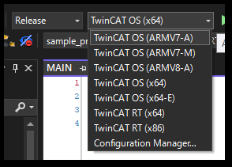

# プロジェクトの読み書きの自動化

既に稼働中の設備において、IPCのプロジェクト書き換えを行う場合、次の2点の作業が必要です。

* 現在稼働中のプロジェクトのバックアップを取得する。
* 新しいTwinCAT XAEプロジェクトをIPCに書き込み（ダウンロード）し、RUNモードへ移行し、プログラムスタートする。

これらをTwinCAT XAEのGUI操作無しにスクリプトで実施する方法についてご説明します。

## 事前準備

言語設定
    : 本スクリプトでは、ターゲットIPCからのバックアップ取得の際、Visual Studioのメニューコマンドをリモートで操作する`ExecuteCommand`を用いています。このコマンドは、Visual Studioの言語設定により変化します。

        ツールバーの Tools > Options... メニューの Environment > International 設定

    : 紹介するスクリプトは、この設定が英語であることを前提としています。その他の言語に切り替えてお使いいただいている方は、バックアップが正しく機能しませんのでご注意ください。

ターゲットへの接続
    : TwinCAT XAEがインストールされた別PCから行う事を前提としています。該当PCのEdit routeにて、ターゲットIPCへの接続を行ってください。本節の例では、下記の通り接続が有るものとします。

    : Route名
        : バックアップに用います。ユーザモードランタイムは指定できません。下記スクリプト例では、 `BTN-000****` として説明します。

    : AmsNetId
        : あらかじめ指定したTwinCATプロジェクトを書き込む（ダウンロード）先のターゲットのルータAMS Net IDを指定します。ユーザモードランタイムを指定可能です。下記スクリプト例では `10.200.64.8.1.1` として説明しています。

    : ```{figure} assets/2023-12-25-16-30-51.png
      :align: center
      :name: figure_router_list

      Edit Routesウィンドウ
      ```

    : ```{tip}
      Usermode runtimeのAms Net IDは下記の方法で調べられます。

      {align=center}
      ```

## IPCからバックアップを収集するスクリプト


```{admonition} ターゲットにソースファイルを含める設定を行ってください。
:class: warning

ターゲットからバックアップしたプロジェクトのPLCを開くには、そもそもIPCに書き込むPLCプロジェクトにソースファイルが含まれていなければなりません。

PLCプロジェクトの`Settings`タブを開いて、`Project Source`およびそのサブメニュー全てにチェックを入れてください。

{align=center}

```

上記をカスタマイズした次のPowershellスクリプトを準備します。

```{code-block} powershell
:name: code_backup_from_target_powershell
:caption: ターゲットからバックアップを自動化するPowershellスクリプト
:linenos:

# バックアップ用変数
$backupBaseDir = $PSScriptRoot + "\backup" # バックアップを保存する親フォルダパス
$BackupProjectName = "backup"
$BackupTargetRouteName = "btn-000****" # バックアップ元のターゲットIPCのRoute名

#$dte = new-object -com VisualStudio.DTE.10.0 # VS2010
#$dte = new-object -com VisualStudio.DTE.11.0 # VS2012
#$dte = new-object -com VisualStudio.DTE.12.0 # VS2013
#$dte = new-object -com VisualStudio.DTE.14.0 # VS2015
#$dte = new-object -com VisualStudio.DTE.15.0 # VS2017
#$dte = new-object -com VisualStudio.DTE.16.0 # VS2019
#$dte = new-object -com VisualStudio.DTE.17.0 # VS2022
#$dte = new-object -com TcXaeShell.DTE.15.0 # TwinCAT XAE Shell
$dte = new-object -com TcXaeShell.DTE.17.0 # TwinCAT XAE Shell x64 (build 4026)

### backup process

# create backup directory including datetime string.
$now = Get-Date
$strDT = $now.ToString('yyyyMMddHHmmss')
$backupDir = $backupBaseDir + "\" + $strDT + "_" + $BackupProjectName

if (test-path $backupDir -pathtype container) {
    Remove-Item $backupDir -Recurse -Force
}
New-Item $backupDir -type directory

# fetch from target
$dte.ExecuteCommand("File.OpenProjectSolutionFromTarget", $BackupTargetRouteName + " " + $backupDir + " " + $BackupProjectName);

# Save as solution
$sln = $dte.Solution
$sln.SaveAs($backupDir + "\" + $BackupProjectName + ".sln")
$sln.Close()
```

このスクリプトを `twincat_backup.ps1` などPowershellが動作するテキストファイルとして保存します。スクリプト先頭部にある変数定義を次のとおり適切に設定します。

$backupBaseDir
    : バックアップを保存する親フォルダパスを指定します。`$prjDir`同様、`$PSScriptRoot` からの相対パス表記でも構いません。

$BackupProjectName
    : バックアップを保存するプロジェクト名を指定します。

$BackupTargetRouteName
    : {numref}`figure_router_list` の接続先Route名を小文字に変換した文字列を指定します。
    : ```{warning}
      `$BackupTargetRouteName` は、下記の通りAdd Route Dialogで作成した際の、`Route Name(Target)` 項目で設定した内容に準じます。この設定はデフォルトで小文字ですが、意図してこの設定を変更した場合は、その文字列を指定する必要があります。

      一方、Routerの一覧（{numref}`figure_router_list`）ではRoute名が全て大文字となっています。大文字小文字が異なると、正しくRoute名として認識できなくなりますのでご注意ください。

      {align=center}
      ```
$dte
    : Visual Studioのオートメーションモデルである`EnvDTE.DTE`インターフェースが提供するAPI機能です。Visual Studio または TwinCAT XAEシェルなどの開発環境のバージョンにより異なるProgram IDを指定することでオブジェクトを生成することができます。[Visual StudioのProgram ID](https://infosys.beckhoff.com/content/1033/tc3_automationinterface/242746251.html?id=1279209786026709307)を参照してください。{numref}`code_backup_from_target_powershell`例では、TwinCAT XAEシェル版の開発環境を用いています。


````{admonition} Visual Studioのバージョンによるコマンドの違いに注意
:class: warning

ターゲットからプロジェクトを開くコマンドをDTEインターフェースを通じて実行するには、 `$dte.ExecuteCommand()` では第一引数にコマンドを記載する必要があります。4024をVisual Studio 2017 をベースとする build 4024 と、Visual Studio 2022 をベースとする build 4026 では次のとおりコマンドが異なりますのでご注意ください。（{ref}`section_visual_studio_dte_api` 参照）

```{csv-table}
build 4024（TcXaeShell.DTE.15.0）, build 4026（TcXaeShell.DTE.17.0）
File.OpenProjectFromTarget, File.OpenProjectSolutionFromTarget
```
````

次に、`$backupBaseDir` で設定したバックアップを保存する先のフォルダを用意してください。本スクリプト例では、Powershellスクリプトを配置する同じディレクトリに、`backup` という名前の空フォルダを作り、その中に保存する仕様です。

設定が完了したら、Powershellを実行してください。下記の通り、実行した日時の数字列が先頭に付いたプロジェクトフォルダが自動的に作成され、その中に `$BackupProjectName` で指定した名前でソリューションが作成されます。

```powershell
Mode                 LastWriteTime         Length Name
----                 -------------         ------ ----
d-----        2023/12/25     16:22                20231225162119_backuo
d-----        2023/12/25     16:28                20231225162755_backup
d-----        2023/12/25     16:33                20231225163334_backup 
    :              :            :                               :
```

## ランタイムへ新しいプロジェクトを書き込むスクリプト

既存のプロジェクトを開き、ユーザモードランタイムや、ターゲットIPCなどのXARに書き込むスクリプトをご紹介します。

```{code-block} powershell
:name: code_auto_dploy_powershell
:caption: ターゲットへのデプロイを自動化するPowershellスクリプト
:linenos:

# プロジェクトのビルドとターゲットへの書き込み用変数
$prjDir = $PSScriptRoot + "\sample_project" # 元となるプロジェクトが格納されたフォルダパス
$prjName = "sample_project" # $prjDir以下にあるソリューションファイル名から拡張子(*.sln)を取り除いたもの
$targetNetId = "10.200.64.8.1.1" # ダウンロード先のルータ設定で行ったターゲットIPCのAmsNetIdを指定

#$dte = new-object -com VisualStudio.DTE.10.0 # VS2010
#$dte = new-object -com VisualStudio.DTE.11.0 # VS2012
#$dte = new-object -com VisualStudio.DTE.12.0 # VS2013
#$dte = new-object -com VisualStudio.DTE.14.0 # VS2015
#$dte = new-object -com VisualStudio.DTE.15.0 # VS2017
#$dte = new-object -com VisualStudio.DTE.16.0 # VS2019
#$dte = new-object -com VisualStudio.DTE.17.0 # VS2022
#$dte = new-object -com TcXaeShell.DTE.15.0 # TwinCAT XAE Shell
$dte = new-object -com TcXaeShell.DTE.17.0 # TwinCAT XAE Shell x64 (build 4026)

### Build or Activate specified project process
$prjPath = $prjDir + "\" + $prjName + ".sln"
$sln = $dte.Solution
$sln.Open($prjPath)

$project = $sln.Projects.Item(1)

### Only build. build image is created into "_boot" directory
# $sysManProjectName = $project.FullName
# $sln.SolutionBuild.BuildProject("Release|TwinCAT OS (x64)",$sysManProjectName,$true) # TwinCAT OS (x64) -> Usermode runtime 

### Build and Activation into target IPC
$systemManager = $project.Object
$systemManager.SetTargetNetId($targetNetId)
$systemManager.ActivateConfiguration()
$systemManager.StartRestartTwinCAT()

$sln.Close()
```

````{admonition} デプロイは行わずにビルドだけ行いたい場合
:class: tip

上記スクリプト例では、ターゲットにプログラムをデプロイし、RUNモード移行、およびPLCスタートまで自動化しています。ビルドだけを行いたい場合もコメントアウトした状態で併記していますので、次のとおり書き換えてください。

```{code} powershell
### Only build. build image is created into "_boot" directory
$sysManProjectName = $project.FullName
$sln.SolutionBuild.BuildProject("Release|TwinCAT OS (x64)",$sysManProjectName,$true) # TwinCAT OS (x64) -> Usermode runtime 

### Build and Activation into target IPC
# $systemManager = $project.Object
# $systemManager.SetTargetNetId($targetNetId)
# $systemManager.ActivateConfiguration()
# $systemManager.StartRestartTwinCAT()
```

ビルドしたブートイメージは、プロジェクトフォルダ内の `_boot` フォルダに生成されます。（{ref}`section_boot_image` 参照）
ただし、`"Release|TwinCAT OS (x64)"` の部分でどのターゲット向けにビルドを行うのか明記する必要があります。ターゲットの環境に合わせて書き換えてください。
{align=center}

TwinCAT OS
    : Usermode runtimeやTwinCAT Linuxをターゲットとする場合のビルド

TwinCAT RT
    : カーネルモードで動作するTwinCAT XAR向けのビルド

````

このスクリプトを `twincat_deploy.ps1` などPowershellが動作するテキストファイルとして保存します。スクリプト先頭部にある変数定義を次のとおり適切に設定します。

$prjDir
    : デプロイする元のTwinCATプロジェクトフォルダを配置したディレクトリのパスを指定します。

$prjName
    : $prjDir以下にあるソリューションファイル名から拡張子(*.sln)を取り除いた名前を設定してください。

$targetNetId
    : {numref}`figure_router_list` の接続先AmsNetIdを指定します。デプロイ先をXAE開発環境のPC上のUsermode runtimeにする場合、NetIDを次図のようにタスクトレーから調べて設定してください。
      ```{list-table}
      - * {align=center}
        * {align=center}
      ```

$dte
    : Visual Studioのオートメーションモデルである`EnvDTE.DTE`インターフェースが提供するAPI機能です。Visual Studio または TwinCAT XAEシェルなどの開発環境のバージョンにより異なるProgram IDを指定することでオブジェクトを生成することができます。[Visual StudioのProgram ID](https://infosys.beckhoff.com/content/1033/tc3_automationinterface/242746251.html?id=1279209786026709307)を参照してください。{numref}`code_auto_dploy_powershell`例では、TwinCAT XAEシェル版の開発環境を用いています。


また、スクリプトで指定した`$prjDir`にターゲットへ書き込むソリューションプロジェクトを、`$prjName` で指定したソリューション名で格納してください。

設定が完了したら、Powershellを実行してください。`$prjDir` に格納したプロジェクトを自動的にビルドしてIPCへ書き込み、その後、RUNモードへ移行、PLCスタートまで行います。

## API解説

基本としてTwinCATのアプリケーションリソースへ接続する方法は、次の二通りがあります。（[参考](https://infosys.beckhoff.com/content/1033/tc3_automationinterface/242721803.html?id=6926366377621229322)）

Visual Studio DTE
    : Microsoft社が提供するVisual Studio用のインターフェース[`EnvDTE.DTE`](https://learn.microsoft.com/ja-jp/dotnet/api/envdte.dte?view=visualstudiosdk-2022)を使ってアクセスします。本スクリプト上では、`$dte`にオブジェクトが格納されています。

TwinCAT Automation Interface
    : Beckhoff TwinCAT プロジェクトが提供する[APIインターフェース](https://infosys.beckhoff.com/content/1033/tc3_automationinterface/242750731.html?id=8779542607648763499)を使ってアクセスします。本スクリプト上では、`$SystemManager` にオブジェクトが格納されています。

上記を組み合わせて、TwinCAT上の操作を自動化させることができます。

(section_visual_studio_dte_api)=
### Visual Studio DTEインターフェースの使い方

スクリプト中での使用箇所は次のとおりです。COMオブジェクトを作成するには、[Visual StudioのProgram ID](https://infosys.beckhoff.com/content/1033/tc3_automationinterface/242746251.html?id=1279209786026709307)に示されるように各アプリケーションのバージョン毎に異なる Program IDが割り振られており、`new-object -com` でProgram IDを指定することで取得できます。これをオブジェクト変数`$dte`に代入し、以後dteインターフェースで定義されたプロパティやメソッドを活用してリソースにアクセスします。

多用されるメソッドとしては、`ExecuteCommand`があります。これの第一引数には、コマンド名`File.OpenProjectFromTarget`を指定し、第二引数にはスペース区切りで、そのコマンドの引数を指定します。これらのProgram IDで指定したアプリケーションが提供するコマンドは、Visual Studioの場合、ツールバーの`Tools` > `Options...`メニューの`Environment` > `Keyboard` を開くと全てのコマンドが一覧されます。

{align=center}

注意点として以下が挙げられます。

Visual Studioのバージョンによってコマンド名が変化する
    : keyboardに割り当てられたコマンド名が、バージョンによって異なることがあります。例えば以下のスクリプトはエラーとなります。
    : ```powershell
      $dte = new-object -com 	TcXaeShell.DTE.17.0 # TwinCAT XAE Shell x64 (build 4026)
       :
       :
      $dte.ExecuteCommand("File.OpenProjectFromTarget", $BackupTargetRouteName + " " + $backupDir + " " + $BackupProjectName);
      ```
    : TwinCAT build 4024 の32bit版のDTEインターフェースはTcXaeShell.DTE.15.0で、上記のスクリプトのコマンドはこのバージョンのものが使用されています。4026から使用可能である、64bit版TCシェルは、TcXaeShell.DTE.17.0で、同様のコマンドが "File.OpenProject**Solution**FromTarget" となっていますので、修正が必要です。

国際化言語設定によりコマンドが変わる
    : コマンド名は言語が変わると変化します。`ExecuteCommand`メソッドでは、文字列でコマンド名を指定する必要がありますので、言語設定を変更された場合は、このメニューから都度選び直す必要があります。

(section_twincat_automation_interface_api)=
### TwinCAT Automation Interface APIの使い方

[APIドキュメントはこちら](https://infosys.beckhoff.com/content/1033/tc3_automationinterface/242750731.html?id=8779542607648763499)にあります。まず、大きく分けて下記二つのメインインターフェースが用意されています。

ITcSysManager
    : 基本機能のオブジェクトです。最も初期に新しい構成を新規作成したり、ターゲットIPCのAmsNetIdを指定してリモートIPCと接続したり、構成（プログラムや設定）をIPCに適用してRUNモードへ移行させたり、といった基本機能です。

ITcSmTreeItem
    : プロジェクト内にあるツリー形式の様々なリソースに対する追加、削除、変更などの機能を提供します。

その他、ライブラリに特化したものや、タスク設定、ライセンス設定など専用のインターフェースが用意されています。

オブジェクトの取得からオブジェクトの使い方までは、次の通りの手順になります。

```powershell
$prjPath = $prjDir + "\" + $BackupProjectName + ".sln"
$sln = $dte.Solution
$sln.Open($prjPath)

$project = $sln.Projects.Item(1)
$systemManager = $project.Object
$systemManager.SetTargetNetId($targetNetId)
$systemManager.ActivateConfiguration()
$systemManager.StartRestartTwinCAT()

$sln.Close()
```

まず、Visual StudioのDTEインターフェースのSolutionプロパティにより、[ソリューションオブジェクト](https://learn.microsoft.com/ja-jp/dotnet/api/envdte.solution?view=visualstudiosdk-2022)を取得します。これを使ってソリューションを開き、[Projectsプロパティ](https://learn.microsoft.com/ja-jp/dotnet/api/envdte._solution.projects?view=visualstudiosdk-2022#envdte-solution-projects)からソリューションにぶら下がっているプロジェクトのコレクションを取得します。大概は、一つ目のアイテムにTwinCATオブジェクトが格納されていますので、[`Projects.Item`](https://learn.microsoft.com/ja-jp/dotnet/api/envdte.projects.item?view=visualstudiosdk-2022#envdte-projects-item(system-object))メソッドを使って、要素番号でこれを取得し、ObjectでTwinCATの[`ITcSysManager`オブジェクト](https://infosys.beckhoff.com/content/1033/tc3_automationinterface/242753675.html?id=5988206545626171718)を収集します。

以後、`SetTargetNetId`や`ActivateConfiguration`や`StartRestartTwinCAT`などのメソッドを使って、一連のTwinCATの操作を行います。
