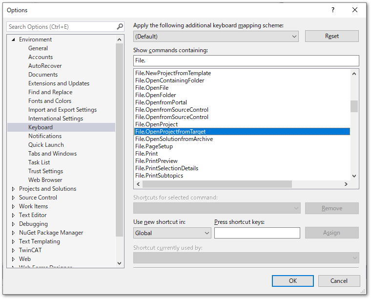

# Automation Interfaceを使ったプロジェクト更新の自動化（Powershell編）

{ref}`section_auto_deploy` 節では、ターゲットIPC内のWindowsのファイルシステム内（Bootフォルダ）に対してイメージを直接書き込む方法でした。この節では、ファイル操作ではなくTwinCAT XAEとその操作を自動化する [TwinCAT Automation Interface](https://infosys.beckhoff.com/content/1033/tc3_automationinterface/242682763.html?id=5107059583047685772)の機能を使ってプロジェクトを自動更新する方法をご紹介します。

[TwinCAT Automation Interface](https://infosys.beckhoff.com/content/1033/tc3_automationinterface/242682763.html?id=5107059583047685772)とは.NETを用いてさまざまな言語からTwnCAT XAEを操作する仕組みです。

{align=center}

本節では、このうちPosershellを用いる方法でTwinCATプロジェクトを、XAEの操作無しに設備へ展開する方法をご紹介します。

## サンプルスクリプトの機能仕様

* 事前にターゲットからTwinCATプロジェクトをアップロードし、日時の付いたバックアップフォルダ内に保存する機能を有します。

* バックアップ取得後、更新するプログラムをIPCに書き込み、RUNモードへ移行し、プログラムスタートします。

````{admonition} Visual Studioの言語設定のご注意
:class: warning

本スクリプトでは、ターゲットIPCからのバックアップ取得の際、Visual Studioのメニューコマンドをリモートで操作する`ExecuteCommand`を用いています。このコマンドは、Visual Studioの言語設定により変化します。

    ツールバーの Tools > Options... メニューの Environment > International 設定

紹介するスクリプトは、この設定が英語であることを前提としています。その他の言語に切り替えてお使いいただいている方は、バックアップが正しく機能しませんのでご注意ください。

````

```{admonition} ターゲットにソースファイルを含める設定を行ってください。
:class: warning

ターゲットからバックアップしたプロジェクトのPLCを開くには、そもそもIPCに書き込むPLCプロジェクトにソースファイルが含まれていなければなりません。

PLCプロジェクトの`Settings`タブを開いて、`Project Source`およびそのサブメニュー全てにチェックを入れてください。

{align=center}

```

## 手順

スクリプトを用いてIPCにプロジェクトのバックアップ取得、更新を行う手順は次の通りです。

1. ターゲットへの接続を行う
    スクリプトは、IPC本体内ではなく、TwinCAT XAEがインストールされた別PCから行う事を前提としています。該当PCのEdit routeにて、ターゲットIPCへの接続を行ってください。

    本節の例では、下記の通り接続が有るものとします。

    Route名
        : TRAINING-NGY8

    AmsNetId
        : 10.200.64.8.1.1

    ```{figure} assets/2023-12-25-16-30-51.png
    :align: center
    :name: figure_router_list

    Edit Routesウィンドウ
    ```

2. Powershellの準備

    {numref}`code_auto_dploy_powershell`に示すスクリプトをテキストファイルを編集し、`****.ps1`という拡張子を付けて保存します。この際、スクリプト先頭にある次の各行を適切に設定します。

    $prjDir
        : プロジェクトの配置するディレクトリのパスを指定します。スクリプト実行場所は、`$PSScriptRoot` で指定できるため、そこからの相対パスを指定する方法でも構いません。

    $backupBaseDir
        : バックアップを保存する親フォルダパスを指定します。`$prjDir`同様、`$PSScriptRoot` からの相対パス表記でも構いません。

    $prjName
        : プロジェクトソリューションファイル名`****.sln`から拡張子`sln`を取り除いた文字列を指定します。

    $targetNetId
        : {numref}`figure_router_list` の接続先AmsNetIdを指定します。

    $targetName
        : {numref}`figure_router_list` の接続先Route名を小文字に変換した文字列を指定します。

    ```{warning}
    `$targetName` は、下記の通りAdd Route Dialogで作成した際の、`Route Name(Target)` 項目で設定した内容に準じます。この設定はデフォルトで小文字ですが、意図してこの設定を変更した場合は、その文字列を指定する必要があります。
    
    一方、Routerの一覧（{numref}`figure_router_list`）ではRoute名が全て大文字となっています。大文字小文字が異なると、正しくRoute名として認識できなくなりますのでご注意ください。

    {align=center}
    ```

    $dte
        : Visual Studioのオートメーションモデルである`EnvDTE.DTE`インターフェースが提供するAPI機能です。Visual Studio または TwinCAT XAEシェルなどの開発環境のバージョンにより異なるProgram IDを指定することでオブジェクトを生成することができます。[Visual StudioのProgram ID](https://infosys.beckhoff.com/content/1033/tc3_automationinterface/242746251.html?id=1279209786026709307)を参照してください。{numref}`code_auto_dploy_powershell`例では、TwinCAT XAEシェル版の開発環境を用いています。

    上記をカスタマイズした次のPowershellスクリプトを準備します。

    ```{code-block} powershell
    :name: code_auto_dploy_powershell
    :caption: バックアップと更新を自動化するPowershellスクリプト
    :linenos:

    $prjDir = $PSScriptRoot + "\sample_project" # 元となるプロジェクトが格納されたフォルダパス
    $backupBaseDir = $PSScriptRoot + "\backup" # バックアップを保存する親フォルダパス
    $prjName = "sample_project" # $prjDir以下にあるソリューションファイル名から拡張子(*.sln)を取り除いたもの
    $targetNetId = "10.200.64.8.1.1" # ルータ設定で行ったターゲットIPCのAmsNetIdを指定
    $targetName = "training-ngy8" # ルータ設定で行ったターゲットIPCのRoute名を全て小文字にしたもの

    #$dte = new-object -com VisualStudio.DTE.10.0 # VS2010
    #$dte = new-object -com VisualStudio.DTE.11.0 # VS2012
    #$dte = new-object -com VisualStudio.DTE.12.0 # VS2013
    #$dte = new-object -com VisualStudio.DTE.14.0 # VS2015
    #$dte = new-object -com VisualStudio.DTE.15.0 # VS2017
    #$dte = new-object -com VisualStudio.DTE.16.0 # VS2019
    $dte = new-object -com 	TcXaeShell.DTE.15.0 # TwinCAT XAE Shell
    $dte.SuppressUI = $false

    ### backup process

    # create backup directory including datetime string.
    $now = Get-Date
    $strDT = $now.ToString('yyyyMMddHHmmss')
    $backupDir = $backupBaseDir + "\" + $strDT + "_" + $prjName

    if (test-path $backupDir -pathtype container) {
        Remove-Item $backupDir -Recurse -Force
    }
    New-Item $backupDir -type directory

    # fetch from target
    $dte.ExecuteCommand("File.OpenProjectFromTarget", $targetName + " " + $backupDir + " " + $prjName);
    # Save as solution
    $sln = $dte.Solution
    $sln.SaveAs($backupDir + "\" + $prjName + ".sln")

    ### download process
    $prjPath = $prjDir + "\" + $prjName + ".sln"
    $sln = $dte.Solution
    $sln.Open($prjPath)

    $project = $sln.Projects.Item(1)
    $systemManager = $project.Object

    $systemManager.SetTargetNetId($targetNetId)
    $systemManager.ActivateConfiguration()
    $systemManager.StartRestartTwinCAT()
    ```

3. フォルダの準備と実行

    スクリプトで指定した`$prjDir`にターゲットへ書き込むソリューションプロジェクトを、`$prjName`というソリューション名で格納してください。

    また、`$backupBaseDir`で指定した、バックアップ先のフォルダを作成してください。

    以上の準備を整えてから上記スクリプトを実行すると、次の順序で処理がバッチ式に行われます。

    1. ターゲットからのバックアップ取得と保存

        下記の通り、実行した日時の数字列が先頭に付いたプロジェクトフォルダが自動的に作成され、その中に`sample_project.sln`が保存されています。更新する前のプロジェクトファイルです。

        ```powershell
        Mode                 LastWriteTime         Length Name
        ----                 -------------         ------ ----
        d-----        2023/12/25     16:22                20231225162119_sample_project
        d-----        2023/12/25     16:28                20231225162755_sample_project
        d-----        2023/12/25     16:33                20231225163334_sample_project 
           :              :            :                               :
        ```

    2. `$prjDir`に格納したプロジェクトをターゲットIPCへの書き込み、その後自動スタートします。

## API解説

まず基本としてTwinCATのアプリケーションリソースへ接続する方法は、次の二通りがあります。（[参考](https://infosys.beckhoff.com/content/1033/tc3_automationinterface/242721803.html?id=6926366377621229322)）

Visual Studio DTE
    : Microsoft社が提供するVisual Studio用のインターフェース[`EnvDTE.DTE`](https://learn.microsoft.com/ja-jp/dotnet/api/envdte.dte?view=visualstudiosdk-2022)を使ってアクセスします。本スクリプト上では、`$dte`にオブジェクトが格納されています。

TwinCAT Automation Interface
    : Beckhoff TwinCAT プロジェクトが提供する[APIインターフェース](https://infosys.beckhoff.com/content/1033/tc3_automationinterface/242750731.html?id=8779542607648763499)を使ってアクセスします。本スクリプト上では、`$SystemManager` にオブジェクトが格納されています。

上記を組み合わせて、TwinCAT上の操作を自動化させることができます。

### Visual Studio DTEインターフェースの使い方

スクリプト中での使用箇所は次のとおりです。COMオブジェクトを作成するには、[Visual StudioのProgram ID](https://infosys.beckhoff.com/content/1033/tc3_automationinterface/242746251.html?id=1279209786026709307)に示されるように各アプリケーションのバージョン毎に異なる Program IDが割り振られており、`new-object -com` でProgram IDを指定することで取得できます。これをオブジェクト変数`$dte`に代入し、以後dteインターフェースで定義されたプロパティやメソッドを活用してリソースにアクセスします。

```powershell
$dte = new-object -com 	TcXaeShell.DTE.15.0 # TwinCAT XAE Shell
   :
   :
$dte.ExecuteCommand("File.OpenProjectFromTarget", $targetName + " " + $backupDir + " " + $prjName);
```

多用されるメソッドとしては、`ExecuteCommand`があります。これの第一引数には、コマンド名`File.OpenProjectFromTarget`を指定し、第二引数にはスペース区切りで、そのコマンドの引数を指定します。これらのProgram IDで指定したアプリケーションが提供するコマンドは、Visual Studioの場合、ツールバーの`Tools` > `Options...`メニューの`Environment` > `Keyboard` を開くと全てのコマンドが一覧されます。

{align=center}

ただし、コマンド名は言語が変わると変化します。`ExecuteCommand`メソッドでは、文字列でコマンド名を指定する必要がありますので、言語設定を変更された場合は、このメニューから都度選び直す必要があります。

### TwinCAT Automation Interface APIの使い方

[APIドキュメントはこちら](https://infosys.beckhoff.com/content/1033/tc3_automationinterface/242750731.html?id=8779542607648763499)にあります。まず、大きく分けて下記二つのメインインターフェースが用意されています。

ITcSysManager
    : 基本機能のオブジェクトです。最も初期に新しい構成を新規作成したり、ターゲットIPCのAmsNetIdを指定してリモートIPCと接続したり、構成（プログラムや設定）をIPCに適用してRUNモードへ移行させたり、といった基本機能です。

ITcSmTreeItem
    : プロジェクト内にあるツリー形式の様々なリソースに対する追加、削除、変更などの機能を提供します。

その他、ライブラリに特化したものや、タスク設定、ライセンス設定など専用のインターフェースが用意されています。

オブジェクトの取得からオブジェクトの使い方までは、次の通りの手順になります。

```powershell
$prjPath = $prjDir + "\" + $prjName + ".sln"
$sln = $dte.Solution
$sln.Open($prjPath)

$project = $sln.Projects.Item(1)
$systemManager = $project.Object
$systemManager.SetTargetNetId($targetNetId)
$systemManager.ActivateConfiguration()
$systemManager.StartRestartTwinCAT()
```

まず、Visual StudioのDTEインターフェースのSolutionプロパティにより、[ソリューションオブジェクト](https://learn.microsoft.com/ja-jp/dotnet/api/envdte.solution?view=visualstudiosdk-2022)を取得します。これを使ってソリューションを開き、[Projectsプロパティ](https://learn.microsoft.com/ja-jp/dotnet/api/envdte._solution.projects?view=visualstudiosdk-2022#envdte-solution-projects)からソリューションにぶら下がっているプロジェクトのコレクションを取得します。大概は、一つ目のアイテムにTwinCATオブジェクトが格納されていますので、[`Projects.Item`](https://learn.microsoft.com/ja-jp/dotnet/api/envdte.projects.item?view=visualstudiosdk-2022#envdte-projects-item(system-object))メソッドを使って、要素番号でこれを取得し、ObjectでTwinCATの[`ITcSysManager`オブジェクト](https://infosys.beckhoff.com/content/1033/tc3_automationinterface/242753675.html?id=5988206545626171718)を収集します。

以後、`SetTargetNetId`や`ActivateConfiguration`や`StartRestartTwinCAT`などのメソッドを使って、一連のTwinCATの操作を行います。

