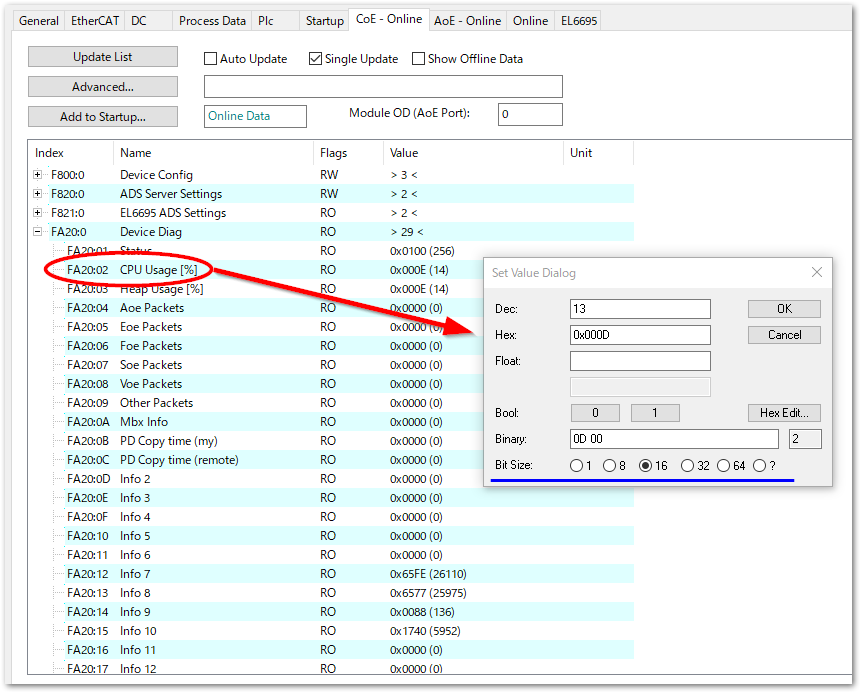

# SDOデータの構造解析

ここでは、EL6695（EtherCATゲートウェイターミナル）を例として取り上げます。このターミナルでは、Index `0xFA20` に診断データが格納されています。これらをコンプリートアクセスで読み出します。

個々のオブジェクトのデータ仕様は、エントリをダブルクリックすることで詳細ウィンドウが現れますのでここから確認できます。データサイズは最下部の`Bit Size`を閲覧できますので、対応する型を選定してください。

{align=center}

```{note}
ODのより詳しい情報はデバイスメーカが提供している仕様書を参照してください。弊社製のELターミナルのマニュアル（InfoSys）では、[EtherCAT Terminals](https://infosys.beckhoff.com/content/1033/fieldbusinfosys/3149086475.html?id=1665754046226245738) 以下の各デバイスの `Commissioning` 以下の`Standard Object`や、`CoE Object`などに記載があります。

例:
    : [EL34x3 電力計測ターミナルの場合](https://infosys.beckhoff.com/content/1033/el34x3/2346739851.html?id=5414847329222130982)
    : [EL6695 EtherCATブリッジターミナルの場合](https://infosys.beckhoff.com/content/1033/el6695/1318278155.html?id=1498117205910471182)
```


## 構造体の定義

任意の`Index`をコンプリートアクセスする場合、サブインデックスのバイト配列に準じた構造体を定義します。定義する構造体は2Byteアライメントとなるように`pack_mode`を指定します。

```{admonition} 重要
:class: warning

コンプリートアクセスでサブインデックスがバイト列で構成されたSDOは、2byteアライメントのデータ配置となっています。対してTwinCAT3の標準的なメモリアライメントは8byteアライメントです。このままではバイト配列を構造体データに対応せずデータがずれてしまいます。このため、SDOとマッピングする構造体、または、そのインスタンス変数などに対しては、必ず2byteアライメントを指定する`{attribute 'pack_mode' := '2'}`のattributeを付与してください。
```

```{code-block} iecst
{attribute 'pack_mode' := '2'}
TYPE sdo_EL6695_diag :
STRUCT
    identify : USINT;
    status : UINT;
    cpu_usage : UINT;
    heap_usage : UINT;
    aoe_packets: UINT;
    eoe_packets : UINT;
    foe_packets : UINT;
    soe_packets : UINT;
    voe_packets : UINT;
    other_pacekts: UINT;
    mbx_info : UINT;
    pd_copy_time_my: UINT;
    pd_copy_time_remote :UINT;
    info_2 : UINT;
    info_3 : UINT;
    info_4 : UINT;
    info_5 : UINT;
    info_6 : UINT;
    info_7 : UINT;
    info_8 : UINT;
    info_9 : UINT;
    info_10 : UINT;
    info_11 : UINT;
    info_12 : UINT;
    info_13 : UINT;
    info_14 : UINT;
    info_15 : UINT;
    info_16: UINT;
    info_17 : UINT;
    info_18 : UINT;
END_STRUCT
END_TYPE

```

