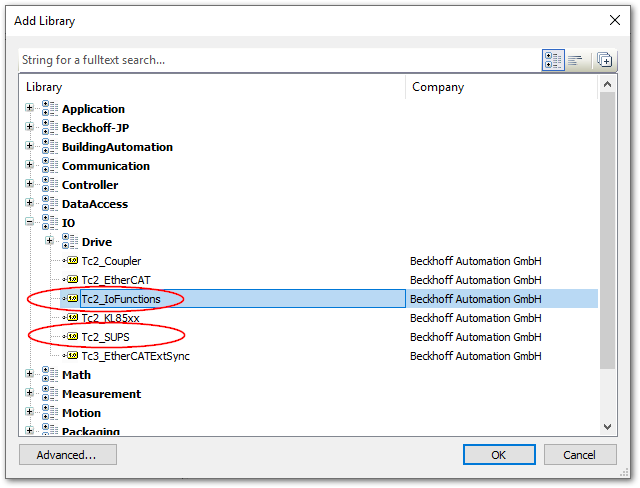

(figure_persistent_value_with_ups)=
# 無停電電源装置（UPS）によるPERSISTENTデータの永続化

Persistent属性の変数値は、IPCの正常シャットダウン操作時にファイルへ書き出され、次の起動時にはファイルから値が再度ロードされる、いわゆる永続化されます。
しかし、不意な電源ダウン時にはファイルへ保存することができず、RUN中の活動により変動したPersistent変数の値の永続化ができません。

これを防ぐためには、UPS（無停電電源装置）を取り付け、電源供給が失われた事を検出して明示的な命令でPersistentデータをファイルへ保存する必要があります。

IPCに搭載可能なUPSには次の2タイプがあり、それぞれ実装方法が異なります。（{numref}`UPS_persistent_flow`）

[1 second UPS](https://infosys.beckhoff.com/content/1033/tcplclib_tc2_sups/index.html?id=2087920595982685749)

    : CXと呼ばれる組み込み型IPCに搭載される大容量キャパシタによる組み込み電源保持機構です。cFastメモリという特別な書き込み速度の速いストレージに変数を保持し、多くの機種でその最大容量は1Mbyteとなります。専用のファンクションブロック`FB_S_UPS_****`が用意され、RUN中は常時実行し続けることで、選択したモードにより不意の停電発生時には自動的にPERSISTENT変数の値をファイルへ永続化することができます。またPERSISTENTデータへの保存が完了したあと、`FB_NT_QuickShutdown` によりWindowsのシャットダウン処理を行う事ができます。

[UPS Software Components（汎用UPS）](https://infosys.beckhoff.com/content/1033/tcupsshellext/html/overview.htm?id=1892807518135003723)

    : 1 second UPSの搭載が無いIPCに電源保護を行う場合は外付けUPSの設置が必要です。UPS Software Componentsは、この汎用UPSをWindowsでマネジメントするユーティリティソフトウェアです。UPSの残量やバッテリのみの駆動時間により自動的にWindowsシャットダウンを実施するところまで管理してくれるソフトウェアとなっています。PLCでは`FB_GetUPSStatus`によりUPSの稼働状態がモニタリングできますので、これにより `WritePersistentData` ファンクションブロックを実行し、PERSISTENT変数を永続化します。その後は、マネジメントソフトが自動的にシャットダウン処理まで行いますので、PLCからのシャットダウン処理は必要ありません。
    対応しているUPSはベッコフ製、APC製などがあります。ベッコフ製の場合はIPCとの間で電源線と通信線を共用するOCT（One Cable Technology）が採用されていますので、別途USBやシリアル通信ケーブルの設置が不要になります。次の通り容量別にラインナップされたコンパクトなUPSをご検討ください。
        * [CU8110-0060（0.3Wh）](https://www.beckhoff.com/ja-jp/products/ipc/embedded-pcs/accessories/cu8110-0060.html) 
        * [CU8110-0120（0.9Wh）](https://www.beckhoff.com/ja-jp/products/ipc/embedded-pcs/accessories/cu8110-0120.html?)
        * [CU8130-0120（15Wh）](https://www.beckhoff.com/ja-jp/products/ipc/embedded-pcs/accessories/cu8130-0120.html)
        * [CU8130-0240（30Wh）](https://www.beckhoff.com/ja-jp/products/ipc/embedded-pcs/accessories/cu8130-0240.html)
    


```{note}
参考InfoSysサイト一覧

* [1 second UPS](https://infosys.beckhoff.com/content/1033/tcplclib_tc2_sups/index.html?id=2087920595982685749)

* [UPS Software Components](https://infosys.beckhoff.com/content/1033/tcupsshellext/html/overview.htm?id=1892807518135003723)

* [WritePersistentData](https://infosys.beckhoff.com/content/1033/tcplclibutilities/11850907403.html?id=1644098846396023990)

```

```{figure-md} UPS_persistent_flow
{align=center}

UPSのタイプ別PERSISTENT変数データの永続化フロー
```

## PLCプログラム実装

次の機能仕様で全てのパターンのUPSに対応したモジュールを作成します。

* UPSに対する電源供給を失うとPERSISTENT属性のデータを保存し、再起動時にそのデータを再現するユースケース

    UPS一次電源を失った瞬間は必ずその時点のでPERSISTENTデータを保存する。その後はUPSのタイプにより次の通りふるまう。

    * 1 second UPS

        原則として短時間での保持を前提とするUPSシステムであるため、初回の保存時のみで以後は保存動作を行わない。

    * 汎用UPS

        `shutdown_delay` プロパティ設定時間周期毎にPERSISTENTデータの保持を行う。

* UPSに対する電源供給を失った後、指定時間以内に電源が復活すると運転を継続できるユースケース

    * 1 second UPS

        `shutdown_delay` プロパティ設定時間以内ではシャットダウンを行わず継続運転を可能とする。ただしバッテリーが劣化して継続できない場合は除く。

    * 汎用UPS

        WindowsのUPS Software Componentにて設定した時間、またはUPSのCritical alarm発生するまでは継続運転を可能とする。

* UPSに対する電源供給を失って初回のPERSISTENTデータ保持後、設定した時間内は稼働を継続し、その後にシャットダウンを開始するユースケース

    * 1 second UPS

        `shutdown_delay` プロパティ設定時間継続してUPSに対する電源供給が失われた場合は、ただちにシャットダウンを開始する。

    * 汎用PC

        WindowsのUPS Software Componentにて設定した時間、またはUPSのCritical alarm発生すると、UPS Software ComponentによってIPCのシャットダウンを開始する。

### サンプルコードプロジェクトの置き場所

本フレームワークのサンプルコードは以下のgithubリポジトリから取得いただけます。

[https://github.com/Beckhoff-JP/UPSPersistentData](https://github.com/Beckhoff-JP/UPSPersistentData)


### クラスモジュール設計

{numref}`UPS_persistent_class` のモジュール構成でUPSの制御とPERSISTENT変数の永続化を管理します。1 second UPSは、多様なドライバが個々に存在し、インターフェース化されていませんので、`FB_SUPS_BASE` という基底クラスである程度共通制御プログラムを実装し、ドライバに応じたサブクラスを作成します。UPS Software componentsで制御しているシステムについては、`FB_GenericUPS` を実装して制御を行います。

また、実際のUPSが無い場合に挙動を確認するための、`FB_UPS_STUB` を用意しています。

```{figure-md} UPS_persistent_class
{align=center}

UPSによるデータ永続化制御プログラムクラス図
```

またこのモジュールを実装する方法は、{numref}`main_inplementation_program` の通りシンプルになります。

それぞれに応じたUPS実装ファンクションブロックを`fbUPS`入力変数にセットした`FB_ShutDown`を毎サイクル実行することで、UPSを常時監視し、一次電源ダウンを検出すると{numref}`UPS_persistent_flow`に示すフローによりPERSISTENTデータを永続化しながらシャットダウンを行うプログラムを実現します。

```{code-block} iecst
:caption: 本モジュールのうち`FB_UPS_STUB`を用いた実装例
:name: main_inplementation_program
:linenos:

PROGRAM MAIN
VAR
	fbShutdown	:FB_ShutDown; // Safely shutdown feature
	fbUPS		:FB_UPS_STUB; // UPS type for test use
    //fbUPS       :FB_GenericUPS; //UPS type based on Windows driver
    //fbUPS       :FB_SUPS; // UPS type for 1sec UPS on CX50x0
    //fbUPS       :FB_SUPS_CB3011; // UPS type for 1sec UPS on CB3011 board
    //fbUPS       :FB_SUPS_CX51x0; // UPS type for 1sec UPS on CX51x0
    //fbUPS       :FB_SUPS_CX9020_U900; // UPS type for 1sec UPS on CX9020_U900
    //fbUPS       :FB_SUPS_BAPI; // UPS type for 1sec UPS using BIOS-API

END_VAR

fbUPS.shutdown_delay := T#3S;
fbShutdown(fbUPS := fbUPS);
```

### 必要ライブラリ

* UPS向けライブラリ

    1 second UPSライブラリ `FB_S_UPS****` は`Tc2_SUPS`に含まれます。また、`FB_GetUpsStatus` は `Tc2_IoFunctions` に含まれます。

    {align=center width=500px}

* `FB_WritePersistentData`は、`Tc2_Utilities` に含まれます。

    {align=center width=500px}


### 列挙体の定義

DUTsに、UPSの状態（{numref}`def_ups_state` ）、および、シャットダウンまでの状態定義（{numref}`def_shutdown_state` ）を定義します。

```{code-block} iecst
:caption: UPS状態定義
:name: def_ups_state
:linenos:

{attribute 'qualified_only'}
{attribute 'strict'}
TYPE E_UPSState :
(
    init := 0,		// UPS not working
    on_power,		// power supplied normally
    on_battery,		// continue working on battery
    critical_error,	// system shutdown
    facility_error	// UPC failure
);
END_TYPE
```

```{code-block} iecst
:caption: シャットダウンまでの状態定義
:name: def_shutdown_state
:linenos:

{attribute 'qualified_only'}
{attribute 'strict'}
TYPE E_ShutdownMode :
(
    init := 0,			// system is working
    persistent_data,	// persist data
    shutting_down		// system shutting down
);
END_TYPE
```

### インターフェース定義

Interface `iUPS` を追加します。

```{csv-table}
:header: 種別, 名称, 説明, 引数, 初期値 ,戻り値

プロパティ, UPSState, GETのみ。UPSの状態を取得する, なし,E_UPSState.init ,E_UPSState
プロパティ, shutdown_delay, 一次電源を失ってからシャットダウンを開始するまでの遅延時間, なし , T#1S ,TIME
メソッド, watch_status, UPSの状態を更新する, なし , なし ,BOOL
メソッド, persist_data, 永続化変数を保存します, なし , なし ,BOOL
メソッド, shutdown, IPCのシャットダウン処理を行います, なし , なし ,BOOL
```

### FB_ShutDownファンクションブロック

インターフェースを実装したUPSオブジェクトを使ってUPSの状態を監視し、シャットダウン制御を行います。
シャットダウン制御には次の状態マシンを使います。

```{csv-table}
:header: 順序, 状態, 説明
:widths: 1,2,7

1, E_ShutdownMode.init, UPSに1次電源が供給されている初期状態。
2, E_ShutdownMode.persistent_data, UPSのバッテリのみで操作する状態で、保持変数を保存し、1次電源の復活を待っている状態。`iUPS.persist_data()`メソッドを実行する。
3, E_ShutdownMode.shutting_down, UPSのバッテリ残量が継続運転できないエラーを発した、または、設定したバッテリ駆動時間を超過したことによりシャットダウンを実行する状態。`iUPS.shutdown()`メソッドを実行する。

```

12行目の`iUPS.watch_tstaus()`が毎サイクル実行される事により、実装されたUPSオブジェクトは`E_UPSState`の状態を更新します。この状態によりシャットダウン状態マシンを制御します。

```{code-block} iecst
:caption: シャットダウンシーケンス制御FB
:name: fb_shutdown
:linenos:

FUNCTION_BLOCK FB_ShutDown
VAR_INPUT
	fbUPS			:iUPS; // UPS object	
END_VAR
VAR_OUTPUT
END_VAR
VAR
	eShutdownMode	:E_ShutdownMode; // State machine when shutting down
END_VAR

// watch power fail
fbUPS.watch_tstaus();

CASE fbUPS.UPSState OF 
	E_UPSState.on_battery:
		eShutdownMode := E_ShutdownMode.persistent_data;
	E_UPSState.critical_error:
		eShutdownMode := E_ShutdownMode.shutting_down;
	ELSE
		eShutdownMode := E_ShutdownMode.init;
END_CASE

CASE eShutdownMode OF 
	E_ShutdownMode.persistent_data:
		fbUPS.persist_data();
		IF fbUPS.UPSState = E_UPSState.facility_error THEN
			eShutdownMode := E_ShutdownMode.shutting_down;
		END_IF
	E_ShutdownMode.shutting_down:
		fbUPS.shutdown();
END_CASE
```

### UPS制御ファンクションブロックの実装

次のページよりタイプ別UPSプログラムを紹介します。