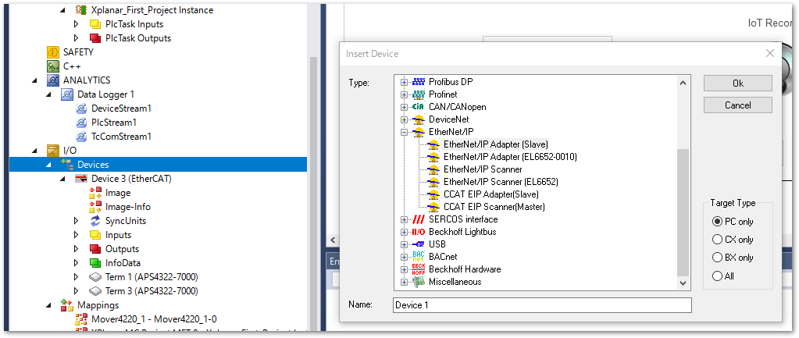
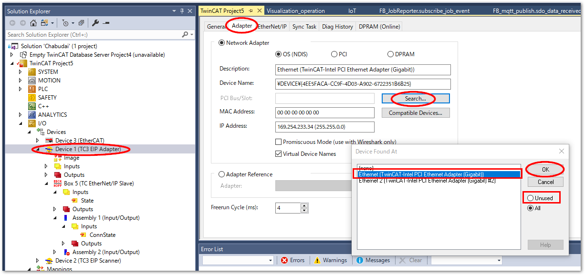
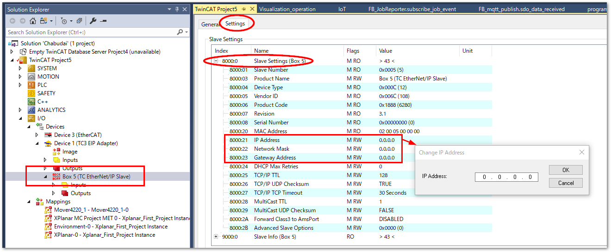
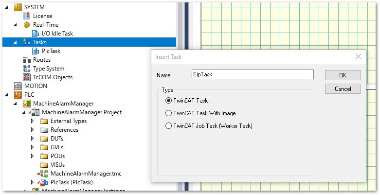
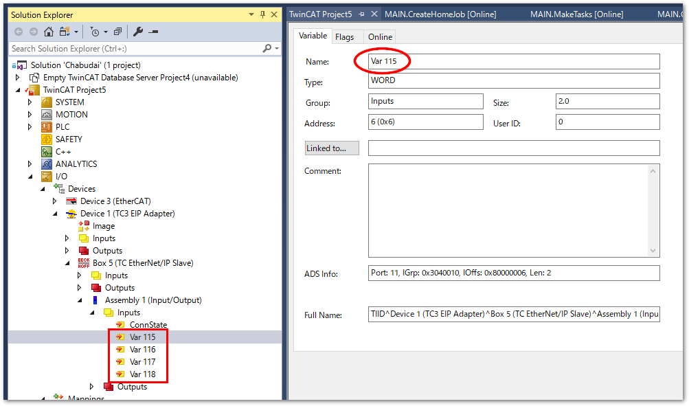
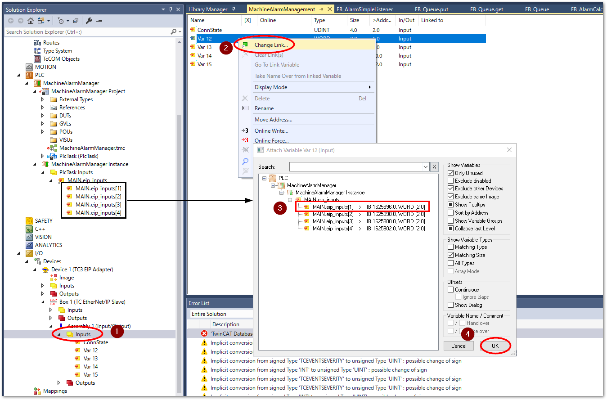
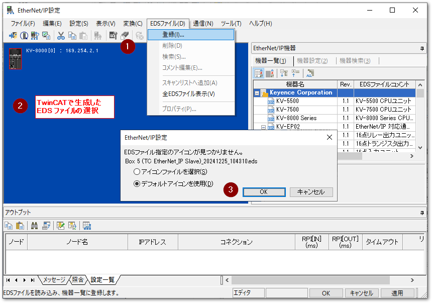
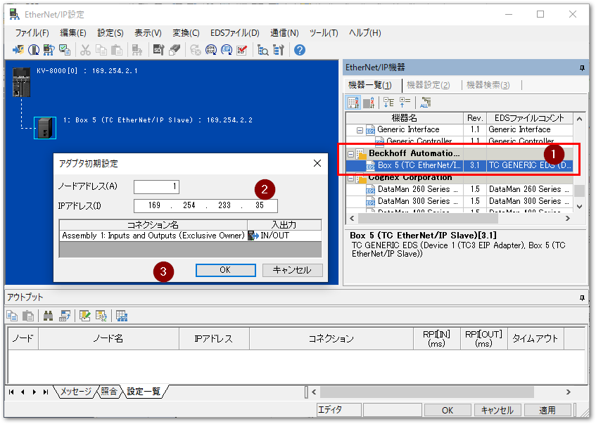
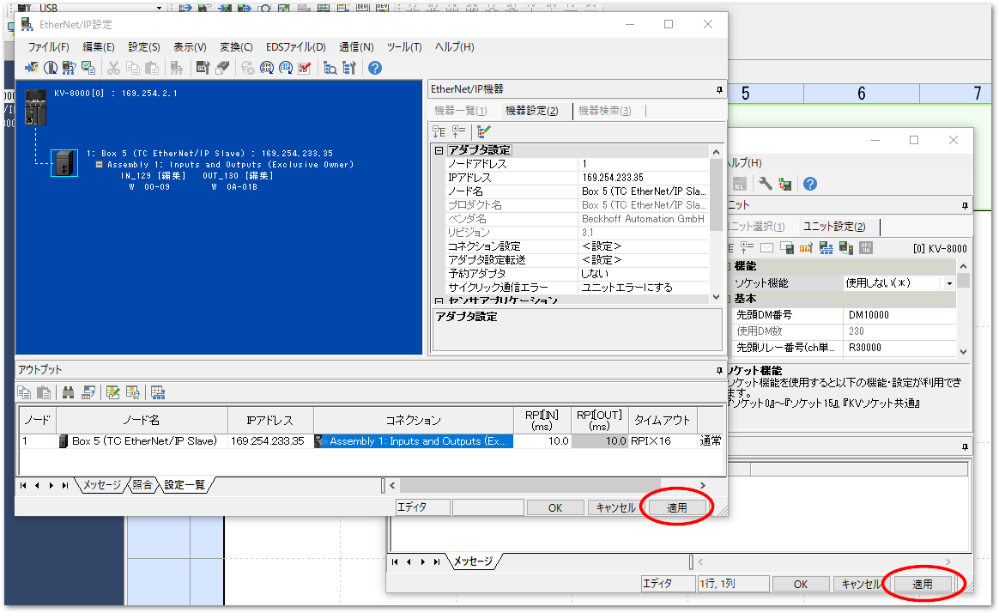
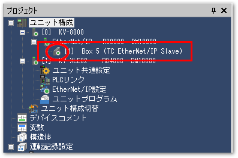

(section_eip_adapter)=
# TF6280 EtherNet/IP アダプタによるIPCのEthernetポートを使った通信

おおまかな流れ
1. アダプタのIO設定
2. EtherNet/IP専用タスクの作成
3. IO Assembly作成
4. TwinCAT PLCの変数とのリンク
5. 設定したノードのEDSファイルをエクスポート
6. スキャナへの設定

(section_eip_adapter_connection_setting)=
## アダプタのIO設定

1. ソリューションウィンドウからTwinCATツリーの `I/O` > `Devices` のポップアップメニューを出現させ、EtherNet/IP Adapter (Slave) を選びOKボタンを押します。

    {align=center}

2. `Device * (TC3 EIP Adapter)` ツリーが出現します。これを線悪してAdapterタブからEtherNet/IPの通信を行うIPCのAdapterのポートを選択する設定を行います。

    ```{tip}
    XAEをターゲットIPCに接続した状態でおこなってください。
    ```

    {align=center}

3. `BOX * (TC EtherNet/IP Slave)` ツリーを選択し、Settingタブから、 `8000:0 Slave Settings (BOX *)` ツリーを展開し、IP Address, Network Mask, Gateway Address をそれぞれ設定します。

    {align=center}

    ```{csv-table}
    :header: 設定アドレス, 振る舞い

    0.0.0.0, DHCPによる自動割り当てに従います
    255.255.255.255, Windows のネットワークアダプタのオプションで設定したIPアドレスに従います。
    任意のIPアドレスとサブネット, 任意のIPアドレスとしてふるまいます。
    ```

<!--

    ```{tip}
    特別な意図が無い限り、IP Addressには`255.255.255.255`を設定し、Windows側のネットワークのプロパティで固定IPアドレスを設定する運用が望ましいでしょう。使用するアダプタと異なるネットワークアドレスを設定した場合、任意のネットワークカードのIPアドレスを経由したルーティング設定が必要となります。
    ```

    ```{admonition} 任意のアドレスを設定した場合のルーティング設定方法

    任意のIPアドレスに設定する場合は、次の手順が必要となります。

    1. 以下のレジストリパスの`IPEnableRouter`を1に設定します。

           HKEY_LOCAL_MACHINE\SYSTEM\CurrentControlSet\Services\Tcpip\Parameters

        {align=center}

    2. スキャナと接続しているネットワークカードのIPアドレスを、Windows側のネットワークアドレスと異なるネットワークアドレスに設定します。この上で、管理者権限のターミナルで次のコマンドを入力してください。

        route add <adapter に設定した IP アドレス> 


    ``` 

-->

## EtherNet/IP専用タスクの作成

PLCとリンクしたEtherNet/IPのアダプタIOは、通常スキャナのサイクルによりIOが更新されます。しかし、PLCタスクに依存したままですと、PLCが停止中や、ブレークポイント停止されている間、スキャナとアダプタとの接続が切断されてしまい、スキャナ側から通信異常として認識されてしまいます。

これを防止するため、EtherNet/IP専用タスクを作成し、アダプタにそのタスクを割り当てる設定を行います。

1. タスクを作成します。

    {align=center}

2. 次に、I/Oツリーの `Device (TC3 EIP Adapter)` を選択し、 `SyncTask` タブを開き、次の通り設定します。

    Settings
        : Special Sync Taskを選択し、作成した EipTask を選びます。

    Sync Task
        : Cycle ticksに1を設定します。これはEtherNet/IPの最小サイクルタイムが1msであるためです。スキャナ側のサイクルタイムに合わせて設定してください。

    {align=center}


## IO Assembly作成

1. `BOX * (TC EtherNet/IP Slave)` ツリー上でコンテクストメニューから `Append IO Assembly` を選択します。

    {align=center}

2. Assembly 1 (Input/Output)ツリーのコンテキストメニューから `Add New Item...` を選択します。

    {align=center}

3. 現われたウィンドウで、データ形式と転送するデータ数を選択します。同じデータ型を複数作りたい場合は、`multiple`に数値を入れてください。変数名の最後が自動的に連番となる番号が付与されます。

    以下の例では ワード型の変数を 4 個、合計 8 バイトのプロセスデータを作成することを設定し、OKボタンを押します。

    {align=center}

    また、配列型を新たに作成することもできます。BYTE型をベースとした、16要素の配列を定義する例を下記に示します。

    {align=center}

4. 作成後、それぞれの `Name` を設定しなおす事もできます。

    {align=center}

    配列の場合は、子ツリーとなります。

    {align=center}


5. 作成したプロセスデータのデータサイズは、`BOX * (TC EtherNet/IP Slave)` ツリーを選択した際の `Setting` タブ内の `8001:07` にて確認することができます。502Byteを超えないようにご注意ください。

    {align=center}

## TwinCAT PLCの変数とのリンク

EtherCATのIOリンクと同様の手順となります。

1. 下記の通りプログラム上で `AT%I*` や `AT%Q*` 装飾子を付加した変数宣言し、PLCプロジェクトをビルドします。

    ```{code-block} iecst
    PROGRAM MAIN
    VAR
        eip_inputs  AT%I*    : ARRAY [1..4] OF WORD;
    END_VAR
    ```

2. ビルド成功したら、PLCのプロジェクトに、 `PLCプロジェクト名 instance` というツリーが出現します。これによりIOとの変数マッピングが可能になります。

3. 再度 `IO Assembly` 以下の Input / Output ツリーを選択し、一覧に現れるEtherNet/IPのプロセスデータをひとつづつ選択して、PLC変数とマッピング操作を行います。

    {align=center}

これにより、EtherNet/IPのスキャナで交換されるプロセスデータにより、サイクリックに処理されるTwinCAT PLC上の変数として取り扱う事が可能になります。

```{admonition} 変数の型変換について
スキャナ側のデータ型の制約により、 `IO Assembly` に設定するデータ型が必ずしもPLCプログラム上のデータ型と一致しないケースも考えられます。この場合、データ型の変換が必要となります。この方法については{ref}`section_unified_address_mapping` に掲載されているように、共用体を用いたマッピングを行ってください。
```

## EDSファイルの出力

`BOX * (TC EtherNet/IP Slave)` のコンテキストメニューから、`Export EDS File`を選択します。確認ダイアログが出現しますが、いいえを選択してください。

{align=center}

EDSの保存先を選択して名前を付けて保存します。

## スキャナへの設定

Keyence等のPLC側の設定として、前項のEDSを読み込んで子局として登録してください。

1. ユニットエディタから、KV-8000 CPUユニット、または、KV-XLE0*などのEtherNet/IPに対応したインターフェースユニットを選択し、メニューから `EtherNet/IP設定(F)...` を選びます。

    {align=center}

2. TwinCATで生成したEDSファイルを読み込みます。

    {align=center}

3. EtherNet/IP機器の一覧に、Beckhoff Automationのツリーの中にXAEで作成したアダプタが現われます。これをダブルクリックすると、アダプタとして登録されます。{numref}`section_eip_adapter_connection_setting` で設定したアダプタのIPアドレスを設定します。

    {align=center}

4. 続いてコネクション設定を行います。アダプタを選択してコンテキストメニューから `コネクション設定(N)...` を選んでください。

    {align=center}

5. コネクション設定では、様々な通信パラメータを設定できますが、少なくとも次の2点を見直してください。

    PRI（通信周期）
        : 最小　$1ms$ です。

    デバイス割付(D)...
        : EDSファイルで定義されたInput/Outputの変数をどのデバイスにマッピングするかの設定です。

    {align=center}

6. デバイス割付では、IN(アダプタから入力)と、OUT(アダプタ)の両方で、それぞれの変数サイズに合ったデバイスに割り当ててください。

    {align=center}

7. 設定が完了したら各ウィンドウの `適用` ボタンを押して設定を保存します。

    {align=center}

8. 保存した設定をPLCにダウンロードします。

    {align=center}

9. PLCがRUNし、アダプタとのEthernetの接続が正常であれば、ツリー上に現われるアダプタのアイコンに、緑色の丸印のオーバラップアイコンが描画されます。

    {align=center}