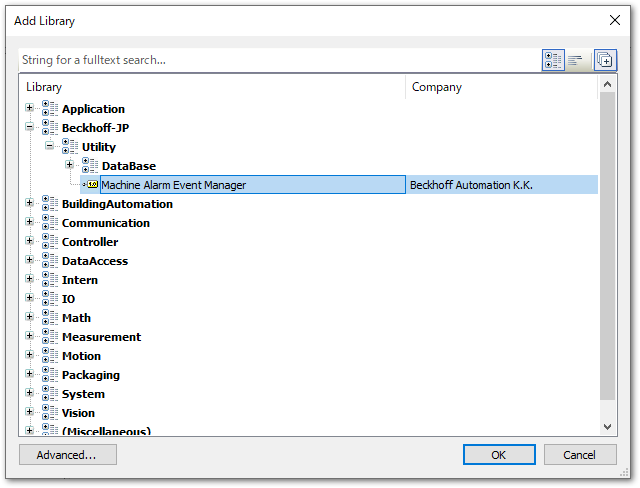
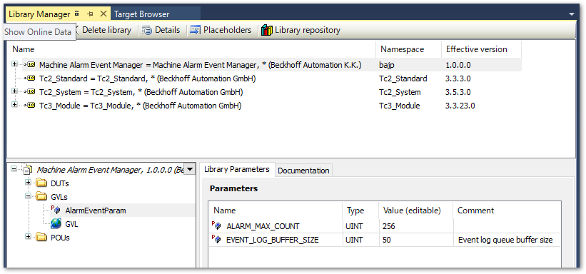

# アラーム管理ライブリ

前節で作成したイベントクラスを通じて、次の機能を提供するファンクションブロックをパッケージしたライブラリを提供しています。

* イベントの発生、装置オペレータによる確認、解除などの各イベントに対するインターフェース

    数行のプログラム記述でアラームの発生、解除を統一的な方法で実装できます。

* すべてのユーザイベントから、重要度ごとに未確認アラームの有無、発生中アラームの有無の状態を集計する機能

    タワーランプやブザー等で新規アラームが発生した事を通知したり、HMI上の表示制御を行うことができます。

```{admonition} 公開先のGithubリポジトリ
:class: info 

以下のリポジトリにて公開しています。プルリクエストをお待ちしています。

[https://github.com/Beckhoff-JP/MachineAlarmManagement](https://github.com/Beckhoff-JP/MachineAlarmManagement) 

```

## ライブラリのインストールとパラメータ設定

1. ライブラリの取得

    Githubリポジトリからクローンしたプロジェクトを開き、{ref}`library_making_basic` の手順に従ってライブラリの作成とインストールを行います。

    インストールしたライブラリを追加する際のカテゴリディレクトリは、`Beckhoff-JP/Utility/Machine Alarm Event Manager`です。

    {align=center}

2. ライブラリパラメータの設定を行います。

    インストール後はライブラリを開いて、GVLs以下の`AlarmEventParm`を開いて次のパラメータ設定を行ってください。

    ALARM_MAX_COUNT
        : 登録するアラーム数を設定します。後ほど説明しますが、FB_AlarmCalculator内に登録するFB_Alarmインスタンスを格納する配列サイズを指定します。登録するFB_Alarmインスタンスがここで設定する値より多ければ、このサイズを超えるFB_Alarmインスタンスの集計ができなくなります。また、過大なサイズを指定すると、毎サイクル行われる集計演算の負担が大きくなります。

    EVENT_LOG_BUFFER_SIZE
        : {ref}`chapter_database_coupling` のとおり、本ライブラリにはTF6420を使ったデータベース連携によりアラームの発生、解除を記録する機能を内包しています。この機能では、複数のアラームが同時に発生、解除した際に順次データベースで処理を行うたキューバッファ機構が用意されています。このデータバッファサイズを指定します。初期値50で特に変更は不要です。アラームの発生、削除の状態変化が同時に50個以上発生する場合は必要に応じて大きな値を設定してください。
        {align=center}

## PLCへの実装方法

まず、宣言部は以下の通り実装します。

FB_AlarmCalculatorインスタンスの定義
    : 集計する単位ごとにインスタンスを定義します。通常は一つで十分です。

FB_Alarmインスタンスの定義
    : イベントの数だけ登録します。宣言時には次の引数を設定してください。

    : TC_Events.<<イベントクラス名>>.<<イベント名>>
        : 登録したイベントを指定します。
    
    : FB_AlarmCalculatorインスタンス
        : 集計用ファンクションブロックインスタンスを指定します。これにより本アラームが集計対象として登録されます。


```{code-block} iecst
:caption: 宣言部

PROGRAM MAIN
VAR
   // Alarm calculation function block
   alarm_calculator    : FB_AlarmCalculator;	
   // each alarm instances
   fbTestAlarm1     : FB_Alarm(TC_Events.UserEventClass.test_alarm1, alarm_calculator);
   fbTestAlarm2     : FB_Alarm(TC_Events.UserEventClass.test_alarm2, alarm_calculator);
    :
    // アラームの数だけ定義。
END_VAR
```

プログラム部は宣言したFB_Alarmインスタンス名に対して次の入力変数を設定してください。

 bEvt
     : センサや外部機器・モジュールのエラー状態など該当イベントの発生条件を定義します。
 
 bLatch
     : TRUEにすると、bEvtがOFFになってもアラームはアクティブな状態を保持し、bConfirm > bReset されるとリセットされます。FALSEの場合は、bEvtと同期してアラームはリセットします。
 
 bConfirm
     : 一瞬だけTRUEにすると、イベントが確認済み状態になります。
 
 bReset
     : bLatchがTRUE設定の際、アクティブなアラームに対してこの入力を一瞬だけTRUEにすると、リセットを試みます。bEvtがFALSEであればリセットされます。

また、登録したユーザイベントの表示テキストに引数が定義されている場合は、次の書式で値を渡すことができます。`***`の部分は渡す値の型名を表すメソッドとなっており、その引数に値を渡します。

```{code-block} cpp
:caption: 引数の定義方法
:name: program_event_logger_arguments

<<FB_Alarmインスタンス>>.ipArguments.Clear().Add***(型対応した1個目に渡す値).Add***(型対応した2個目に渡す値)...
```

最後に、`FB_AlarmCalculator`のインスタンスをサイクル実行します。このインスタンスには次の二つのメソッドがあり、全体のアラームイベント状態を集計した結果を返します。

is_raised
    : severityの引数に`TcEventSeverity.<<重大度>>` を指定し、その指定した重大度以上の発生中アラームが有る場合にTrueを返す。

is_unconfirmed
    : `severity`の引数に`TcEventSeverity.<<重大度>>` を指定し、その指定した重大度以上の未確認アラームが有る場合にTrueを返す。

```{code-block} iecst
:caption: プログラム部
:name: program_event_logger_example

(* 変数定義した各アラームFBを実装 *)
fbTestAlarm1(
    bEvt := error_condition_1, // Activate event by alarm condition.
    module_name := 'General', //module_name
    bLatch := FALSE,   // Event will be stay active state after "bEvt" is fall down.
    bConfirm := confirm_button_input, // Confirmation operation.
    bReset := reset_button_input // Reset operation.
);

fbTestAlarm2(
    bEvt := error_condition_2, // Activate event by alarm condition.
    module_name := 'Loading module', //module_name
    bLatch := FALSE,   // Event will be stay active state after "bEvt" is fall down.
    bConfirm := confirm_button_input, // Confirmation operation.
    bReset := reset_button_input // Reset operation.
);

// 引数の設定
fbTestAlarm2.ipArguments.Clear().AddString('WARN').AddInt(314);
     :
     :
     :

(* 
   アラーム集計FB
   重大度に応じてアラームの有無、未確認アラームの有無を集計することができる。これによりアンドン、タワーランプ、ブザー等の制御を行うことができる。
*)

alarm_calculator();

// 発報中のアラームの有無

is_error := alarm_calculator.is_raised(severity := TcEventSeverity.Warning); // Warningレベル以上の重大度のアラーム有無をチェックし、あればis_errorをTrueにする。

// 未確認アラームの有無

is_unconfirm := alarm_calculator.is_unconfirmed(severity := TcEventSeverity.Warning); // Warningレベル以上の重大度の未確認アラーム有無をチェックし、あればis_errorをTrueにする。

// 他の重大度で異なる振る舞いの集計が必要な場合は、`is_raised_event`, `is_unconfirmed_alarm` メソッドに最低重大度を指定して集計結果を取り出してください。
```

```{admonition} アラーム集計に必要な演算負荷
:class: note

本ライブラリでは、アラーム集計に必要な演算負荷を最小化するため次の通り工夫しています。

* 全アラームの状態走査は1サイクルに1度だけ行われます。
* 重大度毎に状態インデックスが用意されています。走査時には個々のアラームの状態インデックス状態を更新しています。
* `is_raised_event`や`is_unconfirmed_alarm`メソッドによるクエリ（問い合わせ）時は、全アラームを走査するのではなく、状態インデックスを走査することで演算負荷を軽減しています。
```