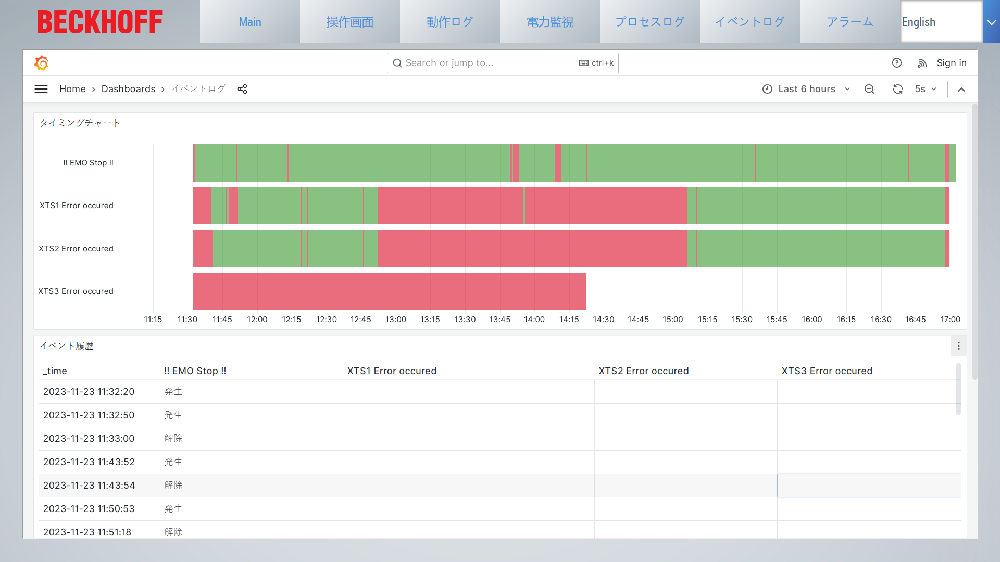
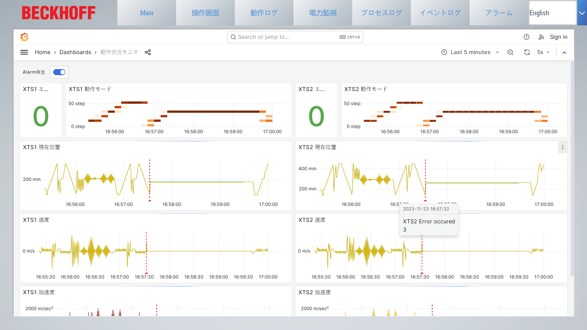

(chapter_database_coupling)=
# データベース連携

TF6420 データベースサーバを通じた時系列データベースへの記録機能は、{ref}`chapter_influxdb` の章でご紹介しています。ここで用いるPLCのライブラリ {ref}`section_influxdb_plc_library` と連携し、イベントの発生・解除時とその時刻、テキストをデータベースへ記録させることができます。

これにより、次図の通りGrafana等のオープンソース可視化ライブラリにアラームの発生、解除の推移をバーグラフで表示したり、簡単にイベント履歴をCSVへのエクスポートをブラウザ上から操作いただくことが可能になります。

{align=center}

{ref}`chapter_influxdb` 時系列データベースは、EtherCATで収集した高速高密度データをその密度のまま記録し、ブラウザに可視化することができます。ここに、機械系のアラームイベントを関連付けて表示させると故障停止に至った原因をいち早く特定し、即座に是正することが期待できます。

たとえば、次図の例ではモーションの位置、速度などの時系列データ上にアラームイベントが発生した時点をマークしています。無人で稼働している装置が異常停止した場合でも、どのような状況で停止したのか現場で後から把握することができます。

{align=center}

# 実装方法

{ref}`chapter_influxdb` をお読みの上、`tc_influxdb_client` ライブラリを読み込んでください。

```{code-block} pascal
:caption: 定義部

PROGRAM MAIN
VAR_GLOBAL CONSTANT
	// Database ID
	TARGET_DBID : UINT := 1;
END_VAR
VAR
	(* For IoT *)
	// Cycle record data
	fbInfluxDBRecorder	:RecordInfluxDB(DBID := TARGET_DBID);
	// For database export from event logger
	data_buffer		: ARRAY [0..AlarmEventParam.EVENT_LOG_BUFFER_SIZE - 1] OF EventActivityFields;
	queue_controller	: BufferedRecord(ADR(data_buffer), fbInfluxDBRecorder);		// record controller
	alarm_db_exporter		: FB_AlarmDBExporter(ADR(queue_controller));
END_VAR
```

```{code-block} pascal
:caption: プログラム部

// Database driver by TF6420
fbInfluxDBRecorder();

// Initialize alarm event calculatror and IoT service
alarm_db_exporter.machine_name := 'Roll Dice demo';
alarm_calculator.p_exporter := alarm_db_exporter;
```