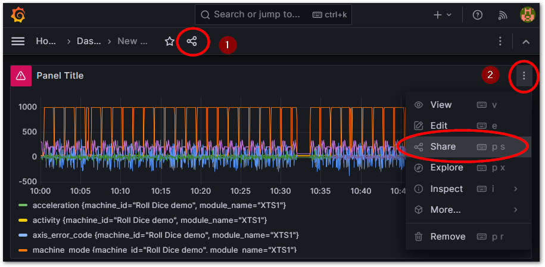
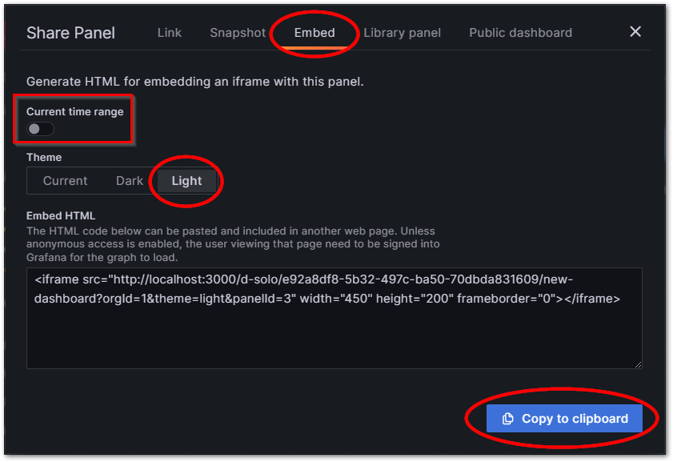
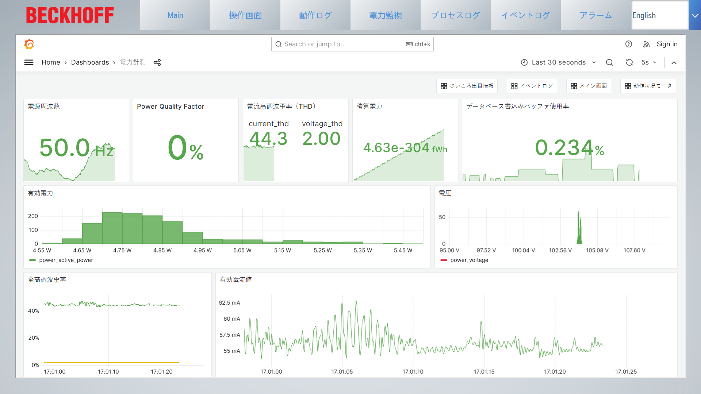

# TwinCAT HMIへの埋め込み

次の手順でGrafanaのダッシュボードをTwinCAT HMIのiFrame部品に統合することができます。

## Grafanaを外部から参照できるように設定

`C:\Program Files\GrafanaLabs\grafana\conf` 以下に、 `defaults.ini` を編集し、以下の通り変更します。編集が終わりましたら保存し、Windowsのサービスから、grafanaをリスタートしてください。

``` ini
#################################### Security ############################
[security]
 :
# set to true if you want to allow browsers to render Grafana in a <frame>, <iframe>, <embed> or <object>. default is false.
allow_embedding = true <- false

[auth.anonymous]
# enable anonymous access
enabled = true <- false

# specify organization name that should be used for unauthenticated users
org_name = beckhoff.co.jp <- Specify your organization name.

# specify role for unauthenticated users
org_role = Viewer
```

## 埋め込みURLを取得

Grafanaより埋め込みHTMLを抽出します。ダッシュボード全体、または、個々のパネル、何れかが埋め込み部品として取得可能です。それぞれ次の図に従った方法で取得してください。

{align=center}

1. ダッシュボード全体を埋め込む場合

    図の丸1のアイコンをクリックします。次図の設定画面が現われますので、`Link` タブ、および、赤枠に示す設定を行って現われるURL文字列をコピーしてください。

    {align=center}

2. 特定のパネルを埋め込む場合

    パネル右上にある縦の3つのドットのアイコン（図の丸2）のアイコンをクリックし、コンテキストメニューからShareを選びます。次図の設定画面が現われますので、`Embed` タブ、および、赤枠に示す設定を行って現われるiFrameタグ文字列をコピーしてください。

    {align=center}

## HTMLファイルの作成

HMIに読み込ませるHTMLファイルを作成します。以下の雛形を基に作成します。個々のパネルから出力した場合は、iFrameを含むタグとなっていますが、ダッシュボード全体からの場合はURLのみとなっています。いずれも下記のとおり設定してください。

iFrameのURL, 埋め込み枠サイズの設定
    : `<iframe src="" width="" height="" frameborder="1">`

      Grafanaから取り出したURLを`src`に、HMIのiFrame部品に設定した枠の大きさを`width`, `height`にそれぞれ設定します。`height`はそのまま枠のサイズのままを設定するとスクロールバーが現われてしまいます。少し小さめ（1080pxであれば1000px程度）の値に設定してください。

URL設定時のオプション
    : ホスト名（IPアドレス）部
        : HMIを外部からアクセスする可能性がある場合は、そのネットワークで参照可能なIPアドレスとしてください。localhostや127.0.0.1と設定すると、HMIサーバと同一ホスト上のブラウザからアクセスした場合しか表示できなくなります。

    : オプション `&from=now-30s`
        : 表示時間範囲設定。`now-(1-59)[h|m|s]` にて現在を起点とした過去の指定時間分が表示時間範囲となります。大きな範囲を設定するとクエリに過大な負荷を生じますのでご注意ください。

    : オプション `&refresh=5s`
        : 更新周期。設定する時間ごとにデータを抽出、グラフ再描画を行います。

    : オプション `&theme=light`
        : 表示テーマを選択します。デフォルトはdarkですが、HMIのデフォルトデザインであればlightの方がマッチするでしょう。

``` html
<HTML>
<head>
    <style type="text/css">
        .wrap {
            display: flex;
            justify-content: center;
        }
    </style>
</head>
<body>
    <div class="wrap">
        <iframe src="http://192.168.1.10:3000/d/d558923b-50ba-4068-abda-46bc2e1eecbc/e99bbb-e58a9b-e8a888-e6b8ac?orgId=1&from=now-30s&refresh=1s&theme=light"
                width="1920" height="1000" frameborder="1"></iframe>

    </div>
</body>
</HTML>
```

## HMI画面の編集

以下の通り設定します。

{align=center}

1. `Components`というフォルダを作成し、先ほど作成したHTMLファイルをここに保存します。
2. 編集対象のContentを選択し、編集画面を表示する。
3. ToolBoxからiFrameを選択してContent上に配置する。
4. iFrameの配置位置、`width`, `height`の値を調整し、前ステップの項目でiFrameのサイズとして設定した表示エリアに合わせたサイズを設定する。
5. Common-Srcの設定項目に、`Contents/ファイル名.html` を設定する。

以上を実行した上で、Live-viewを確認いただき、Grafanaのダッシュボード部品が表示されることを確認してください。成功すると、次の通りパネル単体の埋め込み、また、ダッシュボード全体の埋め込み表示可能です。

{align=center}


{align=center}