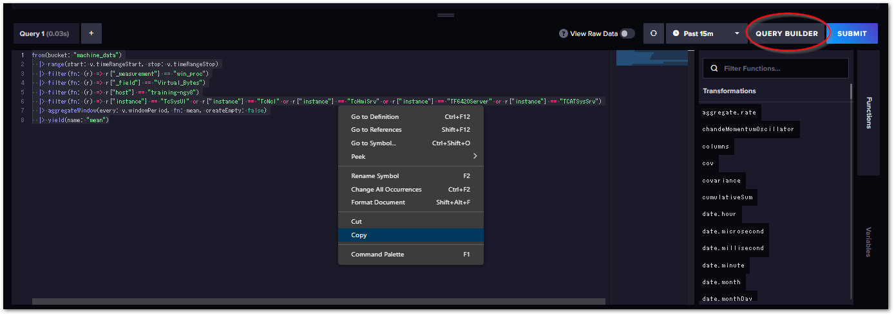
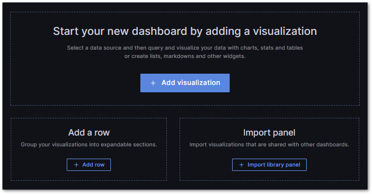
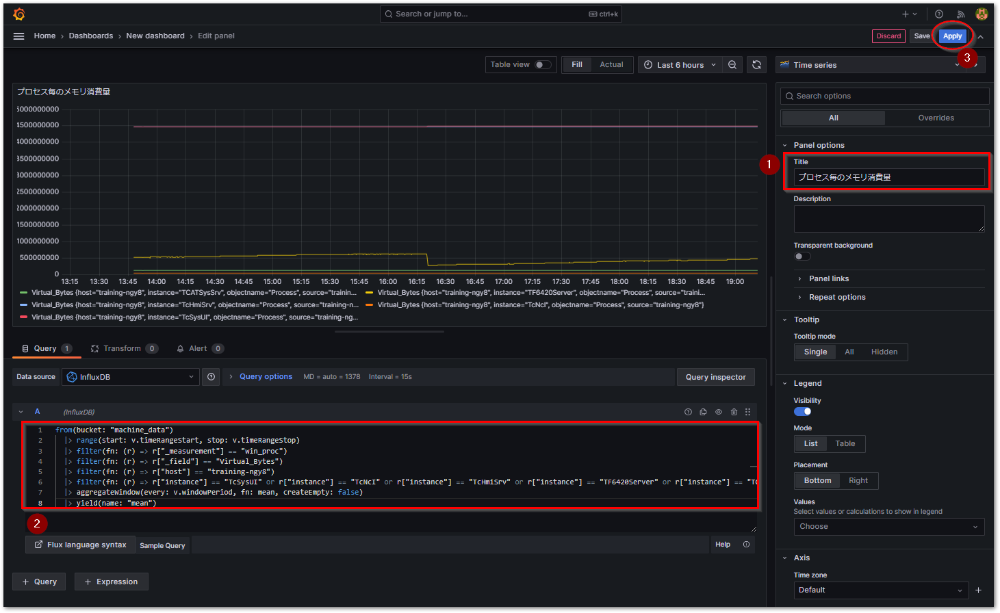
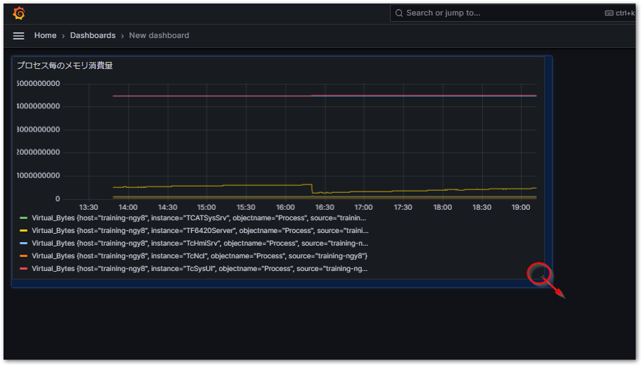
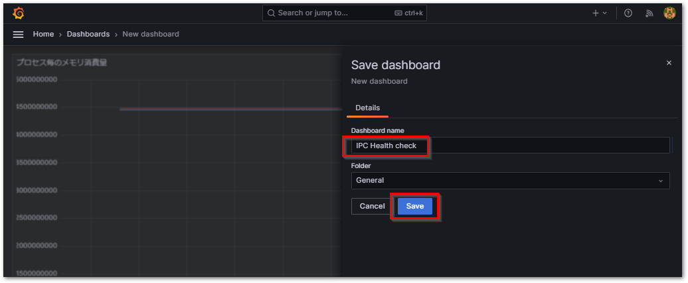
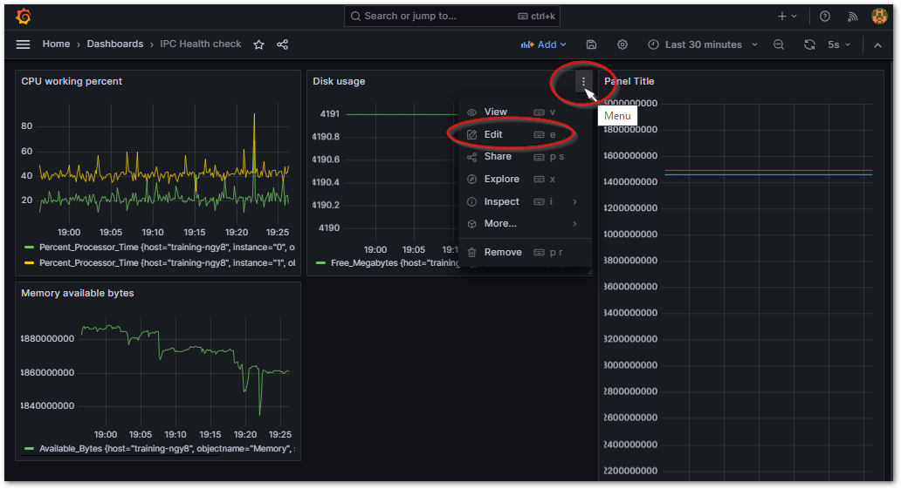

(section_grafana_dashoboard)=
# Grafanaでダッシュボード作成

Grafanaは、より見やすく操作しやすいダッシュボード作成のための豊富な機能を備えた可視化WEBアプリケーションです。

まず、InfluxDBをデータソースとして登録し、そこからInfluxDBへクエリを発行してダッシュボードに各種可視化グラフ表示を行います。

このグラフは、マウス操作等で拡大縮小、軸の選択などが対話的に可能になっており、ブラウザさえあれば、スマートフォンやタブレット等を通じて同様の操作が可能になっています。

## データソースの設定

1. Grafanaにログインし、メニューから`Connection`を選択します。

    {align=center}

2. Searchフィールドから、 `influxdb` と入力する。InfluxDBコネクタが検索されるので、クリックする。

    {align=center}   {width=200px align=center}

3. Create a InfluxDB data source ボタンを押す。

    {align=center}

4. 次の設定項目を埋めます。

    ```{csv-table}
    :header: 設定項目, 設定値
    :widths: 2,8
    Query Language, Fluxを選択
    URL, Docker compose 内部のネットワークにより、Grafanaからは、`influxdb` という名称で、influxdbのホスト名にアクセスすることができます。よって、 `http://influxdb:8086` と入力します。
    Basic Auth Details, データベース管理者のユーザ、パスワードを入力します。
    InfluxDB Details, "Organization, API Token, Default Bucketを入力します。 "
    ```

    {align=center}

    Save & Testを押すと、設定を保存するとともに、`datasource is working` としたコメントで接続成功を確認することができます。

    {align=center}


## ダッシュボードの作成

Grafanaでダッシュボードを作成するために、InfluxDBからデータを抽出し、ボード上に可視化グラフのパネルを配置します。

まずはInfluxDBからクエリを作成し、そのFluxスクリプトによるクエリ文を取得します。これをGrafanaのダッシュボードパネルに設定することで、InfluxDBから抽出したデータを可視化グラフとして描画させることができます。

1. InfluxDBのWEBから、{numref}`figure_script_editor_view` のように{ref}`figure_script_editor_view`にて目的のデータクエリを作成して確認します。

    {align=center}

    {align=center}

2. 取り出したflux言語のクエリを、Grafanaのダッシュボードのデータソースに

    {align=center}

3. Newボタンを押して、新しいダッシュボードを生成します。つづく画面で`Add visualization`ボタンを押してください。

    {align=center}
    {align=center}

4. 現われたVisualization編集画面の下部に、さきほどコピーしたfluxクエリ言語を貼り付けます。また、パネルのタイトルを入力し、Applyを押します。

    {align=center}

5. ダッシュボードにVisualizationが生成されます。大きさを調整するためには、右下（赤丸部）をドラッグして調整します。

    {align=center}

6. これまでの手順を繰り返して必要なパネルを全て配置し終わったら、フロッピーディスクアイコンをクリックしてボードを保存します。

    {align=center}

7. Visualizationの名前を付けて保存します。

    {align=center}

8. Homeページの Dashboards に追加されます。

    {align=center}


## Visualization の編集

Visualization を編集する際は、Visualizationの右上にカーソルを合わせて出現するメニューアイコンをクリックし、Editを選択してください。

{align=center}

```{warning}
パネル編集した結果は、ダッシュボードを上書き保存（フロッピーディスクアイコン）しなければ編集内容が失われます。
```

## Visualizationでプロットされている値をCSVに出力する

Visualizationでは、マウス操作により可視領域をズームイン、ズームアウト、前後シフトさせることができます。その表示中のデータをCSVへエクスポートするには次の手順に従ってください。

1. Visualizationの右上にカーソルを合わせて出現するメニューアイコンから、 `Inspect`
 > `Data` を選択します。

    {align=center}

2. 現在表示されているデータが表形式で一覧されます。Data Optionsを次の通り設定したあと、`Download CSV` ボタンを押すと、CSVファイルが出力されます。

    ```{csv-table}
    :header: 設定項目,　説明, 推奨設定, 推奨設定の説明
    :widths: 1, 4, 1, 4

    Show data frame, どの列を出力するか選びます。, Series joined by time, 全データを時刻をキーとして横持ちテーブルで出力します。欠損データは直近の前回データが埋め込まれます。
    Formatted data, 時刻列の表現方法を切り替えます。ONにするとTIMESTAMP型の文字列（YYYY-MM-DD hh:mm:ss.000）で出力され、OFFにするとマイクロ秒精度の13桁のUNIX時刻で出力されます。, OFF , UNIX TIMEから変換した方が汎用性があります。
    Download for Excel ,先頭行にCSVの書式情報が付加されます。, ON, Excelに適した形式で出力されます。
    ```

    {align=center}

3. Data options の `Formatted data` をOFFにすると、マイクロ秒精度（13桁）のUNIX時刻で表現されます。Excelではこの値を次の通り関数を組む事で、Excelのシリアル値に変換させることができます。

    ``` excel
    = A2/(1000*24*60*60) + DATE(1970,1,1)
    ```
    
    これで得られる時刻はUTC（協定世界時）ですので、日本時間へ変換するには次の関数となります。

    ``` excel
    = A2/(1000*24*60*60) + DATE(1970,1,1) + TIME(9,0,0)
    ```

    ```{tip}
    時間列をミリ秒精度まで表現したい場合は、セルの書式設定を`yyyy/m/d hh:mm:ss.000` としてください。
    ```