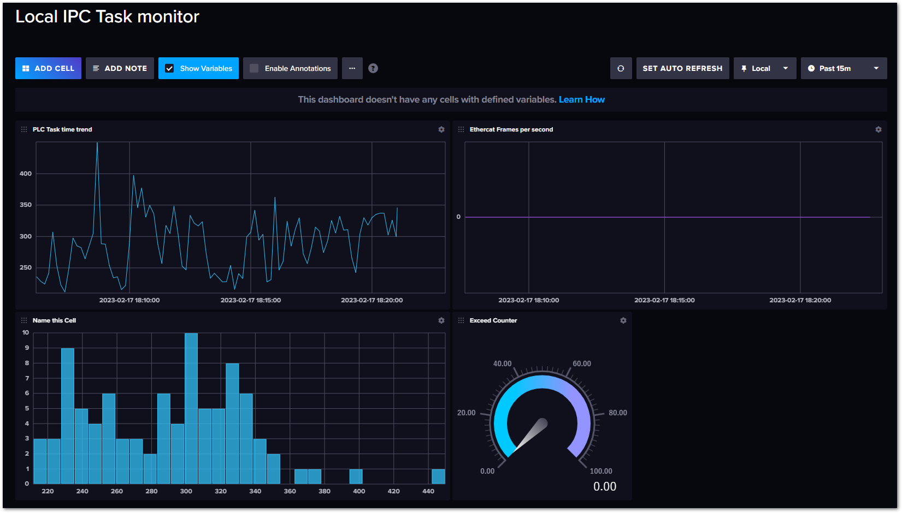

(chapter_influxdb)=
# InfluxDB

influxDBは単にデータを収集するだけではなく、集計演算機能、異常値監視機能、期限切れデータのダウンサンプリングや自動削除機能、書き込み読み込みスループットの速さ、また次図のようなWEBアプリケーションによるダッシュボードでデータを簡単に可視化できるオープンソースの優れたデータベースです。

{align=center}

これにより、EtherCATにより高速周期で収集されたデータを分析・抽出し、必要なデータを永続化するまでの前処理を一気通貫で実行できます。

さらにはIPCのWindows (TM) のプロセスやパフォーマンス、IPCのハードウェア状況を収集できるTelegrafというソフトウェアや、influxDB内のデータに異常値を検出した際にアラートを出したり、ETLジョブといった上位サーバが求める形のデータに整形してロードするスクリプトが書ける Kapacitor というソフトウェアと連携（TICKスタック）が可能になっています。このため、エッジ側でデータ収集、抽出、加工、ロードといった前処理までをひとつのコントローラで完結できます。

{align=center}

制御サイクルレベルの高密度データをとりあつかう場合、通常はPLCメーカが提供する専用のハードウェアやソフトウェアによるデータ処理が必要となります。ここからデータを取り出し、抽出・加工してから有用なデータをクラウドやサーバにロードするといった手間のかかる作業を自動化させることが困難です。

TwinCATではこのような密度の高いデータをInfluxDBというオープンソース上のデータ基盤に展開することが可能になり、データ活用に秀でたPythonをはじめ、JavaScript, Goといったクラウドと親和性の高い技術との組合せが非常に容易です。

```{toctree}
:hidden:

setup_influxdb_windows
setup_docker
setup_tf6420_influxdb
tf6420_write_influxdb
visualization
grafana
embed_grafana_HMI
query_pattern
telegraf
```