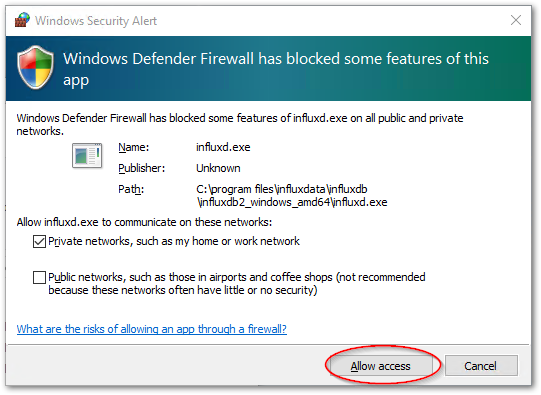
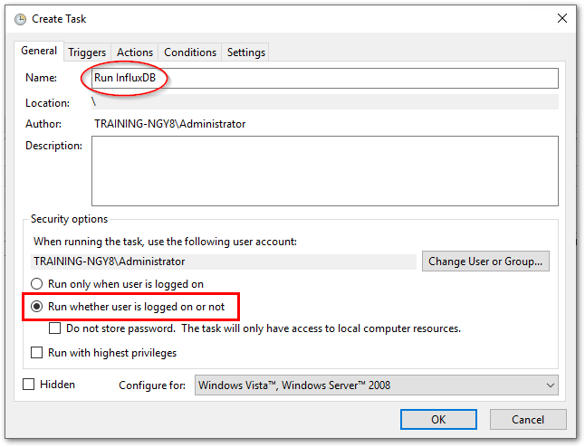
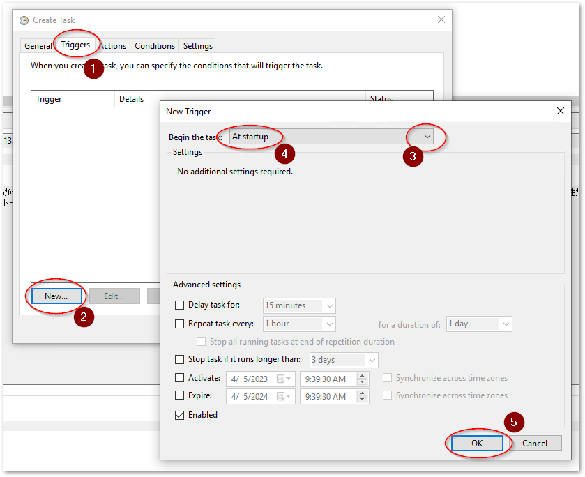
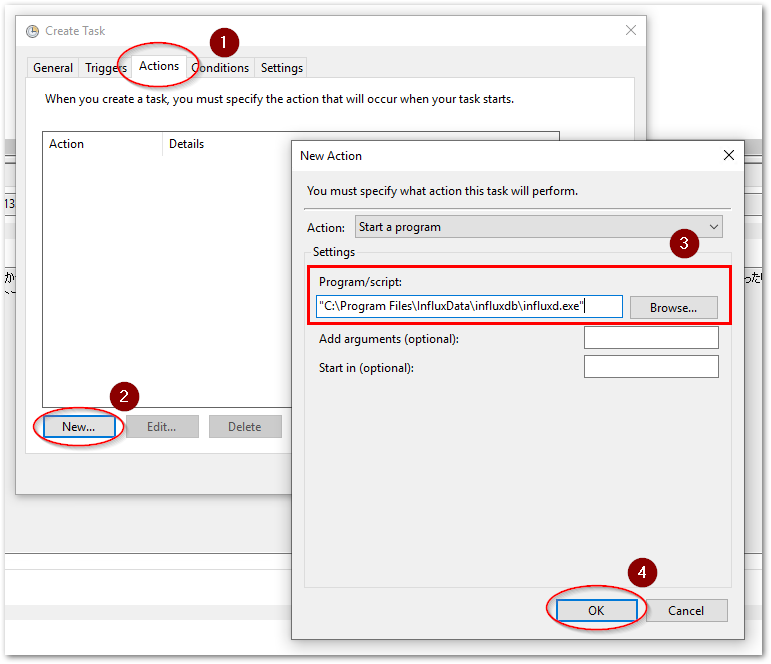

# InfluxDBのセットアップ（手動インストール）

この章では、influxDBのみを手動でインストールする方法について説明します。IPCのWindows領域へインストールする際などは、この方法をご利用ください。

```{admonition} 警告
:class: warning

* influxDBはIPCのWindowsへインストールする事も可能ですが、使い方によっては多くのメモリサイズを使い、クエリ実行に多くのCPUリソースを消費します。このため、XAR上のTcCOMのタスク実行パフォーマンスに影響が出ないことを十分に検証してください。影響がある場合は、別のコンピュータ上にinfluxDBをインストールしていただくことをお勧めします。この場合もできるだけ高速なEthernetネットワークに接続してください。
* 別のサーバへインストールされる場合は本節は実行せず、{ref}`section_setup_docker` をご覧ください。
```

## influxDB のインストール

1. InfluxDB oss のダウンロード

    以下のURLからWindows版のInfluxDBをダウンロードします。

    [https://docs.influxdata.com/influxdb/v2.6/install/?t=Windows](https://docs.influxdata.com/influxdb/v2.6/install/?t=Windows)

2. Program Files以下に、 `InfluxData` フォルダを作成し、ダウンロードしたzipファイルのを解凍してできた`influxdb2-2.6.1-windows-amd64` フォルダごとこの中に入れ、`influxdb` という名前にフォルダ名を変更します。

   ``` powershell
   > Expand-Archive .\influxdb2-2.6.1-windows-amd64.zip -DestinationPath 'C:\Program Files\InfluxData\'
   > mv 'C:\Program Files\InfluxData\influxdb2-2.6.1-windows-amd64' 'C:\Program Files\InfluxData\influxdb'
   ```

   出来上がったプログラムの配置場所は以下の通りとなります。

   ```
   > C:\Program Files\InfluxData\influxdb\influxdb.exe
   ```

3. PowerShellを立ち上げて、インストール先のディレクトリに移動し、influxd.exeを実行します。


   ```shell
   > C:\Users\Administrator> cd "C:\Program Files\InfluxData\influxdb"
   > C:\Program Files\InfluxData\influxdb> .\influxd.exe
     :
     <<サーバ動作時のコンソールログが出現し、最後にポート8086のhttpでListenしていることを示す行を表示する。>>
     :
   ****-**-**T**:**:**.******Z     info    Listening       {"log_id": "0g64ikfW000", "service": "tcp-listener", "transport": "http", "addr": ":8086", "port": 8086}
   ``` 

4. Firewallがこのプログラムによるポート受信を許可してよいか確認ダイアログが現れるので、 Allow ボタンを押す

   {align=center w=380px}

5. ローカルブラウザを立ち上げて、 `http://localhost:8086` へアクセスしたら Welcome to InfluxDB の画面が現れるか確認します。

6. ブラウザからサーバへアクセスできることを確認したら、一旦Powershellを閉じてプログラムを強制終了します。続いて、次の項の通り自動起動設定を行います。

## 自動起動設定

1. Windows の Schedule tasks を起動します。
2. `Task Scheduler Library` を右クリックし、 `Create Task...` を選びます。

   {align=center w=350px}

3. Nameに `Run InfluxDB` を入力し、`Run whther user is logged on or not` を選択する。

   {align=center w=400px}

4. Triggersタブを開き、 `New...` ボタンを押す。現れた New Trigger ウィンドウのBegin the task: フィールドから `At startup` を選択してOKボタンを押す。

   {align=center w=500px}

5. Actionタブを開き、`New...` ボタンを押す。現れた New Action ウィンドウの Program/script フィールドに、`Browse...` ボタンを押して、前項でインストールした influxd.exe を選択し、最後にOKボタンを押す。

   {align=center w=500px}

6. Settingタブを開き、`Stop the task if it runs longer than:` の項目のチェックを外す。

   {align=center w=400px}

7. 以上全て設定し終わったらOKボタンを押して、コンピュータを再起動します。再起動後、ブラウザへアクセスして Welcome to InfluxDB 画面が現れたら自動起動の設定は成功です。

## InfluxDBのセットアップ

5. IPCのIPアドレス（`***.***.***.***`）を調べ、IPCに接続した外部PCから `http://***.***.***.***:8086/` にアクセスする。

   ```{admonition} 参考
   IPC内のブラウザからアクセスする場合は、 http://localhost:8086/ を指定してアクセスしてください。
   ```

   最初に以下のような画面が現れます。 GET STARTED ボタンをクリックしてください。

   ```{image} assets/2023-02-19-15-19-18.png
   :width: 380px
   :align: center
   ```

5. 最初にアカウント情報と組織とバケット（データベース名）を設定します

    * Username, Password

       Bucketへアクセスするためのユーザ名とパスワードを設定します。

    * Organization Name

       influxDBでは、後述する Bucket を組織単位に作成します。組織名を入力します。あなたが所属する組織のドメイン名を入力するのが最適です。

    * Bucket Name

       influxDBでは、データベース名のことを Bucket とよびます。初期に作成する Bucket 名を入力します。

   ```{image} assets/2023-02-19-15-22-53.png
   :width: 380px
   :align: center
   ```

6. {numref}`initial_data_loading` で設定は完了です。次の3つから続く作業を選んでください。

   `QUICK START`

      InfluxDB独自にサンプルデータを作成した状態でbucketが初期化され、初期設定は終了します。不要なレコードを作りたくない場合はこのメニューを選ばないでください。

   `ADVANCED`

      続いてデータ収集エージェントであるTelegrafの設定を行う画面に遷移します。今回はPLCからデータ収集するため、このメニューは選択不要です。必要であれば設定に進んでください。

   `CONFIGURE LATER` 
   
      何もせずにここで終了します。

   ```{figure-md} initial_data_loading
   {width=380px align=center}
   
   初期設定完了画面
   ```

7. メイン画面が現れるので、最初にbucketを新規に作成します。左側メニューの上から2番目をクリックして現れるメニューから`Buckets`を選びます。

   ```{image} assets/2023-03-06-17-28-28.png
   :width: 300px
   :align: center
   ```

   現れた画面で`CREATE BUCKET` ボタンを押します。

   ```{image} assets/2023-03-06-17-36-15.png
   :width: 500px
   :align: center
   ```

8. bucket名と記録データの永続期間（リテンションポリシー）を設定します。初期値はNEVER（削除せず無制限に記録する）となります。

   ```{image} assets/2023-03-06-17-40-56.png
   :width: 300px
   :align: center
   ```

   あるいは、ディスク容量に限りがある場合、次の通り有限期間を設定できます。この設定期間を経過すると、古いものから順に削除してデータを消去します。

   ```{image} assets/2023-03-06-17-43-12.png
   :width: 300px
   :align: center
   ```

   ```{admonition} Shared group duration設定にご注意
   :class: warning

   InfluxDBがファイルシステムにデータを書き込む際、Shared groupという単位でファイル化します。Shared groupは、初回のBucket作成時のリテンションポリシーにおける削除期間の設定により自動的に設定されます。一度Bucketを作成すると、このShared group durationの期間以下にリテンションポリシーのデータ保存有効期間に設定変更することができなくなります。
   
   * 最初に無制限を含む6か月より長い期間設定で作成したBucketは、7日未満の保存有効期間設定に変更できません。
   * 最初に2日以上の期間設定で作成したBucketは、1日未満の保存有効期間設定に変更できません。

   ディスク容量の都合で小さい有限期間設定を行いたい場合は、最初に短い期間の保存有効期間設定を行ってください。

   Shared group durationに関する情報は以下をご覧ください。
   [https://docs.influxdata.com/influxdb/v2.6/reference/internals/shards/#shard-group-duration](https://docs.influxdata.com/influxdb/v2.6/reference/internals/shards/#shard-group-duration)

   ```