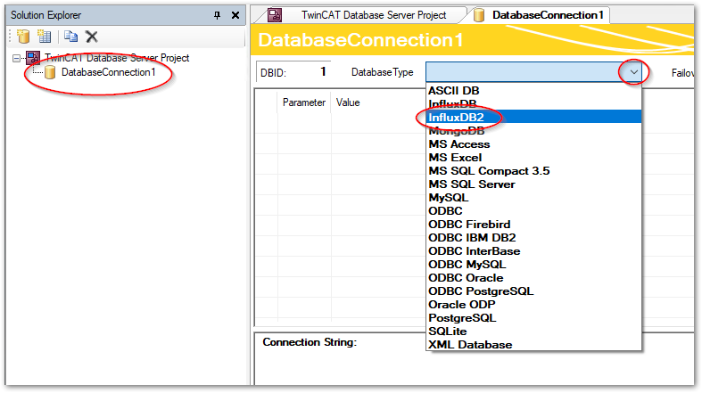
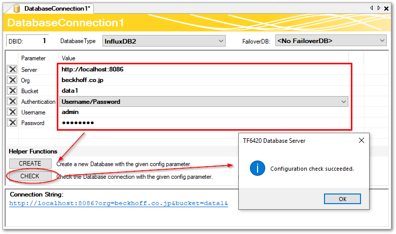

## TF6420 のセットアップ

```{admonition} 注意
:class: info

TF6420はXARが稼働しているIPC上にインストールしてください。
```


1. 以下のサイトからTF6420をダウンロードし、ターゲットIPCに TF6420 をインストールしてください。

    TF6420のダウンロード先
    : [https://www.beckhoff.com/ja-jp/products/automation/twincat/tfxxxx-twincat-3-functions/tf6xxx-connectivity/tf6420.html](https://www.beckhoff.com/ja-jp/products/automation/twincat/tfxxxx-twincat-3-functions/tf6xxx-connectivity/tf6420.html)


2. TwinCATプロジェクトを立ち上げて TF6420 を有効にしてください

    ターゲットIPCに接続したTwinCAT XAE プロジェクトから、TF6420 のライセンスを有効にして Active configuration してください。

3. TF6420 Configuratorを起動します

    ```{image} assets/2023-02-19-15-45-14.png
    :width: 200px
    ```

4. Solution ExplorerのTwinCAT Database Server Projectを右クリックし、ポップアップメニューから New DB Connection を選択します。

    ```{image} assets/2023-02-19-16-06-01.png
    :width: 350px
    ```

5. DatabaseConnection1という名前のデータベースが新たに作成されます。これをクリックすると、右のウィンドウにその設定画面が現れます。Datbase Typeから influxDB2 を選択してください。

    

6. セットアップしたinfluxDBの最初の設定にしたがって必要項目を入力します。

    Server
    : `http://<<influxDBをインストールしたコンピュータへのIPアドレス>>:8086/`

    Org
    : influxDBに初期設定したOrganization名

    Bucket
    : influxDBに初期設定したBucket名

    Authentication
    : Username/Password

    Username, Password
    : influxDBに初期設定したユーザ名とパスワード

   

   全て埋め終わったら `CHECK` ボタンを押してください。すべて正しい値であれば接続成功のポップアップウィンドウが出現します。

   ```{admonition} 注意
   :class: warning
   XAEにてTF6420のライセンスを有効していない場合、この接続テストで接続に失敗します。
   ```

7. 最後に、File メニューから `Active Configuration` メニューを選択することで設定が反映されます。正しく反映されたらウィンドウ枠の左下にメッセージが表示されます。

    