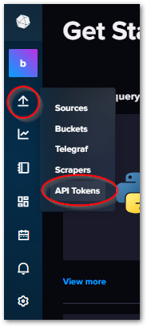
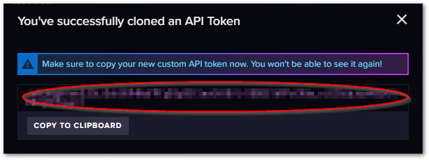
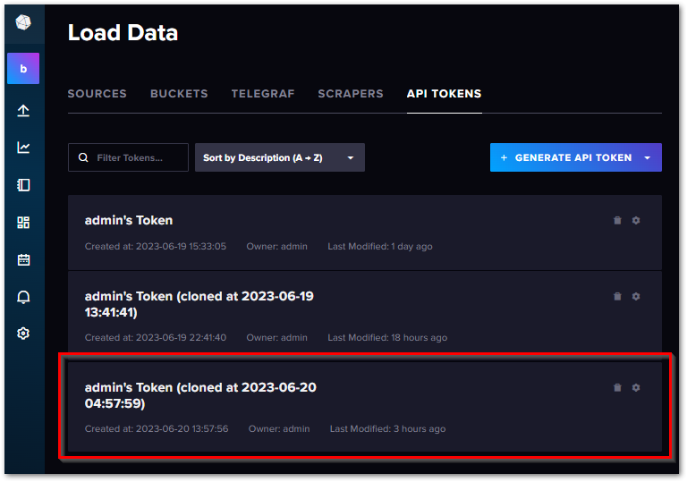
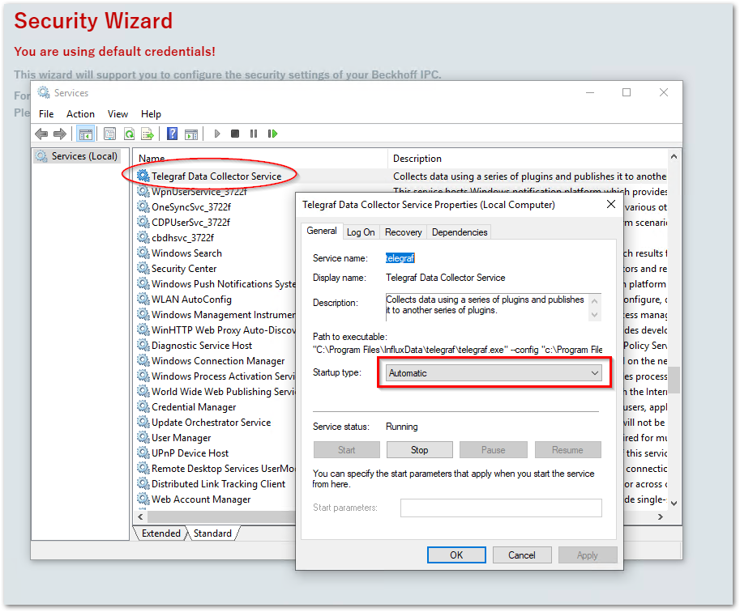

# Telegraf を用いたIPCのWindowsメトリクス計測

Telegrafは、さまざまなデータ収集するデータハブエージェントです。このエージェントにはさまざまなデータを収集する機能がありますが、このうちWindowsのパフォーマンスデータを収集する機能を使って、InfluxDBへ記録する方法について説明します。

# IPCへのTelegrafのインストール

```{note}
telegrafは、Beckhoff IPC上にインストールします。telegrafはWindows上のさまざまな稼働データを収集して、influxDBへ記録する機能を果たします。

influxDBは別の専用サーバに設置していただく場合でも、telegrafはネットワーク経由でさまざまなメトリクスを記録することができます。よって、工場内の全てのIPCに本手順書によるtelegarfをインストールしておき、一か所のinfluxDBサーバへ記録させることで、全IPCの健康状態を監視することが可能になります。
```

InfluxData社からは、Telegrafと呼ばれるデータ収集エージェントが別途リリースされています。これを用いることで、IPCのWindowsやIPCのハードウェアに関する各種メトリクスを収集し、InfluxDBへ時系列記録させることができます。

1. [https://portal.influxdata.com/downloads/](https://portal.influxdata.com/downloads/)にアクセスし、TelegrafのWindows binaries(64bit)を選択します。ここに現われたコマンド行2行をクリップボードコピーします。

    ```{code-block} powershell
    wget https://dl.influxdata.com/telegraf/releases/telegraf-1.27.0_windows_amd64.zip -UseBasicParsing -OutFile telegraf-1.27.0_windows_amd64.zip
    Expand-Archive .\telegraf-1.27.0_windows_amd64.zip -DestinationPath 'C:\Program Files\InfluxData\telegraf'
    ```

    ```{warning}
    本節の手順ではtelegrafのバージョン1.27.0を例として説明します。以後、上記のinfluxdataのダウンロードサイトから得られる最新のバージョンに読み替えてください。
    ```

2. 管理者権限でPowershellを開き、コピーしたコマンドを2行実行します。これによりインターネットからtelegrafをダウンロードし、`C:\Program Files\InfluxData\telegraf`以下に展開します。

3. influxDBのアクセストークンを発行します。この例では、adminユーザとしての権限でinfluxDBへアクセスするトークンを発行しますが、適切な権限に制限した一般ユーザのトークンを発行した方がセキュリティ上においても適切です。

    1. Bucket設定メニューから`API Tokens`を選択します。

        {width=150px align=center}

    2. 外部からアクセスしたい権限と同じ権限を持ったユーザの右側にある歯車アイコンをクリックし、`Clone` ボタンを押します。

        {width=600px align=center}

    3. API Tokenが表示されたウィンドウがポップアップされます。この文字列をクリップボードにコピーしてください。

        {width=500px align=center}

    4. 登録が完了したら、最新のTokenが最下部に一覧されます。

        {width=600px align=center}


    ```{warning}
    コピーする前にポップアップウィンドウ閉じたり、次の手順でAPI Tokenを定義ファイルに書き写す前にクリップボードから削除してしまった場合、API Tokenは二度と閲覧することはできません。一度ごみばこアイコンでTokenを削除して、再度同様の手順で作り直してください。
    ```

4. 展開されたフォルダ内に生成された`telegraf.conf`ファイルをテキストエディタで以下の要領で編集します。

    * OUTPUT PLUGINS

        telegrafからデータを出力する先に関する設定です。

        ```{csv-table}
        :widths: 3,2,5
        :header: セクション, キー, 値
        `[[outputs.influxdb_v2]]`, urls, InfluxDBへアクセスするURL
        ,token, 前項で取得したAPI Tokenを設定します
        ,organization, 接続するinfluxDBのorganizaionを設定します。
        ,bucket , 接続するinfluxDBのbucketを設定します。
        ```

    * INPUT PLUGINS

        telegrafで収集するデータ元に関する設定です。

        ```{csv-table}
        :widths: 3,2,5
        :header: セクション, キー, 値
        "`[[inputs.cpu]]`
        `[[inputs.disk]]`
        `[[inputs.diskio]]`
        `[[inputs.kernel]]`
        `[[inputs.mem]]`
        `[[inputs.processes]]`
        `[[inputs.swap]]`
        `[[inputs.system]]`",全て, 後述するwin_perf_countersで収集するため、こちらはコメントアウトして無効化する。
        `[[inputs.win_perf_counters]]`,"`[[inputs.win_perf_counters.object]]`.
        Processer, LogicalDisk, PhysicalDisk, Network Interface, System, Memory, Paging file", デフォルト設定のままコメントを外して有効化。Windowsの基本的なパフォーマンスデータを収集。
        **追加** ,"`[[inputs.win_perf_counters.object]]`.
        Process", `Instances`で指定したプロセスのCPU使用率、メモリ使用量などのメトリクスを収集します。
        ,`[[inputs.win_wmi]]`, コメントアウトを外して有効化。WMIで収集できるメトリクスを収集可能。ディスク使用量、残量などを収集。
        ```

    以上を編集した後の例を以下のとおりunified diff形式で示します。

    ```{literalinclude} assets/telegraf.conf.diff
    :caption: telegraf.conf ファイルの変更点
    :language: udiff
    :linenos:
    ```

5. 再度管理者権限で実行されたPowershell内で、以下のコマンドを実行します。

    ```{code-block} powershell
    PS> C:\Program Files\InfluxData\telegraf\telegraf-1.27.0\telegraf.exe --service install --config "C:\Program Files\InfluxData\telegraf\telegraf-1.27.0\telegraf.conf"
    PS> net telegraf start
    ```

以上の設定により、IPC上のサービスに自動的に登録されたtelegrafにより収集されたWindowsのメトリクスを、telegraf.confに設定したinfluxDBサーバに10秒おきに登録されます。この機能は、以後、IPC起動時にサービス設定により自動起動します。

{width=600px align=center}