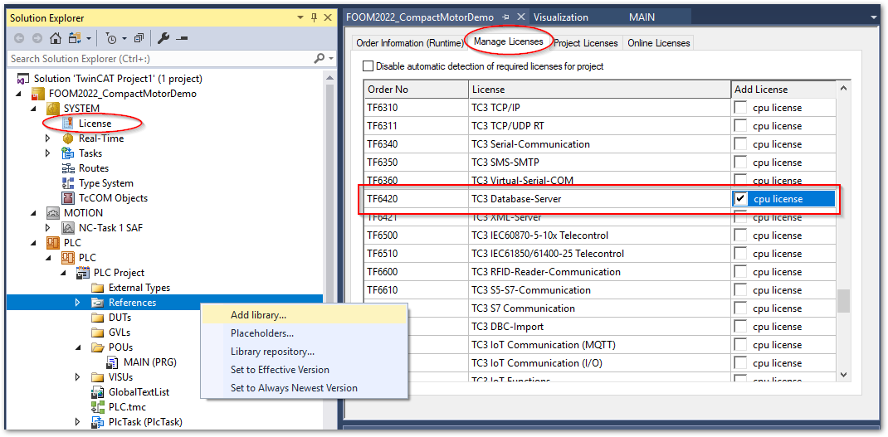
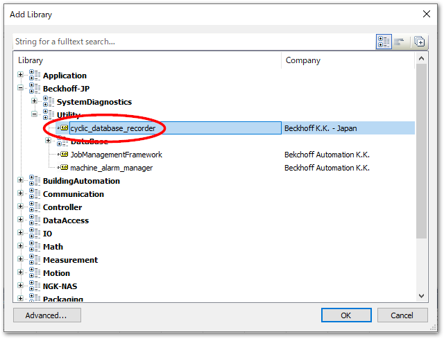
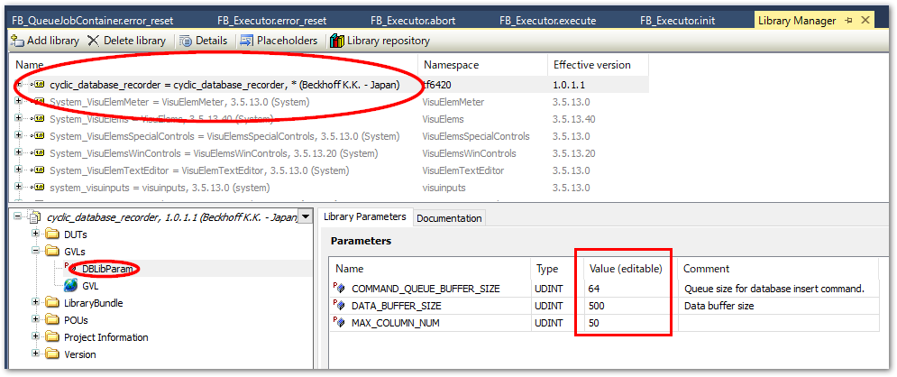
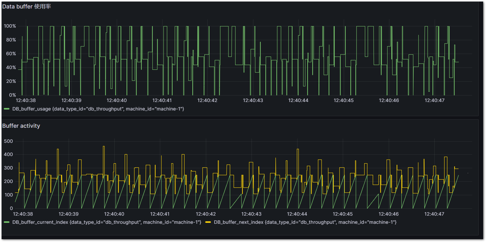
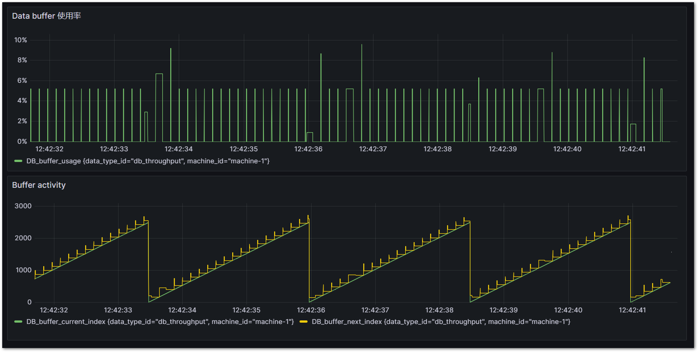
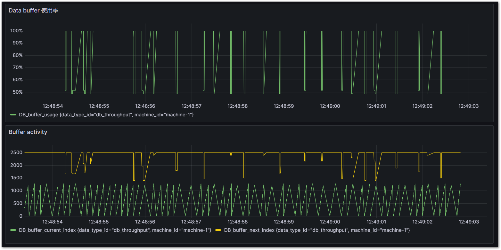
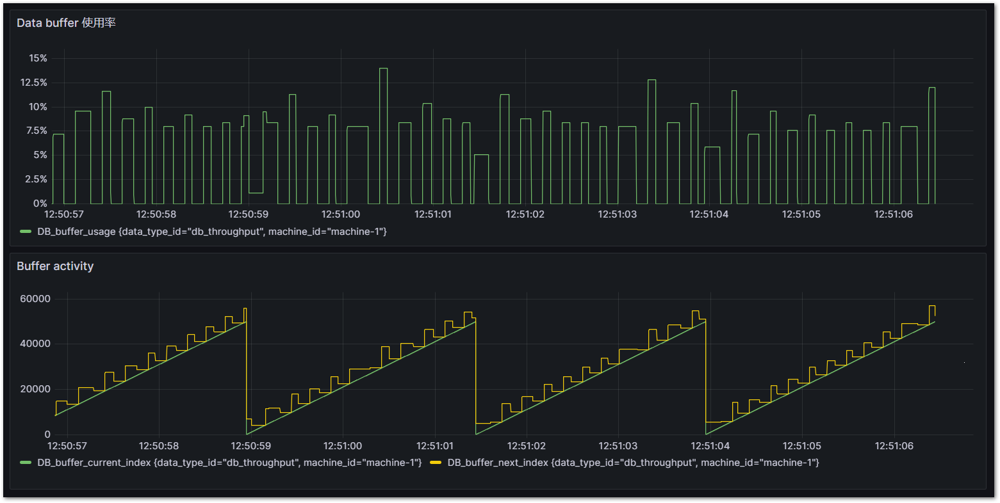

# PLCプログラム

以下ライブラリを用いた実装方法について説明します。

```{admonition} 公開先のGithubリポジトリ
:class: info 

以下のリポジトリにて公開しています。プルリクエストをお待ちしています。

[https://github.com/Beckhoff-JP/tc_influxdb_client](https://github.com/Beckhoff-JP/tc_influxdb_client) 

```

このライブラリにより記録できるデータは以下の通りです。

* 時系列に変動するTwinCATのサイクル精度（最短50μs）のデータ取得
* 不定期に発生するイベントの状態変化記録

ただし、データベースの抽出（読み出し）の機能はサポートしていません。

本節の実装例においてPLC側でデータを収集し、データベースへ記録する方法について説明します。この際のタスク設定やデータを遅滞なく記録するためのデータバッファの調整方法について説明します。

## ライブラリの仕様

本ライブラリでは、データベース書込み用ファンクションブロック`RecordInfluxDB`と、様々な制御タスク上に配置する計測用ファンクションブロック`BufferedRecord`、`DirectRecord`から構成されています。

計測用ファンクションブロックのインスタンスは複数作成することができます（マルチチャンネル）。これらのチャンネルから個々にコマンドキューを通じて書込み指令がキューインされ、`RecordInfluxDB`のインスタンスに対して順次データ書込みを行います。

`RecordInfluxDB`はグローバル変数として定義し、各計測用ファンクションブロックの引数にその参照を与える方法で実装します。

```{figure-md} figure_tsdb_library_feature
{align=center}

本ライブラリの機能概要
```

計測用ファンクションブロックには、記録用バッファを持つ`BufferedRecord`と、バッファを持たない`DeirectRecord`の2種類があります。データベースの書込みタスクの処理時間内に複数のデータを書き込む可能性がある場合は必ず`BufferedRecord`をお使いください。バッファの配列を使って順次データを記録しますので、計測データ入力とデータベースへの書込み出力の速度差を吸収します。したがって、バッファサイズは計測サンプリング間隔やそのサイズと、データベースへの書込み速度とのバランスで最適値を設定する必要があります。その方法を{ref}`section_adjust_data_buffer_size`に示します。

また、`BufferedRecord`ファンクションブロックは、{numref}`figure_cyclic_data_buffer`のとおり、事前に設定するチャンクサイズの指定に応じて、`RecordInfluxDB`へコマンドが指示される単位のデータサイズが最適化される機能があります。

```{figure-md} figure_cyclic_data_buffer
{align=center}

データバッファとチャンクサイズの決定方法
```


```{admonition} チャンクサイズの自動調整機能
:class: note

チャンクサイズは、`minimum_chunk_size` と `maximum_chunk_size` プロパティで設定したサイズの間で、バッファ使用率に応じた比例制御で決定されます。

次図に示すグラフは、黄色が次回データベースへ書き込む予定の目標配列アドレスで、緑色が計測値が記録される実アドレスです。緑色が黄色に交わった時点でデータベースへの書き込みコマンドが発行されます。黄色の目標アドレスは、キューの使用サイズによりダイナミックに変化していることがわかります。

通常は`minimum_chunk_size`を下限としたサイズのチャンクで小刻みにデータベースに書込みを行い最新データを速やかにデータベースへ反映することができます。データベースに対して一時的に負荷がかかった場合（たとえば別クライアントからデータベースに対して大量のデータ問い合わせが発生したり他のプロセスにより一時的にリソース不足に陥った場合）は、書込み速度が一時的に低下します。この際、自動的にチャンクサイズを大きくすることで、書込みの回数を減らしてインサートに掛かるオーバヘッドを最小化させることができます。これによってこの後、リソースが回復した際に速やかにバッファ容量を回復させることができます。

{align=center width=800px}
```


このライブラリを実装する手順を行います。

1. ライブラリのインストールとライブラリパラメータ（デフォルトバッファサイズ）設定
2. InfludxDBへ記録データ型を定義した構造体の作成
3. データベース書込みドライバ用のタスクとプログラム作成
4. 各実行タスク上にデータ収集プログラム作成
5. データベース書込みスループット評価とバッファ最適化

(section_library_deploy)=
## ライブラリのインストールとパラメータ設定

1. リポジトリから取得したソリューションを開きます。

2. PLCプロジェクトを右クリックし、`Save as library and install...` を選択します。`database_connection.library` ファイルを保存するウィンドウが現われます。適当な場所へ保存してください。

	{width=500px align=center}

	```{note}
	同じXAE環境であればインストールを同時に行っていますので、保存じた `database_connection.library` ファイルは今回使用しません。他のXAEでライブラリを使いたい場合は、ライブラリマネージャからこのファイルをインストールしてください。
	```

3. ライブラリを適用したいTwinCATプロジェクトを開き、TF6420のライセンスを有効にしてください。

4. 続いて、PLCプロジェクトの `References` メニューを右クリックして`Add library...` を選択します。

	{width=600px align=center}

5. `Beckhoff-JP` > `Utility` > `Database` > `InfluxDB` > `influxdb-client` を選択してOKボタンを押します。

	{width=700px align=center}

6. 追加後は、`influxdb-client`がライブラリに一覧されます。パラメータとして次の二つのバッファサイズを設定します。

	```{csv-table}
	:header: パラメータ, 初期値, 説明
	:widths: 1,1,8

	COMMAND_QUEUE_BUFFER_SIZE, 64, データベースサーバへ書込みを行うコマンドのキューバッファです。特に理由が無い限り変更は必要ありません。
	DATA_BUFFER_SIZE, 2500, "計測側のサンプリングタイムに応じたサイズのバッファを用意する必要があります。目安としてデフォルト値では1～10msのサイクルタイムであれば2,500、50μsであれば50,000程度となりますが、データ構造体のサイズや、他のチャンネル数次第で変動します。{ref}`section_adjust_influxdb_data_queue_buffer_size` の明示的な指定を行わない場合、この指定サイズが適用されます。したがって、{ref}`section_buffered_record_program_example` の実装例のようにデータバッファの実体を作成する際、その配列サイズに`DbLibParam.DATA_BUFFER_SIZE`を指定する必要があります。"
	```

	{align=center}


## データベース書込み専用のタスクとプログラム作成

計測用のプログラムを記述する前に、データベース書込み用のタスクとプログラムを記述します。

### データベース書込みタスク作成

PLC上に作成したバッファからデータベースへ書込み処理が行われるプログラムのための専用タスクを作成します。

次の要件でタスクを作成し、PLC上にReference taskを新規作成してください。

* Windowsとのシェアで50%程度
* 専用コアを割り当てる
* サイクルタイムは10ms程度で良い

```{admonition} 注意
:class: warning

TF6420とのADS通信により、データベースのレスポンスに依存してレイテンシが生じる可能性があります。このため、データベース書き込みタスクはコアを含めてモーション等のリアルタイム性能を要するタスクから独立させる必要があります。

次図は、50μsの制御タスクと、データベース書込みタスクを分離した際のレイテンシを計測したグラフです。高速周期データをADSを用いて書き込むタスクでは、都度Windows側の非リアルタイムプロセスとハンドシェークを行うため、大きなレイテンシが生じることが分かります（左下）。対してPLCのデータバッファを用いて計測データを書き込む処理を行っている50μsのタスクにはレイテンシが生じていないことが分かります。

{align=center}

このように通信に対する安定性をPLCで担保できることが本ライブラリを利用いただくメリットにもなります。
```

### データベース書込み部プログラム作成

まず、グローバル変数定義（Global variable list名を `GVL`とします）としてデータベース書き込みファンクションブロック`RecordInfluxDB`のインスタンスを定義します。
グローバル変数とすることで、全てのプログラムから参照できるようにします。

また、TF6420のコンフィギュレータで定義したDBIDを定数定義し、`RecordInfluxDB`のコンストラクタ引数 `DBID` に指定します。

```{code-block} pascal
{attribute 'qualified_only'}
VAR_GLOBAL CONSTANT
	TARGET_DBID : UINT := 1;
END_VAR
VAR_GLOBAL
	// Cycle record data
	fbInfluxDBRecorder	:RecordInfluxDB(DBID := GVL.TARGET_DBID);
END_VAR
```

続いて、先ほど作成したReference taskに属するプログラムを新規で作成し、以下のとおりプログラムを定義します。宣言部は何も記載する必要はありません。

```pascal
// DB Write
GVL.fbInfluxDBRecorder();

```

## 計測用データ構造体の定義

登録したいデータモデルを構造体で定義します。構造体の各要素の宣言行の上部に、次の書式で

* `{attribute 'TagName' := 'タグ名称'}`

	タグ（インデックス）となるデータ行の上部に宣言します。

* `{attribute 'FieldName' := 'フィールド名称'}`

	フィールドとなるデータ行の上部に宣言します。


下記の通り、タグとフィールドの構造体を分けて定義し、フィールド定義構造体では、タグ定義構造体を継承して定義すると良いでしょう。これにより、 Measurement 毎に共通のタグセットを定義する事ができます。

```{admonition} 警告：タグに利用できるデータ型は文字列型のみ
:class: warning

InfluxDBの仕様により、タグに使用できるデータ型は`STRING`または、`WSTRING`のみです。他の型を含めた構造体データを書込むとエラーになります。
```

```{admonition} 警告：タグのバリエーションにご注意ください
:class: warning

`DataTag` 構造体で定義する要素は一般的なデータベースシステムにおけるインデックスに該当します。influxDBは時刻に加えてこのこのタグを組合せて高速に検索できる仕様となっています。

このタグの値のバリエーションが多くなる [^high-cardinality] と、influxDBは非常に多くのメモリを消費する事が分かっています。このため、動作が遅くなったり他のプロセスに影響を及ぼし、システムを不安定にさせる要因となります。よって、タグに設定するデータには次の要件を満たすものに対して割り当てていただくよう、十分にご注意ください。

* 見積可能な有限の種類のデータであること

	短期間に毎回異なる値がセットされるようなデータにはタグを割り当てず、フィールドに割り当ててください。
	
	リテンションポリシーのデータの保存期間において予測可能なデータの種類の数が、許容できるメモリ消費量に収まっていることが求められます。

* データの種類が増える頻度とタイミングが一定で予測可能であること

	イベントデータ等で、予測不可能なタイミングでデータ書き込みが行われ、都度その値が変化するようなものをタグとして登録すると、イベントが集中することで意図せずカーディナリティが上昇し、メモリを圧迫する恐れがあります。

```

[^high-cardinality]: この状態を「カーディナリティが高い」状態といいます。


本節の例では、下記のとおりのデータ構造を定義する例で説明します。

* データタグ

   機械名称、および、その内部のモジュール名称を定義します。1台のエッジPLCだとしても複数の機械、モジュールを制御している可能性があり、該当するデータがどの部位のものかをここで定義します。

* データフィールド

   この例では、弊社のリニア搬送システムXTSの位置、速度、加速度、エラーコードを記録します。

タグ構造体
```pascal
TYPE DataTag :
STRUCT
	{attribute 'TagName' := 'machine_id'}
    machine_id : STRING;
	{attribute 'TagName' := 'module_name'}
    module_name: STRING;
END_STRUCT
END_TYPE
```

フィールド構造体

```pascal
TYPE MotionActivityData EXTENDS DataTag :
STRUCT
    {attribute 'FieldName' := 'machine_mode'}
    machime_mode : INT;
	{attribute 'FieldName' := 'activity'}
	activity_id: INT;
	{attribute 'FieldName' := 'position'}
    position : LREAL;
	{attribute 'FieldName' := 'velocity'}
    velocity : LREAL;
	{attribute 'FieldName' := 'acceleration'}
	acceleration : LREAL;
	{attribute 'FieldName' := 'set_position'}
    set_position : LREAL;
	{attribute 'FieldName' := 'set_velocity'}
    set_velocity : LREAL;
	{attribute 'FieldName' := 'set_acceleration'}
    set_acceleration : LREAL;
	{attribute 'FieldName' := 'axis_error_code'}
	axis_error_code : UDINT;
END_STRUCT
END_TYPE
```

## 計測用プログラム実装

データ収集には2つの方式があります。

* BufferedRecord

   登録したデータをバッファにコピーし、キュー配列に並べて順次データベースへ書き込む方式です。データベース処理中に重なって次のデータを書き込む必要が有る場合は、この方式を採用する必要があります。
   バッファのサイズと書込みデータのチャンクサイズによっては、データベースへ記録されるタイミングに遅延が生じます。

* DirectRecord

   登録したデータを直接データベースへ書き込む方式です。キューが有りませんのでデータベース書き込み処理中に登録データの内容を変更すると、意図しないデータが記録される可能性があります。
   ただし、即時データベースへは反映されます。

```{note}
データベースに記録される時刻は、いずれもこのファンクションブロックの`write`メソッド実行時です。キューによる書込み遅延には影響しません。
```

(section_buffered_record_program_example)=
### データバッファ付き計測実装例（BufferdRecord）

宣言した構造体`Motion ActivityData`の実体を作り、キューへデータを送り込みます。

次の実装を行ってください。

* 宣言部にて以下の変数を定義

	* 前節で作成したフィールド構造体型のデータバッファ配列を定義する
	
		データバッファサイズは、ライブラリ内で`DbLibParam.DATA_BUFFER_SIZE`が初期値として使用されているため、これに準じる場合はこのサイズの配列を作成します。任意のサイズを指定したい場合は{ref}`section_adjust_influxdb_data_queue_buffer_size`をご覧ください。

	* `BufferedRecord`インスタンスを作成し、コンストラクタ引数に以下を指定する

		* 前項で作成したデータバッファのポインタを第一引数に渡す
		* グローバル変数として定義したデータベース書込みファンクションブロック`RecordInfluxDB`のインスタンスを第二引数に渡す

* プログラム部に以下を実装

	* 前節で作成したフィールド構造体型のインスタンス変数（下記実装例では`motion_activities`）を作成し、各フィールド要素に値をセット
	* 記録するデータのInfluxDBのメジャメント名をセット
	* 前節で作成したフィールド構造体型の構造体名をセット
	* `motion_activities`をT_Arg型（F_BIGTYPE）に変換し、`write`メソッドで処理する。

``` pascal
PROGRAM MAIN
VAR
	// 現在データ登録用変数
	motion_activities 	: MotionActivityData := (module_name := 'XTS1');
	// データバッファの配列
	motion_activity_data_buffer	: ARRAY [0..DbLibParam.DATA_BUFFER_SIZE - 1] OF MotionActivityData;
	// ビジネスロジック用ファンクションブロック
	fbActivityDataController	:BufferedRecord(ADR(motion_activity_data_buffer), GVL.fbInfluxDBRecorder); 
END_VAR

// データセット
motion_activities.machine_id := 'Roll Dice demo';
motion_activities.machime_mode := MAIN.iState;
motion_activities.activity_id := MAIN.iState_Run;
motion_activities.position := MAIN.stMover1.NcToPlc.ActPos;
motion_activities.velocity := MAIN.stMover1.NcToPlc.ActVelo;
motion_activities.acceleration := MAIN.stMover1.NcToPlc.ActAcc;
motion_activities.set_position := MAIN.stMover1.NcToPlc.SetPos;
motion_activities.set_velocity := MAIN.stMover1.NcToPlc.SetVelo;
motion_activities.set_acceleration := MAIN.stMover1.NcToPlc.SetAcc;
motion_activities.axis_error_code := MAIN.stMover1.NcToPlc.ErrorCode;

//キューへのデータ書き込み

fbActivityDataController.db_table_name := 'MotionActivityData'; // InfluxDBのメジャメント名
fbActivityDataController.data_def_structure_name := 'MotionActivityData'; // データ構造体名称

fbActivityDataController.write(
	input_data := F_BIGTYPE(
		pData := ADR(motion_activities),
		cbLen := SIZEOF(motion_activities)
	)
); // キューへのデータ書き込み処理

```

(section_adjust_influxdb_data_queue_buffer_size)=
### 任意のサイズのデータバッファ付き計測実装例（BufferdRecord）

前節の実装例では、ライブラリパラメータ`DbLibParam.DATA_BUFFER_SIZE`が暗示的にライブラリ内部でデータバッファの制御に用いられています。前節のとおりデータバッファの実体を定義する場合も下記のとおり設定する必要がありました。

``` pascal
VAR
   motion_activity_data_buffer	: ARRAY [0..DbLibParam.DATA_BUFFER_SIZE - 1] OF MotionActivityData;
END_VAR
```

しかし、計測部が複数あり、それぞれのタスクサイクルタイムが一意でない場合は、それぞれに適したバッファサイズを指定する必要があります。この方法について示します。

バッファ配列の初期化
	: 0..バッファサイズ - 1
		: バッファの最大インデックスを0始まりの配列でインデックス指定できる配列を作成してください。 

BufferedRecordファンクションブロックのプロパティ
	: minimum_chunk_size
		: デフォルトでは、ライブラリパラメータで指定するバッファサイズの20%が設定されています。任意の値を設定してください。
	: maximum_chunk_size
		: バッファサイズ - 1 が最大インデックスとなるように設定してください。
	: buffer_size
		: 任意のバッファサイズを設定してください。

次にバッファサイズとして定数 `LOG_BUFFER_SIZE_LOW` を定義した実装例を示します。

```{admonition} minimum_chunk_size設定時の注意
:class: warning

連続記録データにおいて`minimum_chunk_size`を小さな値に設定すると、それだけ頻繁にコマンドが発行されるため、代わりにコマンドキューが圧迫される事になります。この場合、{ref}`section_library_deploy` 節に示す`COMMAND_QUEUE_BUFFER_SIZE`を十分大きな値に設定してください。
```

``` pascal
PROGRAM MAIN
VAR CONSTANT
	LOG_BUFFER_SIZE_LOW	: UINT := 2500;
END_VAR
VAR
	// 現在データ登録用変数
	motion_activities 	: MotionActivityData := (module_name := 'XTS1');
	// データバッファの配列（バッファサイズの違いに注意）
	motion_activity_data_buffer	: ARRAY [0..LOG_BUFFER_SIZE_LOW - 1] OF MotionActivityData;
	// ビジネスロジック用ファンクションブロック
	fbActivityDataController	:BufferedRecord(ADR(motion_activity_data_buffer), GVL.fbInfluxDBRecorder); 
END_VAR

fbActivityDataController.db_table_name := 'MotionActivityData'; // InfluxDBのメジャメント名
fbActivityDataController.data_def_structure_name := 'MotionActivityData'; // データ構造体名称

fbActivityDataController.minimum_chunk_size := 1;
fbActivityDataController.maximum_chunk_size := LOG_BUFFER_SIZE_LOW - 1;
fbActivityDataController.buffer_size := LOG_BUFFER_SIZE_LOW;

fbActivityDataController.write(
	input_data := F_BIGTYPE(
		pData := ADR(motion_activities),
		cbLen := SIZEOF(motion_activities)
	)
); // キューへのデータ書き込み処理

```

### BufferedRecordで1個づつ記録したい場合

前述のとおり、BufferdRecordではチャンクサイズは自動計算されます。これはサイクリックな連続データの場合に用意された機構です。

イベントデータを記録したい場合は問題となります。いつ起こるか分からないイベントデータの場合、リアルタイムにそのデータを活用するためにも速やかにデータベースは反映させる事が望ましいです。しかしシステム内部で計算されたチャンクサイズにバッファが満たされるまではデータベースに記録されない事となります。

DirectRecordはこのために用意された機構ですが、困った事に不意に発生するイベントは、短期間に集中して発生する可能性もあります。このため、データバッファ機構は必要です。

このケースにおいては、次の通り設定してください。

``` pascal
fbActivityDataController.minimum_chunk_size := 1;
fbActivityDataController.maximum_chunk_size := 1;
```

つまり、チャンクサイズの上限値と下限値をそれぞれ1とします。これにより、バッファ機構を活かしながら、必ず1個づつデータベースへ記録される動作となります。

#### 直接計測実装例（DirectRecord）

直接記録の場合は、一度につき1レコードのみ記録可能です。TF6420を通じてデータベースへ書込みが行われている最中に`motion_activities`のデータが直接ADSを通じてデータベースに参照されますので、データベースの記録が完了するまでこのデータを保持しておくことが求められます。

さらに、データベースへの書込み処理の開始は、他のキューからの書き込みコマンドのキューを待ってから行われますので、遅延する可能性があります。

十分な書込み間隔が保証されている場合のみこのファンクションブロックをご利用ください。

実装方法は以下の通りで、`BufferedRecord`の実装例と比較して、バッファ配列を取り除いただけの違いとなります。

``` pascal
PROGRAM MAIN
VAR
	// 現在データ登録用変数
	motion_activities 	: MotionActivityData := (module_name := 'XTS1');
	// ビジネスロジック用ファンクションブロック
	fbActivityDataController	:DirectRecord(GVL.fbInfluxDBRecorder); 
END_VAR

// データセット
motion_activities.machine_id := 'Roll Dice demo';
motion_activities.machime_mode := MAIN.iState;
motion_activities.activity_id := MAIN.iState_Run;
motion_activities.position := MAIN.stMover1.NcToPlc.ActPos;
motion_activities.velocity := MAIN.stMover1.NcToPlc.ActVelo;
motion_activities.acceleration := MAIN.stMover1.NcToPlc.ActAcc;
motion_activities.set_position := MAIN.stMover1.NcToPlc.SetPos;
motion_activities.set_velocity := MAIN.stMover1.NcToPlc.SetVelo;
motion_activities.set_acceleration := MAIN.stMover1.NcToPlc.SetAcc;
motion_activities.axis_error_code := MAIN.stMover1.NcToPlc.ErrorCode;

//キューへのデータ書き込み

fbActivityDataController.db_table_name := 'MotionActivityData'; // InfluxDBのメジャメント名
fbActivityDataController.data_def_structure_name := 'MotionActivityData'; // データ構造体名称

fbActivityDataController.write(
	input_data := F_BIGTYPE(
		pData := ADR(motion_activities),
		cbLen := SIZEOF(motion_activities)
	)
); // キューへのデータ書き込み処理

```

(section_adjust_data_buffer_size)=
## 評価とバッファサイズの調整

別途データベースのバッファ使用状況についても、InfluxDBへ記録するプログラムを以下の通り追加します。

計測する値は、前項の例で作成した`fbActivityDataController`のファンクションブロックから提供されているバッファの使用状況を示す様々なメトリクスです。

```{csv-table}
:header: インスタンス, プロパティ, 説明
:widths: 1,1,8

InfluxDBRecorder,queue.queue_usage,コマンドキューの使用率
BufferedRecord,current_index, 現在のデータ記録インデックス
BufferedRecord,next_index, 次回データベースに書込みが行われる予定のインデックス
BufferedRecord,buffer_usage, 現在バッファに溜まっているデータの全体のサイズに対する比率
```

これらのメトリクスは、ライブラリ内にあらかじめ定義された構造体`DatabaseThroughput`にて定義されています。本ライブラリは、`tf6420`というデフォルトのネームスペースが定義されていますので、念のために`tf6420.DatabaseThroughput`という構造体名を指定してください。

```{code-block} pascal
:caption: データベーススループット計測プログラム
:name: database_throughput_monitoring

PROGRAM MAIN
VAR
   // For cycric insert
   DatabaseThroughputRecordData   :tf6420.DatabaseThroughput; // for insert dataset
   DatabaseThroughputRecordBuffer   :ARRAY [0..DBLibParam.DATA_BUFFER_SIZE - 1] OF DatabaseThroughput;
   fbThroughputDataController   :BufferedRecord(ADR(tf6420.DatabaseThroughputRecordBuffer), GVL.fbInfluxDBRecorder); // record controller
END_VAR

// Field data
DatabaseThroughputRecordData.db_insert_queue_count := GVL.fbInfluxDBRecorder.queue.queue_usage;
DatabaseThroughputRecordData.current_index := fbActivityDataController.index;
DatabaseThroughputRecordData.next_index := fbActivityDataController.next_index;
DatabaseThroughputRecordData.buffer_usage := fbActivityDataController.buffer_usage;

// Insert command queue
fbThroughputDataController.db_table_name := 'DatabaseThroughput'; // Measurement name
fbThroughputDataController.data_def_structure_name := 'tf6420.DatabaseThroughput'; // Structure type name

// cyclic record
fbThroughputDataController.write(
	input_data := F_BIGTYPE(
		pData := ADR(DatabaseThroughputRecordData), 
		cbLen := SIZEOF(DatabaseThroughputRecordData)
	)
);
```

このデータ収集を計測するBufferedRecord毎に行い、InfluxDBへ記録させます。Grafanaにて次の2つのダッシュボードを作成します。

```{code-block}
:caption: データバッファ使用率のfluxクエリ
:name: flux_query_buffer_usage

from(bucket: "machine_monitoring")
  |> range(start: v.timeRangeStart, stop: v.timeRangeStop)
  |> filter(fn: (r) => r["_measurement"] == "DatabaseThroughput")
  |> filter(fn: (r) => r["_field"] == "DB_buffer_usage")
  |> aggregateWindow(every: v.windowPeriod, fn: mean, createEmpty: false)
  |> yield(name: "mean")
```

```{code-block}
:caption: データバッファ使用状況のクエリ
:name: flux_query_buffer_activity

from(bucket: "machine_monitoring")
  |> range(start: v.timeRangeStart, stop: v.timeRangeStop)
  |> filter(fn: (r) => r["_measurement"] == "DatabaseThroughput")
  |> filter(fn: (r) => r["_field"] == "DB_buffer_next_index" or r["_field"] == "DB_buffer_current_index")
  |> aggregateWindow(every: v.windowPeriod, fn: mean, createEmpty: false)
  |> yield(name: "mean")
```

これら二つのクエリをGrafanaを用いて可視化ダッシュボードを作成します。Grafanaのセットアップでダッシュボードを作成する手順は、{ref}`section_grafana_dashoboard` まで読み進めてください。

Cycle time = 1ms, DbLibParam.DATA_BUFFER_SIZE := 250のとき。概ね100%を超えており、バッファサイズが少なすぎることが分かります。
{align=center}

Cycle time = 1ms, DbLibParam.DATA_BUFFER_SIZE := 2,500のとき。概ね10%以下を安定しており、十分なバッファサイズであることがわかります。
{align=center}

Cycle time = 50μs, DbLibParam.DATA_BUFFER_SIZE := 2,500のとき。概ね100%を超えており、バッファサイズが少なすぎることが分かります。
{align=center}

Cycle time = 50μs, DbLibParam.DATA_BUFFER_SIZE := 50,000のとき。10%を越えることがありますが、安定してデータが書き込めていることが分かります。必要に応じてバッファサイズを増やせば10%を下回る状態で安定します。
{align=center}


バッファサイズは安定した状態だけでなく、データベース側（Windows側やオンプレミスサーバ側）の負荷やネットワークの状況により変動する最悪スループットを考慮して十分なサイズを割り当ててください。
