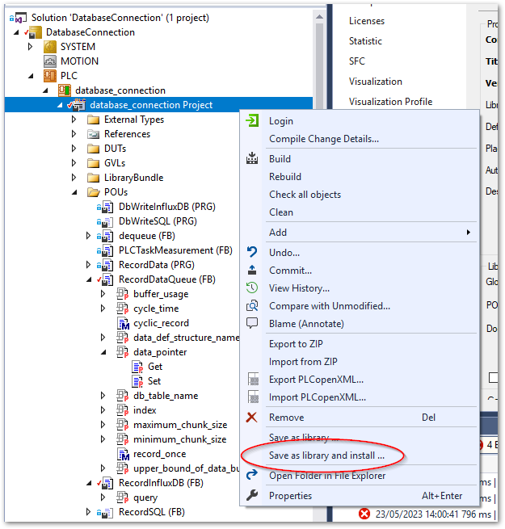
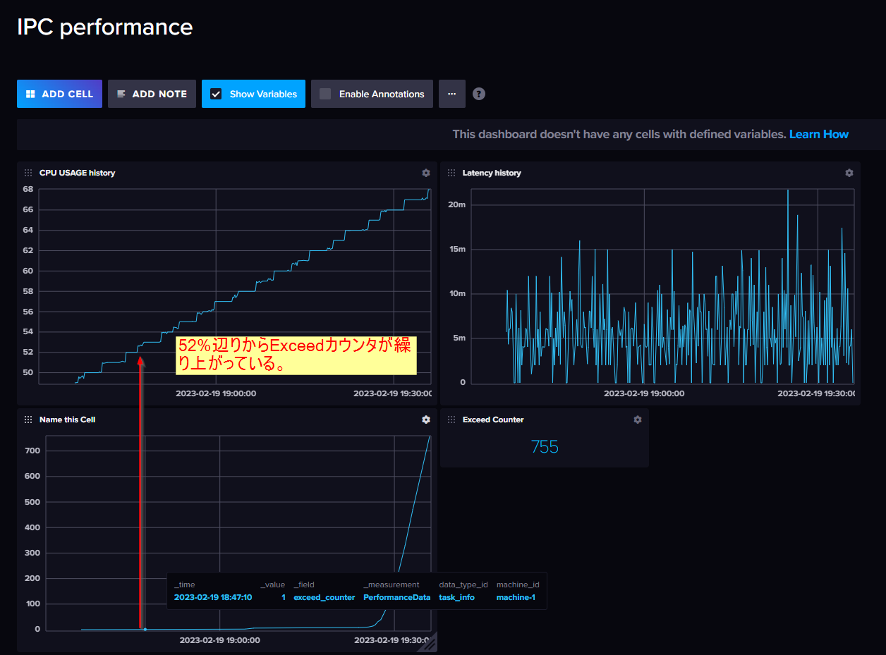

# PLCプログラム方法

実際の運用では、様々なデータモデルとそのデータの生成タイミングでデータベースに記録する必要があります。このためサンプルコードを含むプロジェクトを公開いたします。ライブラリとしてもお使いいただくことができます。

```{admonition} 公開先のGithubリポジトリ
:class: info 

以下のリポジトリにて公開しています。プルリクエストをお待ちしています。

[https://github.com/Beckhoff-JP/tc_influxdb_client](https://github.com/Beckhoff-JP/tc_influxdb_client) 

```

このライブラリには、TwinCATにおける様々なパフォーマンスデータを収集するファンクションブロックが内包されています。このファンクションブロックの仕様は、{ref}`section_collect_performance_data_fb` をご覧ください。

本節の実装例では、このファンクションブロックから得られるさまざまなメトリクスをinfluxDBに記録します。

## ライブラリのインストール

1. リポジトリから取得したソリューションを開きます。

2. PLCプロジェクトを右クリックし、`Save as library and install...` を選択します。`database_connection.library` ファイルを保存するウィンドウが現われます。適当な場所へ保存してください。

	{width=500px align=center}

	```{note}
	同じXAE環境であればインストールを同時に行っていますので、保存じた `database_connection.library` ファイルは今回使用しません。他のXAEでライブラリを使いたい場合は、ライブラリマネージャからこのファイルをインストールしてください。
	```

3. ライブラリを適用したいTwinCATプロジェクトを開き、TF6420のライセンスを有効にしてください。

4. 続いて、PLCプロジェクトの `References` メニューを右クリックして`Add library...` を選択します。

	{width=600px align=center}

5. `Beckhoff-JP` > `Utility` > `Database` > `InfluxDB` > `influxdb-client` を選択してOKボタンを押します。

	{width=700px align=center}


## ライブラリを使った実装方法

このライブラリでは、{ref}`figure_tsdb_library_feature` に示す通りサイクル実行中に収集されるデータと、データベース書込みを非同期で実行できるようにキューバッファによる書込み制御を行う機能を提供します。

```{figure-md} figure_tsdb_library_feature
{width=600px align=center}

本ライブラリの機能概要
```

次の手順で本ライブラリを用いたデータベース書込みプログラムを実装を行います。

1. InfluxDBに書き込むデータセットを定義する構造体を定義します。

2. グローバルラベルにコマンドキューの変数を定義します。

3. データベース書込みプログラム専用のタスクを作成します。このタスクで実行する、キューからデータをInfluxDBへ書込むプログラムを実装します。

4. 制御タスク上にデータ収集用のプログラムを配置し、`RecordDataQueue`ファンクションブロックのインスタンスを設けます。`RecordDataQueue`ファンクションブロックでは、1レコードだけを書き込む `record_once` メソッドと、バッファに連続して書込み、一定のチャンクサイズになった時点でデータベースへ書き込む `cyclic_record` の二つのメソッドがあります。`cyclic_record` メソッド使用時のチャンクサイズの決定方法は、 `minimum_chunk_size` サイズで指定するチャンク数を下限値とし、データバッファの使用状況に応じてサイズが自動的に拡張され、データベース書込み遅延をバッファで吸収します。（ {ref}`figure_cyclic_data_buffer` ）

	```{figure-md} figure_cyclic_data_buffer
	{width=400px align=center}

	サイクリックデータバッファの構造
	```


## 実装手順

本プロジェクトに含まれるファンクションブロック等を用いる事で、次の手順でInfluxDBへアクセス頂く事ができます。

以下の手順で実装してください。

### DUTs へのInfludxDBへ記録するデータモデルの登録

まず、登録したいデータモデルを構造体で定義します。構造体の各要素の宣言行の上部に、次の書式で

* `{attribute 'TagName' := 'タグ名称'}`

	タグ（インデックス）となるデータ行の上部に宣言します。

* `{attribute 'FieldName' := 'フィールド名称'}`

	フィールドとなるデータ行の上部に宣言します。


下記の通り、タグとフィールドの構造体を分けて定義し、フィールド定義構造体では、タグ定義構造体を継承して定義すると良いでしょう。これにより、 Measurement 毎に共通のタグセットを定義する事ができます。

```{admonition} 警告：タグのバリエーションにご注意ください
:class: warning

`DataTag` 構造体で定義する要素は一般的なデータベースシステムにおけるインデックスに該当します。influxDBは時刻に加えてこのこのタグを組合せて高速に検索できる仕様となっています。

このタグの値のバリエーションが多くなる [^high-cardinality] と、influxDBは非常に多くのメモリを消費する事が分かっています。このため、動作が遅くなったり他のプロセスに影響を及ぼし、システムを不安定にさせる要因となります。よって、タグに設定するデータには次の要件を満たすものに対して割り当てていただくよう、十分にご注意ください。

* 見積可能な有限の種類のデータであること

	短期間に毎回異なる値がセットされるようなデータにはタグを割り当てず、フィールドに割り当ててください。
	
	リテンションポリシーのデータの保存期間において予測可能なデータの種類の数が、許容できるメモリ消費量に収まっていることが求められます。

* データの種類が増える頻度とタイミングが一定で予測可能であること

	イベントデータ等で、予測不可能なタイミングでデータ書き込みが行われ、都度その値が変化するようなものをタグとして登録すると、イベントが集中することで意図せずカーディナリティが上昇し、メモリを圧迫する恐れがあります。

```

[^high-cardinality]: この状態を「カーディナリティが高い」状態といいます。


タグ構造体
```pascal
TYPE DataTag:
STRUCT
    {attribute 'TagName' := 'machine_id'}
    machine_id : STRING(255);

    {attribute 'TagName' := 'data_type_id'}
    data_type_id : STRING(255);
END_STRUCT
END_TYPE
```

フィールド構造体（サイクル記録実装例用）

```pascal
TYPE PerformanceData EXTENDS DataTag:
STRUCT
    {attribute 'FieldName' := 'plc_task_time'}
    task_time: UDINT;
    {attribute 'FieldName' := 'cpu_usage'}
    cpu_usage: UDINT;
    {attribute 'FieldName' := 'latency'}
    latency: UDINT;
    {attribute 'FieldName' := 'max_latency'}
    max_latency: UDINT;
    {attribute 'FieldName' := 'exceed_counter'}
    exceed_counter: UDINT;
    {attribute 'FieldName' := 'ec_lost_frames'}
    ec_lost_frames: UDINT;
    {attribute 'FieldName' := 'ec_frame_rate'}
    ec_frame_rate: LREAL;
    {attribute 'FieldName' := 'ec_lost_q_frame'}
    ec_lost_q_frames: UDINT;
    {attribute 'FieldName' := 'ec_q_frame_rate'}
    ec_q_frame_rate: LREAL;
END_STRUCT
END_TYPE
```

フィールド構造体（イベントデータ記録実装例用）

```pascal
TYPE ProcessModeData EXTENDS DataTag:
STRUCT
	{attribute 'FieldName' := 'executing'}
    executing: BOOL;
	{attribute 'FieldName' := 'message'}
	message: STRING := 'ABC000';
END_STRUCT
END_TYPE

```
### グローバルラベルにおけるキューの宣言

DBへ書込みを行う低速の処理と、記録データをバッファにセットしてキューインする高速周期タスクで、個別のタスクを作成します。

このタスク間通信のために`CommandQueueMember`構造体変数と、キューサイズの定数を`GVL` に定義します。

```{code-block} pascal
{attribute 'qualified_only'}
VAR_GLOBAL CONSTANT
	COMMAND_BUFFER_SIZE :UDINT := 63; // Queue size for database insert command.
END_VAR

{attribute 'qualified_only'}
VAR_GLOBAL
	tsdb_command_queue	:CommandQueueMember;
END_VAR
```

### データベース書込みプログラムの作成

データベース書き込み部のプログラムを作成します。作成したプログラムは、制御サイクルほど高速のサイクルタイムは必要としません。専用のタスクを生成し、10ms程度のサイクルタイムを設定の上、このタスク上で実行させてください。

```{admonition} 注意
:class: warning

TF6420とのADS通信での同期制御が行われる関係で、データベースのレスポンスが悪くなるとレイテンシが生じる可能性があります。できるだけ独立コアで実行させるか、レイテンシが許容できないタスクと同じコアで実行しないようにご注意ください。
```

* 宣言部

	```{code-block} pascal
	PROGRAM DbWriteInfluxDB
	VAR
		// Cycle record data
		fbInfluxDBRecorder	:RecordInfluxDB;
	END_VAR
	```

* プログラム部

	```pascal
	// Insert DB
	fbInfluxDBRecorder(
		command_queue := GVL.tsdb_command_queue,
		nDBID := 1      // Database ID by TF6420 configurator
	);
	```


#### サイクル記録（cyclic_record）実装例

サイクル毎にデータを記録し、適切なチャンクサイズでデータベースへ書き込むコマンドをキューインする制御部です。このタスクは制御サイクルのタスク上で実行してください。

`PerformanceDataRecordBuffer`
	: データベースに記録するデータモデル `PerformanceData` 構造体型の配列バッファ。定数 `RECORD_DATA_MAX_INDEX` を上限としている。この例のバッファサイズでは0～4999の5000個であるが、1msよりも短い周期のデータであれば、この10倍は欲しい。
`fbPerfromanceDataCommandBuffer`
	: `RecordDataQueue` ファンクションブロックインスタンス。

* 宣言部

	```pascal

	PROGRAM RecordToInfluxDB

	VAR CONSTANT
		RECORD_DATA_MAX_INDEX: UDINT := 4999;	// データバッファのUPPER BOUND
		TARGET_DBID: UDINT := 1;	// TF6420に定義したInfluxDBのDBID
	END_VAR

	VAR
		// 前節で定義した構造体型（PerformanceData）型の配列（連続データを記録するバッファ）
		PerformanceDataRecordBuffer	: ARRAY [0..RECORD_DATA_MAX_INDEX] OF PerformanceData;
		// 現在のサイクルで登録するデータセット
		PerformanceDataRecordData	:PerformanceData;

		// ビジネスロジック用ファンクションブロック
		fbPerfromanceDataCommandBuffer	:RecordDataQueue; // バッファキュー制御ロジック

		// 本ライブラリのおまけ。IPCの各種メトリクス（CPU占有率やメトリクス等）を収集する独自のFB
		fb_PLCTaskMeasurement: PLCTaskMeasurement;

	END_VAR
	```

* プログラム部

	まずはデータの収集とバッファへのデータセットです。
	```pascal
	// Tag Dataのセット
	PerformanceDataRecordData.machine_id := 'machine-1';  // 装置1のデータである事を示す
	PerformanceDataRecordData.job_id := 'task_info';	　// データ種別

	// Field Data のセット（IPCの各種状態を計測）
	fb_PLCTaskMeasurement(ec_master_netid := '169.254.55.71.4.1');

	// 書込みデータセット
	PerformanceDataRecordData.task_time := fb_PLCTaskMeasurement.total_task_time;
	PerformanceDataRecordData.cpu_usage := fb_PLCTaskMeasurement.cpu_usage;
	PerformanceDataRecordData.latency := fb_PLCTaskMeasurement.latency;
	PerformanceDataRecordData.max_latency := fb_PLCTaskMeasurement.max_latency;
	PerformanceDataRecordData.exceed_counter := fb_PLCTaskMeasurement.exceed_counter;
	PerformanceDataRecordData.ec_frame_rate := fb_PLCTaskMeasurement.ec_frame_rate;
	PerformanceDataRecordData.ec_q_frame_rate := fb_PLCTaskMeasurement.ec_q_frame_rate;
	PerformanceDataRecordData.ec_lost_frames := fb_PLCTaskMeasurement.ec_lost_frames;
	PerformanceDataRecordData.ec_lost_q_frames := fb_PLCTaskMeasurement.ec_lost_q_frames;


	// 上記までで収集したデータが PerformanceRecordData にセットされたため、
	// コマンドバッファが管理している現在記録中のindexへ書き込む。
	PerformanceDataRecordBuffer[fbPerfromanceDataCommandBuffer.index] := PerformanceDataRecordData;
	```

	続いてバッファ制御部（一定量蓄積したら書込みキューに送る処理）の実装です。

	```pascal
	// 書き込んだデータポインタを教えるため、ジェネリクス型（T_Arg）としてセットする。
	fbPerfromanceDataCommandBuffer.data_pointer := F_BIGTYPE(
			pData := ADR(PerformanceDataRecordBuffer[fbPerfromanceDataCommandBuffer.index]), 
			cbLen := SIZEOF(PerformanceDataRecordBuffer[fbPerfromanceDataCommandBuffer.index])
		);
	// InfluxDBの書込み対象Measurement名をセット
	fbPerfromanceDataCommandBuffer.db_table_name := 'PerformanceData';
	// DUTsで定義した書込みデータの構造体名をセット
	fbPerfromanceDataCommandBuffer.data_def_structure_name := 'PerformanceData';
	// チャンクの最小サイズを設定（DB書込みスループットにより自動拡張される）
	fbPerfromanceDataCommandBuffer.minimum_chunk_size := 500;
	// データバッファ（PerformanceDataRecordBuffer）の配列の最大要素番号をセット
	fbPerfromanceDataCommandBuffer.upper_bound_of_data_buffer	:= RECORD_DATA_MAX_INDEX;

	// バッファ制御FBを実行。コマンドキューを渡す。
	fbPerfromanceDataCommandBuffer(command_queue := GVL.tsdb_command_queue);

	// サイクル記録メソッドの連続実行
	fbPerfromanceDataCommandBuffer.cyclic_record();
	```

#### イベントデータ記録（record_once）実装例

この書込みは任意のタイミングで単一のデータをキューインします。このプログラムは制御サイクルのタスク上で実行してください。

実行する `record_once` メソッドは実行するたびに書込みコマンドが発行されます。よって、イベント発生時の1サイクルだけ実行されるようにご配慮ください。下記実装例では、 処理 `bExecuting` の開始、終了の立ち上がり `R_TRIG` および立下り`F_TRIG` の1サイクル時のイベントデータを書き込む処理を行っています。

* 宣言部

	```pascal

	PROGRAM RecordToInfluxDB

	VAR
		// 書き込むデータインスタンスの定義
		DataBaseProcessModeRecordData	:ProcessModeData;

		// データベース書き込みコマンドを処理するFIFOキュー
		command_queue	: CommandQueueMember;

		// ビジネスロジック用ファンクションブロック
		fbProcessModeBuffer	:RecordDataQueue; // キュー制御ロジック

		// おまけ。処理開始、終了のイベントとプロセス番号定義
		bExecuting	: BOOL;
		dProcessNumber: UDINT;
		bExecRTrig	:R_TRIG;
		bExecFTrig	:F_TRIG;

	END_VAR
	```

* プログラム部

	まずはデータのセット部。サイクル記録と違うのは、バッファが無いこと。直接 `DataBaseProcessModeRecordData` という単一データ（配列化して複数データを用意する事も可能）を作成し、データベース書込みチャンクとする。

	```pascal
	// Tag Dataのセット
	DataBaseProcessModeRecordData.machine_id := 'machine-1';  // 装置1のデータである事を示す
	DataBaseProcessModeRecordData.job_id := 'task_info';	　// データ種別

	// 疑似処理開始、終了パルス
	bExecRTrig(CLK := bExecuting);
	bExecFTrig(CLK := bExecuting);

	IF bExecRTrig.Q THEN
		// 処理開始毎に処理番号を繰り上げ
		dProcessNumber := dProcessNumber + 1;
	END_IF

	// Field Data のセット（イベントの状態セット）
	DataBaseProcessModeRecordData.executing := bExecuting;
	DataBaseProcessModeRecordData.message := Tc2_Standard.CONCAT('Process # : ',UDINT_TO_STRING(dProcessNumber));

	```

	続いてキュー制御部の実装。用意したチャンクデータを同様にT_Arg型へ変換してセット。そのあと各種属性を定義し、

	```pascal
	// 書き込んだデータをジェネリクス型（T_Arg）に変換してセットする。
	fbProcessModeBuffer.data_pointer := F_BIGTYPE(
			pData := ADR(DataBaseProcessModeRecordData), 
			cbLen := SIZEOF(DataBaseProcessModeRecordData)
		);
	// InfluxDBの書込み対象Measurement名をセット
	fbProcessModeBuffer.db_table_name := 'PerformanceData';
	// DUTsで定義した書込みデータの構造体名をセット
	fbProcessModeBuffer.data_def_structure_name := 'ProcessModeData';
	// チャンクの最小サイズを設定（DB書込みスループットにより自動拡張される）
	fbProcessModeBuffer.minimum_chunk_size := 1;
	// バッファ制御FBを実行。コマンドキューを渡す。
	fbProcessModeBuffer(
		command_queue := GVL.tsdb_command_queue
	);

	IF bExecRTrig.Q OR bExecFTrig.Q THEN
		// 必ず1サイクルだけ実行すること。
		// 実行し続けたら極小のチャンクの書込み命令が毎サイクルキューインするため、あっという間にキューが溢れる。
		fbProcessModeBuffer.record_once();
	END_IF
	```

## InfluxDB 内臓ソフトによる可視化例

influxDBには、 Chronograf と呼ばれる可視化ソフトが付属しています。これを用いて次図のようなダッシュボードを簡単に構築することができます。



ライブラリには、サンプルデータを生成するファンクションブロックとして、IPCのさまざまなパフォーマンスデータを計測する `PLCTaskMeasurement` を内臓しています。

上記の計測データは、PLCの処理において単純な加算処理をN回ループする処理を行い、この際のCPU占有率やPLCタスク実行時間、Exceedカウンタ、レイテンシなどを計測したデータを可視化したものです。変化がわかるように、ループ回数を60秒毎に1000回増やし、その変化を可視化しました。

評価を行った環境では、レイテンシそのものの変化は見られませんでしたが、52 $\%$ のCPU使用率となった辺りからExceedカウンタが上がり始めている事がわかります。