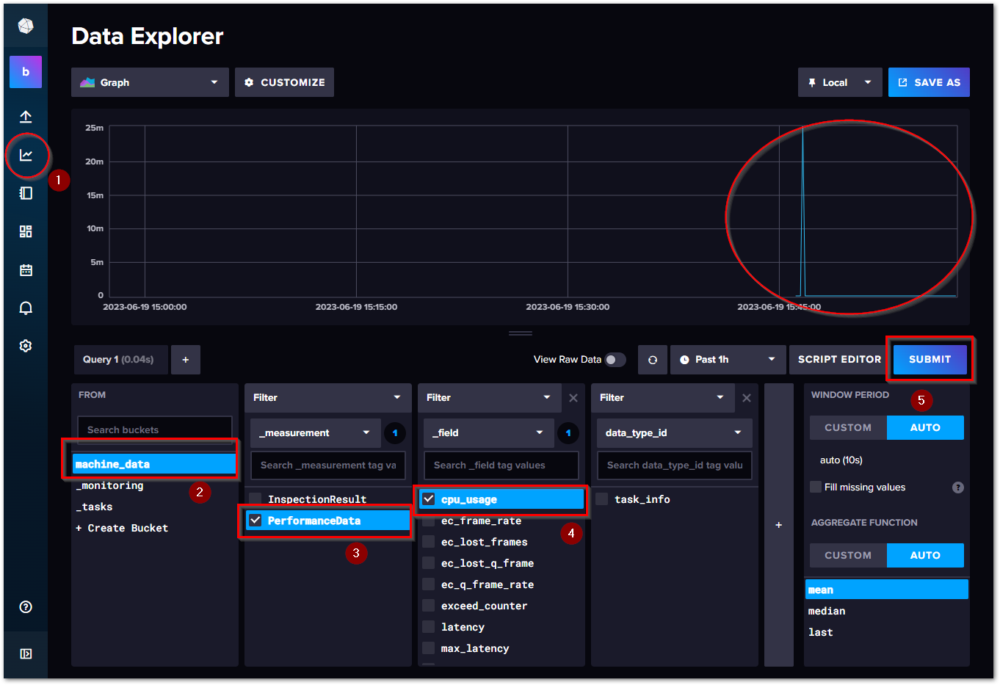
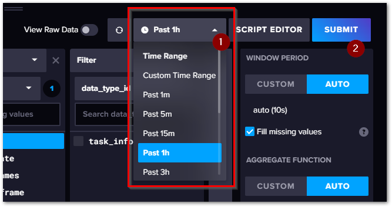
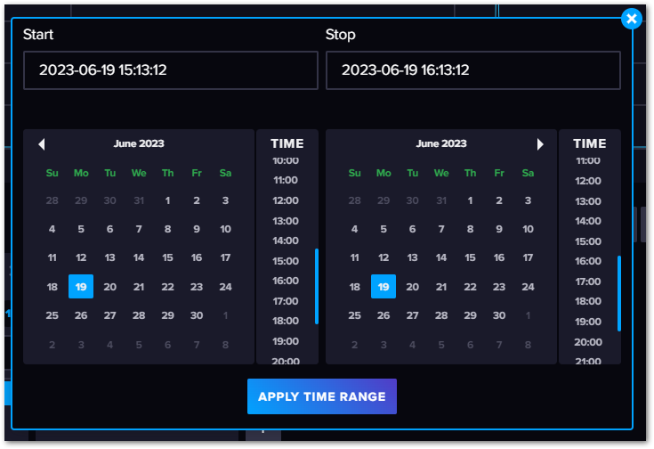
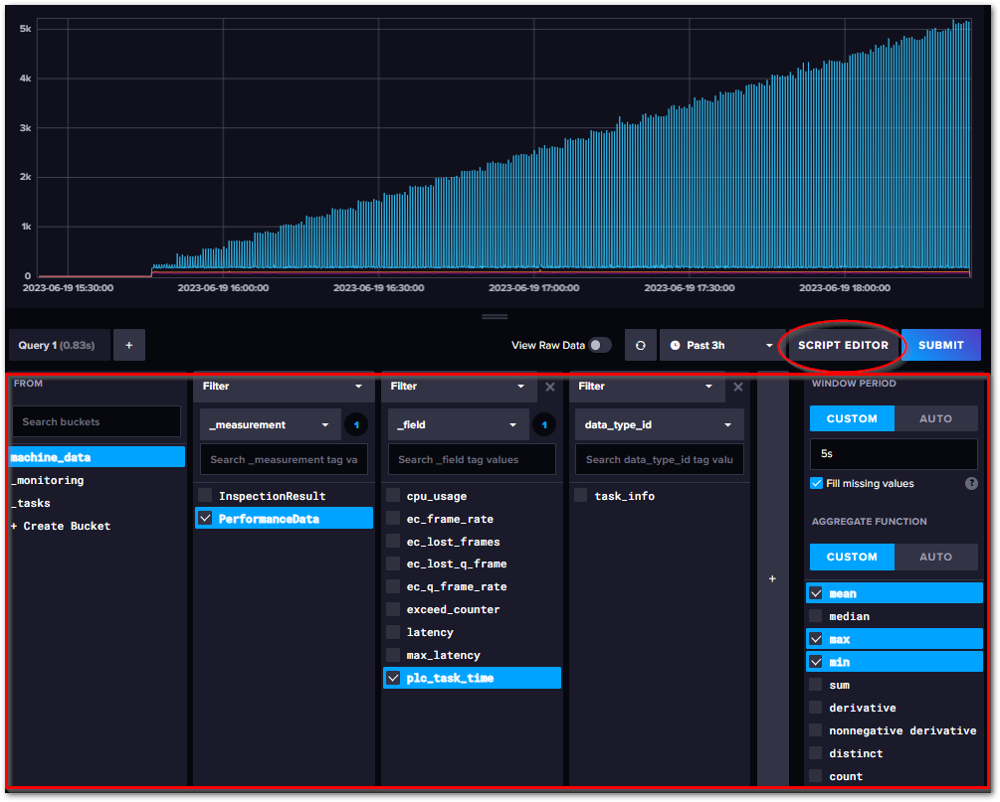
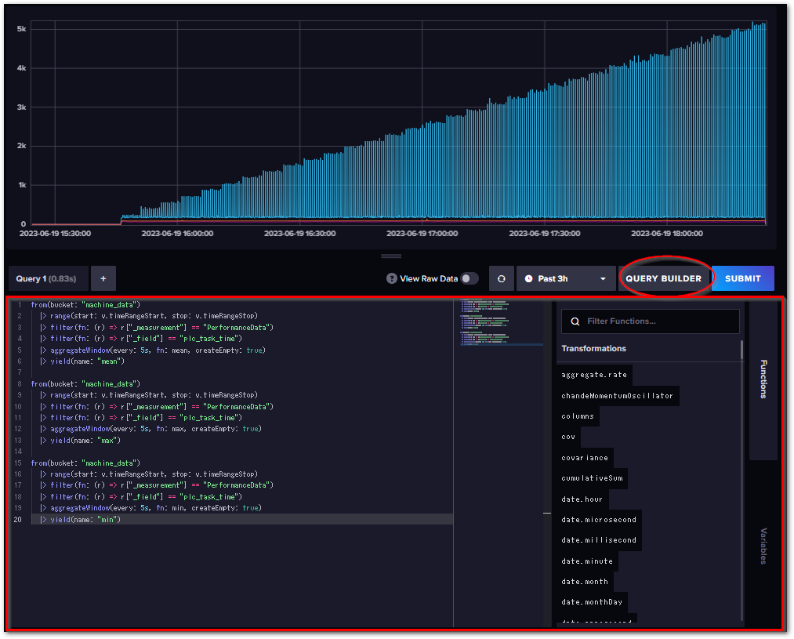
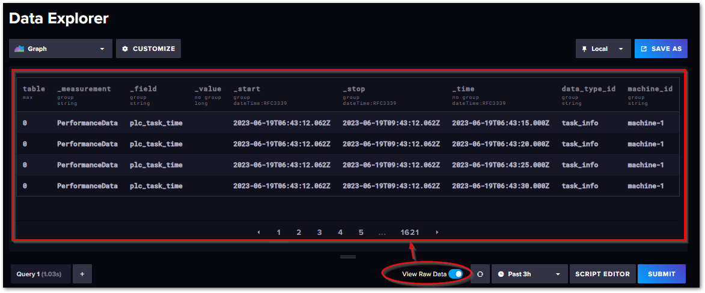

# InfluxDBからのデータ抽出と可視化

InfluxDBで記録されたデータは、flux言語と呼ばれる問い合わせ言語によってデータを抽出することができます。

### InfluxDB WEB画面によるデータ抽出操作の基本

InfluxDBを使ったデータの抽出の基本操作は以下の通りです。左ペインのメインメニューが現われます。次の手順でデータをクエリします。

{width=700px align=center}

1. メインメニューからData Explorerを選びます。
2. まず、クエリ対象のBucketを選択します。
3. 次にMeasurementを選択します。
4. Fieldデータの一覧から抽出したいデータを選択します。
5. SUBMITボタンを押すと、収集したデータがグラフに表示されます。

#### 時間範囲の指定方法

初期状態では、過去1時間分のデータを抽出する設定となっています。

{width=500px align=center}

Custom time rangeを選択すると、下記のとおり任意の範囲の時間を設定できます。

{width=500px align=center}

### ダウンサンプリングと集計方法の指定

PLCのサイクル処理により記録されたデータをそのままクエリすることで、大量のデータの転送とディスクアクセスが行われます。このためクエリ発行してからデータが表示されるまでに長い時間を要してしまい分析のストレスにつながります。

これを防ぐため、生のデータを一定の間隔毎に得られたデータをさまざまな方法で要約することで、データを間引くことができます。要約方法として代表的な集計関数には以下のものがあります。

mean
    : 平均化処理。全ての値の平均値を採用。

median
    : 中央値。全サンプルを小さいものから大きいものへ並べた際に中央に位置するデータの値を採用。

first, last
    : 最初、最終の値を採用。

max, min
    : 最大、最小値を採用。

その他詳細は、[InfluxDBのFluxのマニュアル](https://docs.influxdata.com/influxdb/cloud/query-data/flux/)をご覧いただいて、適切な集計関数を選んでください。

設定の操作方法は、次図のとおり右側の赤枠内で行います。

WINDOW PERIOD
    : ダウンサンプリングする間隔を指定します。AUTOを選ぶと、クエリで取得した時間範囲に応じた値が自動的に設定されますが、CUSTOMを選び、その下で間隔を設定すると、この間隔で取得したデータに対して処理を行います。

AGGRIGATE FUNCTION
    : 集計関数を選びます。AUTOを選択すると、最もよく使われるMean, Median, Lastのみ現われますが、CUSTOMを選択すると、使用可能な集計関数全てリストアップされます。
    複数選択すると、次図の通り集計されたデータ全てがプロットされます。

{width=600px align=center}

### flux言語によるクエリ条件編集

これまで行ったデータ抽出（クエリ）条件設定は、主にGUI上で行いました。このモードを QUERY BUILDERモードと呼びます。クエリ条件はGUIで設定しますが、内部では "Flux" 言語によるクエリが発行された結果が反映されてデータが抽出されます。

GUIでできること以上の細かなクエリを定義する場合は、Flux言語を直接編集する SCRIPT EDITOR モードへ移行する必要があります。

それぞれのモードは、画面中ほどのボタンで操作します。

:::{figure-md} figure_query_builder_view
{width=600px align=center}

QUERY BUILDERビュー
:::

:::{figure-md} figure_script_editor_view
{width=600px align=center}

SCRIPT EDITORビュー
:::

### テーブルビューで生データを閲覧する

今までは、可視化方法は時系列グラフだけでした。実際のデータを表形式で見るには、画面中ほどの `View Raw Data` スイッチをONにします。

{width=700px align=center}

この表形式のデータの各列は、次の構成となっています。

```{csv-table}
:header: tablemean,_measurement,_field,_value,_start,_stopg,_time,data_type_id,machine_id
0,PerformanceData,cpu_usage,0,2023-06-19T09:51:26.518Z,2023-06-19T10:51:26.518Z,2023-06-19T09:51:30.000Z,task_info,machine-1
0,PerformanceData,cpu_usage,0,2023-06-19T09:51:26.518Z,2023-06-19T10:51:26.518Z,2023-06-19T09:51:40.000Z,task_info,machine-1
0,PerformanceData,cpu_usage,0,2023-06-19T09:51:26.518Z,2023-06-19T10:51:26.518Z,2023-06-19T09:51:50.000Z,task_info,machine-1
1,PerformanceData,plc_task_time,92.90557988,2023-06-19T10:40:31.092Z,2023-06-19T10:55:31.092Z,2023-06-19T10:40:40.000Z,task_info,machine-1
1,PerformanceData,plc_task_time,92.9815,2023-06-19T10:40:31.092Z,2023-06-19T10:55:31.092Z,2023-06-19T10:40:50.000Z,task_info,machine-1
1,PerformanceData,plc_task_time,94.4177,2023-06-19T10:40:31.092Z,2023-06-19T10:55:31.092Z,2023-06-19T10:41:00.000Z,task_info,machine-1
```
このように、構造体で定義したフィールドごとに列が分かれるのではなく、`_field` 列で表されたフィールドの値ごとに行が分かれて一覧される、「縦持ち表」になっています。

```{csv-table}
:header: テーブル名,説明

_measurement, Measurement名
_field, 記録データのフィールド名。
_value, フィールドの値。
_start, クエリで指定抽出期間の開始日時
_stop, クエリで指定抽出期間の修了日時
_time, 記録データの時刻。
以後の列, 各タグの値
```

これをField毎に列を分けた一覧表に整形したい場合、PIVOT関数を使います。`aggregateWindow` 関数の後に、`pivot` 関数が追加されています。

```{code-block}
from(bucket: "machine_data")
  |> range(start: v.timeRangeStart, stop: v.timeRangeStop)
  |> filter(fn: (r) => r["_measurement"] == "PerformanceData")
  |> filter(fn: (r) => r["_field"] == "cpu_usage" or r["_field"] == "plc_task_time")
  |> aggregateWindow(every: 5s, fn: mean, createEmpty: true)
  |> pivot(rowKey: ["_time"], columnKey: ["_field"], valueColumn: "_value")
  |> yield(name: "mean")
```

これによって、"cpu_usage" と "plc_task_time" それぞれのフィールドは個別の列で出力されます。

```{csv-table}
:header: tablemean,_measurement,_start,_stop,_time,cpu_usage,data_type_id,machine_id,plc_task_time
0,PerformanceData,2023-06-19T09:47:01.602Z,2023-06-19T10:47:01.602Z,2023-06-19T09:47:10.000Z,0,task_info,machine-1,93.03822794
0,PerformanceData,2023-06-19T09:47:01.602Z,2023-06-19T10:47:01.602Z,2023-06-19T09:47:20.000Z,0,task_info,machine-1,91.8897
0,PerformanceData,2023-06-19T09:47:01.602Z,2023-06-19T10:47:01.602Z,2023-06-19T09:47:30.000Z,0,task_info,machine-1,92.6507
0,PerformanceData,2023-06-19T09:47:01.602Z,2023-06-19T10:47:01.602Z,2023-06-19T09:47:40.000Z,0,task_info,machine-1,92.3226
0,PerformanceData,2023-06-19T09:47:01.602Z,2023-06-19T10:47:01.602Z,2023-06-19T09:47:50.000Z,0,task_info,machine-1,92.9121
```