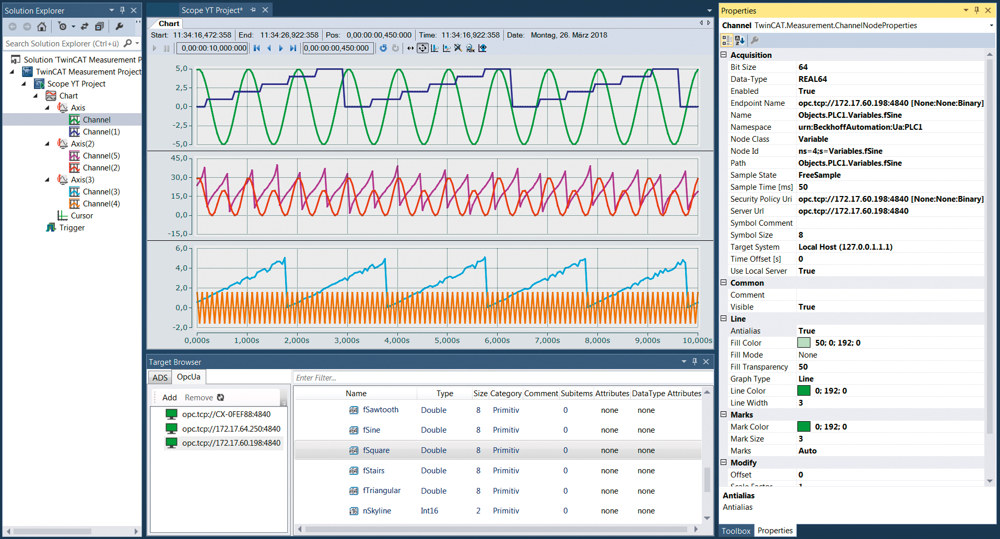
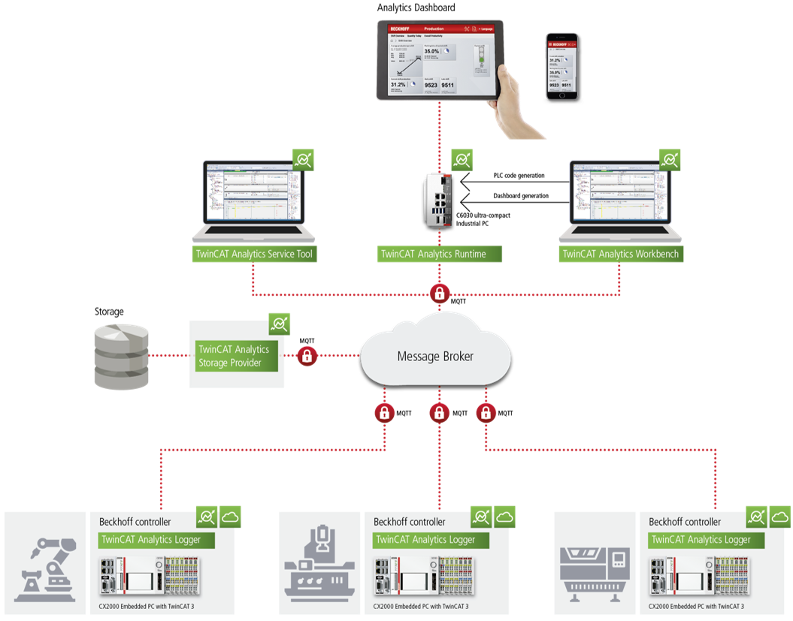
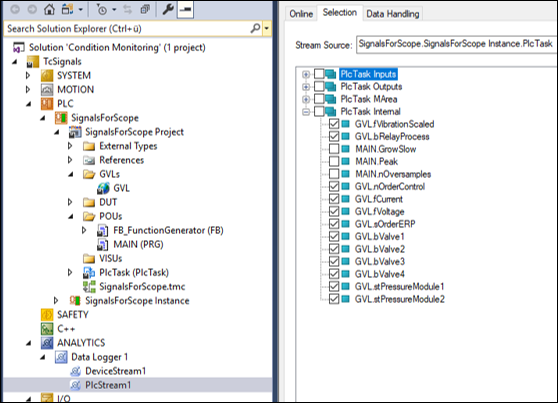
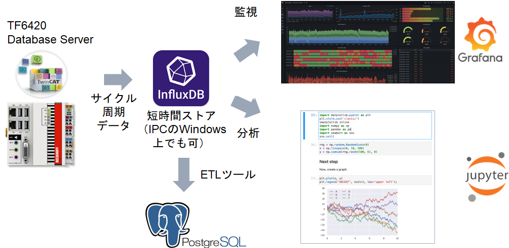

# TwinCAT IoTソリューション

IoTはデジタルツインにおける現実世界のデータを収集する重要な手段です。高度なセンサ技術により数多くのデータが収集できるようになったことに加え、EtherCATにより収集された高解像度データ、そのタイミングの同期性などの利点を生かすことで、より製造ラインに何が起こっているのか、正確に把握することができるためです。

## 製造現場で必要とされるデータの種類

データの種類には、あらかじめ定めたルール（スキーマ）に基づいて値を収集する「構造化データ」と、センサやアクチュエータの計測データ、カメラの撮影画像、録音した音声データのように、加工しないまま記録された「非構造化データ」の二種類があります。

製造における最も重要な構造化データは、製造業の4M（Man, Machine, Material, Method）の属性です。このため、さまざまなセンサ機器から収集した情報から4Mの課題の原因を突き止めることがデータ活用の本質です。

例えば検査工程で多くの不良が生じて歩留まりが上がらない場合、品種（Material）、特定の作業者（Man）、前工程での加工条件（Method）、といったさまざまな視点ごとの、センサからの記録データや画像などの非構造化データを関連付けた要因や特徴分析が必要です。このためには工場全体で串刺しできる構造化データの基盤が欠かせません。

## 構造化データ共有基盤のデファクトスタンダード OPC UA

近年、設備のデータを収集するプロトコルとして欧州を中心に拡大しているのがOPC UAです。OPC UAはただデータを送るだけの規約ではなく、どのようなデータがアクセス可能なのか、というデータの仕様「情報モデル」を事前に相互にやり取りすることまで規約で定義されていることが大きな特徴です。

このため、先に挙げた4Mに関する情報モデルを定義さえすれば、機器間だけではなく、工場とその上位のERPやPLMといった経営資源に基づくデータ基盤との連携が容易になります。

TwinCATではPLCやC++プログラム内で宣言した変数や、ファンクションブロックのメソッドやプロパティを公開指定するだけで、データアクセスが可能になっています。対象は単一の変数だけではなく、配列・構造体などのはもちろん、Enum（列挙子）、ファンクションブロックの入出力変数、さらにはIEC-61131-3オブジェクト指向の拡張であるプロパティやメソッドも公開でき、非常に柔軟な機器間、上位間連携システムを構築可能です。

むしろ大変なのは情報モデルを規定して、さまざまな機器のデータのインターフェース仕様を標準化することです。近年ではドイツ機械工業連盟（VDMA）が中心となり、この情報モデルの標準仕様である「コンパニオン仕様」を規定しています。またこの仕様を推進する団体umatiが企業・業界を跨いだ活動を行っています。弊社もこれに則り、コンパニオン仕様を容易にTwinCATプロジェクトへ実装するためのヘルパーツールである、TE6100 OPC UA ノードセットエディタをまもなくリリース予定しています。

## リアルタイムデータ分析の方法

センサやカメラ等から収集した非構造化データはどのように収集すればよいでしょうか。弊社の中核製品であるTwinCATは、一つのコントローラにおいてEtherCATから得たI/O情報やTwinCAT Visionにより処理された画像を高速な周期で収集し、これらを同期してデータ記録することが可能になります。しかし、データベースの書き込みは時間がかかるため、連続して高速周期データを記録することは簡単ではありません。

TwinCATでは、次のいくつかの方法でそれを簡単に実現できる製品をご提供しています。

(section_scope_view)=
### TwinCAT Scope view

TwinCATのリアルタイム制御モジュールがWindowsやBSDなどの汎用OSと通信する手段としてADS通信があります。この通信ストリーム上でデータを圧縮したものをリアルタイムに可視化グラフへ表示する単体ソフトがScope Viewです。

{width=800px align=center}

単体のソフトではありますが、Ethernetでアクセス可能ならば複数のIPCに対して接続することができます。これにより別途ロガーを取り付けることなく必要な変数を監視・記録することができます。

(section_tc_analytics)=
### TwinCAT Analytics

[https://www.beckhoff.com/ja-jp/products/automation/twincat-analytics/](https://www.beckhoff.com/ja-jp/products/automation/twincat-analytics/)

Scope viewで記録するデータストリームを、MQTTと呼ばれる汎用の通信基盤を通じてクラウドを通してデータ共有するための拡張製品が、TwinCAT Analytics製品群になります。この製品群は、データ活用に必要なワークフローを包括的にサポートする製品の集合となっています。

{width=800px align=center}

1. データ収集

   まず各設備制御用のエッジIPCからは、[TF3500 Analytics logger](https://www.beckhoff.com/ja-jp/products/automation/twincat/tfxxxx-twincat-3-functions/tf3xxx-measurement/tf3500.html) というソフトウェアによりMQTTメッセージブローカへパブリッシュする事ができます。公開方法は極めて簡単です。PLCのプログラムにおいて変数宣言した個所に`{attribute 'TcAnalytics'}`を付加します。

   ```{code-block} pascal
   {attribute ‘TcAnalytics’}
   変数名 	: 型名
   ```

   このように宣言した変数一覧から公開したいものをチェックリストで選ぶだけです。

   {width=400px align=center}

2. データレイクへの記録

   MQTTからサブスクライブしたデータをストレージに記録するのが [TF3520 Storage Provider](https://www.beckhoff.com/ja-jp/products/automation/twincat/tfxxxx-twincat-3-functions/tf3xxx-measurement/tf3520.html) という製品になります。保存先は独自のAnalytics binaryファイル、Micorosoft SQLサーバ、Microsoft Azure blobの3つです。

3. データ分析

   MQTTからサブスクライブして得られるリアルタイムデータ、もしくはデータレイク（Storage provider）上の過去データを取り出して抽出・分析・加工するのが、[TE3520 Service tool](https://www.beckhoff.com/ja-jp/products/automation/twincat/texxxx-twincat-3-engineering/te3500.html) または [TE3500 Workbench](https://www.beckhoff.com/ja-jp/products/automation/twincat/texxxx-twincat-3-engineering/te3500.html) です。Service tool はより簡易的なソリューションで、データの可視化ができますが次に示すRuntimeを生成することはできません。

   どちらの製品も、{numref}`workbench-ui` のようにフィルタや分析器の組み合わせをGUI上で定義し、MQTTで購読したデータをリアルタイムにモニタしながらデータ処理ロジックを組み立てることができます。

   :::{figure-md} workbench-ui
   {width=800px align=center}

   TE3500 Analytics workbenchのUIイメージ
   :::

   フィルタはC++などを用いて独自に実装いただくことが可能です。さらに次のアドオンにより多彩なフィルタ・解析器をご利用いただくことができます。

   [TF3680 Filter](https://www.beckhoff.com/ja-jp/products/automation/twincat/tfxxxx-twincat-3-functions/tf3xxx-measurement/tf3680.html)
      : IIRフィルタ、移動平均、n次フィルタなどさまざまな特性を持つLPF, BPF, HPFを提供します。
   
   [TF3600 Condition monitoring](https://www.beckhoff.com/ja-jp/products/automation/twincat/tfxxxx-twincat-3-functions/tf3xxx-measurement/tf3600.html)
      : 波高率計測、FFT解析、歪解析、RMS（実効値）、ケプストラム..etc
   

4. 抽出・変換・常時監視・書き出し（ETL）

   分析ツールにWorkbenchをご利用されていれば、その分析パターンを常時監視ロジックとして弊社のIPC上に実装頂くことができます。常時監視ロジックで実現可能な機能は以下の通りです。
   
   * TwinCAT HMIを用いたダッシュボード

      Workbench上で整形したデータを用いて、WEBアプリケーションによるダッシュボード画面を作成することができます。作成した画面はRuntime上で動作するHMI serverにより提供され、次図のような可視化画面を、PC、タブレット、スマートフォンのWEBブラウザを通してご覧いただけます。

      {width=200px align=center}

   * トリガや定周期でのレポート機能

      指定した周期やトリガが発生した際に、JSON/HTML/PDFのいずれかの形式でKPIレポートを作成します。作成したレポートは、指定された場所にファイル保存、もしくは、指定した宛先にメール送信することができます。

   * リアルタイムデータ書き出し

      各種フィルタや分析器を経て整形されたデータは、再度JSON形式でMQTTにパブリッシュされる事ができます。また、.Net-5 / Framework 4.5.2 によるData Exchange APIが用意されていますので、これらのデータを外部ソフトウェアと連携する事が可能です。
   


```{admonition} まとめ
:class: info

製造現場のデータを収集する場合、仕様の異なる複数設備からのデータ収集で避けられない単位やデータ型合わせ、また、ノイズ除去などのデータクレンジング処理が必要になります。従来はこのロジックをPLC側やゲートウェイPCといったエッジ側で実装することが一般的でした。これにより欲しいデータをすぐに集める、といったアジリティ（俊敏さ）を損なう要因になり、データ活用のボトルネックになっているのではないでしょうか。

Analytics製品を使う事で、中央側で制御可能なWorkbenchによりこの処理ができ、データ解像度が高いままさまざまな用途にデータを即座に活用いただくことが可能になります。より高度なDigital Twin環境をご提供する土台になるのではないでしょうか。

{width=800px align=center}

```

### Database server

これまでご説明では、ダッシュボードで表示したり、アラートやレポートを作成したり、データベースへ書き込むまでのデータストリームをすべて弊社製品群を使って実現する方法をご紹介しました。

ここでご紹介する[TF6420 TwinCAT Database server](https://www.beckhoff.com/ja-jp/products/automation/twincat/tfxxxx-twincat-3-functions/tf6xxx-connectivity/tf6420.html)は、PLC上のサイクリックな周期で得られたデータを生のまま直接データベースに記録する機能を提供します。この製品はさまざまなデータベース製品に接続することが可能ですが、特に時系列データベースである[InfluxDB](https://www.influxdata.com/) が高速周期データを記録する用途には最適です。

この方法ではライセンス費用が低価格抑えられますが、これまでご紹介した以下の機能実装や作業を自前で行っていただく必要があります。

* サイクリックに収集するデータを都度書き込むのではなく、まとまった量貯めてから書き込む、「バッファ機構」をPLC上に実装いただく必要があります。
* データベースを稼動させるサーバの性能やネットワーク環境により、上記のバッファから切り出して一度にデータベースに書き込むサイズの最適値を評価する必要があります。
* 収集した後のデータを分析したり、クレンジングする機能を自前で実装いただく必要があります。

PLCにおけるバッファ機能はオープンソースソフトウェアではありますがライブラリとして公開しております。[TC influxDB client プロジェクト](https://github.com/Beckhoff-JP/tc_influxdb_client) をご覧ください。

また、データ分析・監視・クレンジングソリューションとしては以下のものがあります。

可視化/監視ツール
   : [Grafana](https://grafana.com/docs/grafana/latest/getting-started/get-started-grafana-influxdb/)により可視化、および監視を行うことができます。異常値を発見した場合、メール通知やWEB APIへの登録、Slackなどへの自動通知も行うことが可能です。
   
分析
   : InfluxDBのPythonライブラリである[influxdb-client-python](https://github.com/influxdata/influxdb-client-python)と[Jupyter lab](https://jupyter.org/)を用いることで、対話的なデータ加工と可視化によるデータ分析を行うことができます。

データクレンジング
   : [Python pandas](https://pandas.pydata.org/)へ抽出し、[SciPy](https://scipy.org/)などをご利用いただくことで、{numref}`section_tc_analytics` でご紹介した高度なフィルタ（TF3680）や解析器（TF3600）と同等の事が可能です。

{width=800px align=center}

```{toctree}
:maxdepth: 2
:caption: 目次

../scope_view/index.rst
../influxdb/index.md
```