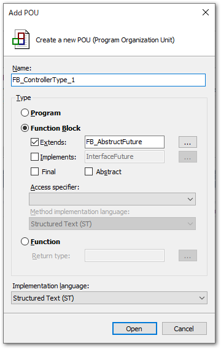

# ジョブフレームワークライブラリ使用方法

## インストール

1. 以下のGithubリポジトリをクローンしてください。

    [https://github.com/Beckhoff-JP/PLC_JobManagementFramework](https://github.com/Beckhoff-JP/PLC_JobManagementFramework)

2. TwinCAT XAEでプロジェクトを開き、{ref}`library_making_basic`に従ってライブラリファイル`JobManagement.library`を保存してください。

3. ライブラリを使用する任意のプロジェクトを作成してください。そのあと、{ref}`section_use_library`に従ってライブラリをインストール、追加を行います。

4. ライブラリを追加したら、ライブラリパラメータを調整します。`Reference`からライブラリマネージャから`JobManagementFramework`を選び、GVLs以下の`ParamFutureLib`を選択します。Library Parametersタブに現れる下記パラメータを適切な値に設定します。

    ```{csv-table}
    :header: パラメータ名称, デフォルト値, 説明

    MAX_TASK_NUM, 20, 逐次・並列ジョブを実行するために複数のジョブを格納するコンテナオブジェクトに格納できるジョブ数を指定します。
    MAX_STRING_LENGTH, 255, ジョブのひな型となるFutureオブジェクトに設定する名称の最大文字数を指定します。
    ```

    {align=center}

## 要求分析

要求分析により、機械が行う処理内容から、共通の振る舞いを抽出します。抽出した抽象化された共通の振る舞いごとに`InterfaceFuture`インターフェースの実装ファンクションブロックを定義します。

```{csv-table} 要求分析による抽象化
:name: analyze_requirement_table_job_design
:header: 処理, 処理内容, 抽象化した機能仕様
　
1, 3秒間点滅し、そのあと消灯して終了, 指定のBOOL型変数を任意の時間ON-OFFを繰り返し、その後消灯して終了。
2, 外部信号の立ち上がりを20回カウントする, 指定のBOOL型変数の立ち上がりをカウントして、規定値になると終了する
```

## Futureファンクションブロックの実装

最初に、基本の制御モデルをファンクションブロックを作成します。`FB_AbstructFuture`を継承したファンクションブロックを作成してください。

{align=center width=300px}

次に、任意のメソッドとプロパティを実装します。追加したファンクションブロックを選択し、コンテキストメニューから`Add` > `Method`または`Property`を選択します。オーバライドする場合Name欄の選択タブから基底ファンクションブロックのメソッドが一覧されますので、選択してください。

{align=center}

メソッドとプロパティの詳細は、{numref}`table_future_methods` 、{numref}`table_future_properties` を参照してください。どのメソッドも、実装時は次のルールに基づく必要があります。

入出力変数は空にしておく
    : 入出力変数はインターフェースにより定められていますので、加えることはできません。ファンクションブロックの入出力変数や、ファンクションブロック独自のプロパティを使って、外部とのデータアクセスを行ってください。

終了条件としてメソッドの戻り値を`TRUE`にする
    : FB_Executorファンクションブロックは `init()`, `execute()`, `quit()`, `abort()` 各メソッドを実行したあと、戻り値がTRUEとなる事でプログラムが進行します。かならず戻り値を設定してください。

    : ```{code} iecst
      METHOD execute : BOOL

      <<execute 処理>>
      IF <<execute 処理終了条件>> THEN
        execute := TRUE;
      END_IF
      ```

    : ファンクションブロック内の変数や処理の初期化や中断の処理が不要な場合でも、以下の通り空の`init()`, `quit()`, `abort()`を実装する必要があります。

    : ```{code} iecst
      METHOD init : BOOL
      <<init 処理>>
      IF <<init 処理終了条件>> THEN
        init := TRUE;
      END_IF
      ```

    : ```{code} iecst
      METHOD quit : BOOL
      <<quit 処理>>
      IF <<quit 処理終了条件>> THEN
          quit := TRUE;
      END_IF
      ```

    : ```{code} iecst
      METHOD abort : BOOL
      <<abort 処理>>
      IF <<abort 処理終了条件>> THEN
        abort := TRUE;
      END_IF
      ```

以上を踏まえて、例として{numref}`analyze_requirement_table_job_design` に示す処理1のFutureを定義した例が次の通りです。

```{tip}
この実装事例は、フレームワークのTwinCATプロジェクトの`POUs` > `model` > `activities`以下にあります。ご参考ください。

処理1
  : `FB_ControllerType_1`

処理2
  : `FB_ControllerType_2`
```

`own_output`や`own_parameter`という名前は、InterfaceFutureで規定されたもの以外であることを示しています。実際は目的に合った分かりやすいメソッドやプロパティ名としてください。

`own_parameter`は点滅動作を行う時間をTIME型で設定し、`own_output`はBOOL型変数のREFERENCEを設定しています。

`init()`でTON変数をリセット、`own_output`のデバイスをFALSEにするなど初期化を行っています。また、`execute()`では0.5秒間隔で`own_output`のデバイスのON/OFF反転を繰り返しています。

`quit()`では、`THIS^.init()`を実行することでタイマおよび`own_output`の初期化を実施しています。

```{code-block} iecst
FUNCTION_BLOCK FB_ControllerType_1 EXTENDS FB_AbstructFuture
VAR
  _own_parameter: TIME;
  _set_time: TIME;
  process_timer: TON;
  blink_timer: TON;
  _result :UDINT;
  _own_output: REFERENCE TO BOOL;
END_VAR

METHOD abort : BOOL

  IF process_timer.IN THEN
    _set_time := process_timer.PT - process_timer.ET;
  END_IF
  process_timer(IN := FALSE);
  _own_output := FALSE;
  abort := TRUE;

METHOD execute : BOOL

  blink_timer(IN := NOT blink_timer.Q, PT := T#0.5S);
  IF _own_output AND blink_timer.Q THEN
    _own_output := FALSE;
  ELSIF blink_timer.Q THEN
    _own_output := TRUE;
  END_IF
  process_timer(IN := TRUE,PT := _set_time);
  execute := process_timer.Q;

METHOD init : BOOL

  _own_output := FALSE;
  _set_time := _own_parameter;
  process_timer(IN := FALSE);
  blink_timer(IN := FALSE);
  init := TRUE;

PROPERTY own_output : REFERENCE TO BOOL

  Set:
    _own_output REF= own_output;

PROPERTY own_parameter : TIME

  Get:
    own_parameter := _own_parameter;
  Set:
    _own_parameter := own_parameter;

METHOD quit : BOOL

  THIS^.init();
  quit := TRUE;

```


終了時にエラーが発生した場合は `nErrorID` プロパティを通して0以外の値を通知します
    : `init()`, `execute()`, `quit()`の終了時のエラー状態は、`nErrorID` プロパティにて通知してください。 `FB_Executor` で実行した際、これらの処理が完了するとこの終了コードが`FB_Executor.nErrorID`プロパティで取り出せます。また、0以外の値となった場合は、`E_FutureExecutionState.abort`状態となり処理中断状態となります。中断時に実行する処理内容は、`abort()`に定義してください。

## ジョブの生成と実行

メインプログラムなどのプログラムでは、定義したFutureファンクションブロックのインスタンスと、FB_Executorファンクションブロックのインスタンス化が必要です。

まずは単一のジョブの実行方法についてご説明します。

```{code-block} iecst
VAR
  fbTask1         : FB_ControllerType_1;
  output  AT %Q*  : BOOL; // 点滅させたいBOOL変数
  main_job        : FB_Executor;
  start           : BOOL; // HMIなどのスタートスイッチ
  _state          : UDINT;
END_VAR
```

これらのインスタンスに対して、次のプログラムを記述し、ジョブを生成とその実行を行います。これにより、start変数をTRUEにするたびに10秒間点滅を行うジョブが実行されます。

```{code-block} iecst

CASE _state OF
  0:
    _state := 1;
  1: // JOBの組み立て
    fbTask1.own_output REF= output; // IOの受け渡し
    fbTask1.own_parameter := T#10S;   // 点滅時間の設定
    fbTask1.future_name := 'Blinker'; // Future名を設定
    main_job.future := fbTask1; // ExecutorにFutureをセット
    main_job.init(); // 初期化
    _state := 2;
  2: // 実行

    IF main_job.execute() THEN // 実行と終了監視
      _state := 0;
    END_IF

    // Start条件。wait_for_processかabortからのリトライの何れかで再開
    IF start AND main_job.ready THEN
      main_job.start();
      start := FALSE;
    END_IF

END_CASE

```

## ジョブコンテナによる実行

通常は複数のジョブを組み合わせて実行する必要があります。次の適切なジョブコンテナをイスタンス化して、`add_future()`メソッドにてジョブを登録します。

FB_BatchJobContainer
    : 逐次実行する静的なジョブコンテナ

FB_ParallelJobContainer
    : 並列実行する静的なジョブコンテナ

FB_QueueJobContainer
    : 逐次実行する動的なジョブコンテナ

FB_ParallelQueueJobContainer
    : 並列実行する動的なジョブコンテナ


ここでは、10秒毎に異なるランプを順次点滅させる処理を`FB_BatchJobContainer`を使って実現する例をご紹介します。


```{code-block} iecst
VAR
  fbTasks    : ARRAY [1..4] OF FB_ControllerType_1;
  outputs  AT %Q*  : ARRAY [1..4] OF BOOL; // 順番に点滅させたいBOOL変数
  fbJobContainer : FB_BatchJobContainer;
  ads_reporter : bajp_jobmgmt.FB_ADSLOG_reporter; // 備え付けのイベントレポート
  main_job   : FB_Executor;
  start      : BOOL; // HMIなどのスタートスイッチ
  _state     : UDINT;
  i :UINT;  
END_VAR
```
さきほどの例と違うのは、複数のIO（アクチュエータ）とそれに応じたFutureオブジェクトを配列で用意し、`FB_BatchJobContainer`のインスタンスを1つ宣言している点です。

```{code-block} iecst

CASE _state OF
  0:
    _state := 1;
  1: // JOBの組み立て
    FOR i := 1 TO 4 DO
      fbTasks[i].own_output REF= outputs[i]; // IOの受け渡し
      fbTasks[i].own_parameter := T#10S;   // 点滅時間の設定
      fbTasks[i].future_name := CONCAT('Blinker ', TO_STRING(i)); // Future名を設定
      fbJobContainer.add_future(fbTasks[i]); // 逐次実行ジョブを追加
    END_FOR

    main_job.future := fbJobContainer; // ExecutorにFutureをセット
    main_job.job_event_reporter := ads_reporter; // ADSLOGSTR出力のイベントハンドラをセット
    main_job.init(); // 初期化
    _state := 2;
  2: // 実行

    IF main_job.execute() THEN // 実行と終了監視
      _state := 3;
    END_IF

    // Start条件。wait_for_processかabortからのリトライの何れかで再開
    IF start AND main_job.ready THEN
      main_job.start();
      start := FALSE;
    END_IF
  3:
    IF main_job.reset() THEN
      _state := 0;
    END_IF

END_CASE

```

実装の違いは、JOBの組み立て方だけが異なります。まず配列で定義した出力変数と、個々のFutureオブジェクトのプロパティをセットし、`FB_BatchJobContainer`の`add_future`メソッドにてFutureオブジェクトを追加しています。また、main_jobとなるFB_Executorには、組み立てた`FB_BatchJobContainer`インスタンスをセットしています。

おまけで、job_event_reporterにフレームワーク付属のADSLOGSTRを使ったジョブの状態遷移イベントをメッセージウィンドウに出力する機能を付けています。

これを実行すると、`outputs[1]`～`outputs[4]`に10秒間順番に点滅を実行します。

## 処理中断とリセット

`InterfaceFuture.init()`, `InterfaceFuture.execute()`, `InterfaceFuture.quit()`それぞれの終了時に、`nErrID`が0でない場合、エラーとみなし自動的にabort状態へ遷移し、`InterfaceFuture.abort()`が実行されます。状況に応じて`InterfaceFuture.abort()`の処理を実行したくない場合は、`InterfaceFuture.abort()`内の定義で、`nErrID`の値に応じて処理を切り替えてください。

`InterfaceFuture.abort()`が正常に終了すると、`FB_Executor.ready`プロパティがTRUEになります。

そのあと異常になる要因を対処し、再開する場合、`FB_Executor.start()`を呼び出すと、中断前に行っていた処理を再実行します。

処理を中止する場合
  : 中断後、完全に処理を中止する場合、`FB_Executor.execute()`の実行をやめ、`FB_Executor.init()`を行ってください。処理状態が初期化され、次回`FB_Executor.execute()`を実行したら最初からやりなおします。

外部から処理中断を行うこともできます
    : `FB_Executor.abort()`を外部から呼び出すと、`nErrID`に関わらずabort状態に遷移します。そのあとの再実行、中止方法は同様です。

```{tip}
サンプルコードでは`InterfaceFuture.abort()`処理内にて、タイマ値の現在地を保存した上でタイマの計測停止を行います。また、次回処理再開時にはその残時間を改めてTONに設定しています。

このように、処理単位をFutureファンクションブロック化することで、インスタンスごとに安全な処理中断・再開処理が可能になります。
```

## イベントハンドラの適用

`FB_Executor`には、`job_event_reporter`というプロパティがあり、`InterfaceJobEventReporter`型で実装した状態遷移毎に実行されるイベントハンドラを登録することができます。

`InterfaceJobEventReporter`は`report`メソッドのみを持つインターフェースで、`FB_Executor`で状態遷移が発生すると、都度このメソッドがコールされます。詳細は、{ref}`section_InterfaceJobEventReporter`をご覧ください。

`report`メソッドには、さまざまなイベント記録機構を実装可能です。たとえばTF6730 IoT CommunicatorのMQTTのパブリッシュを実装すればAzureやAWSのIoTサービスに接続し、装置のジョブ動作状態をモニタ可能ですし、TF6420を用いれば各種データベースサーバにイベントを記録することができます。

ここでは、本フレームワークに内包している、ADSLOGSTRに出力する実装例をご紹介します。開発環境のメッセージウィンドウに文字列でスクロール表示します。

```{code-block} iecst
METHOD report : BOOL
VAR_INPUT
  old_state	: E_FutureExecutionState;
  new_state	: E_FutureExecutionState;
  record_time	: Tc2_Utilities.T_FILETIME64;
  executor	: REFERENCE TO FB_Executor;
END_VAR
VAR_INST
  fb_timezone_info : FB_GetTimeZoneInformation := (bExecute := TRUE);
END_VAR
VAR
  last_state : STRING;
  current_state : STRING;
END_VAR

last_state := TO_STRING(old_state);
current_state := TO_STRING(new_state);
fb_timezone_info();
text := FILETIME64_TO_ISO8601(fileTime := record_time, nBias := DINT_TO_INT(fb_timezone_info.tzInfo.bias), bUTC := TRUE,nPrecision := 6);
text := CONCAT(text, ':');
text := CONCAT(text, last_state);
text := CONCAT(text, '->');
text := CONCAT(text, TO_STRING(current_state));
text := CONCAT(text, ':');
text := CONCAT(text, executor.future.future_name);
text := CONCAT(text, ':');
text := CONCAT(text, executor.id);

ADSLOGSTR(msgCtrlMask := ADSLOG_MSGTYPE_LOG, msgFmtStr := text, strArg := '');

report := TRUE;
```