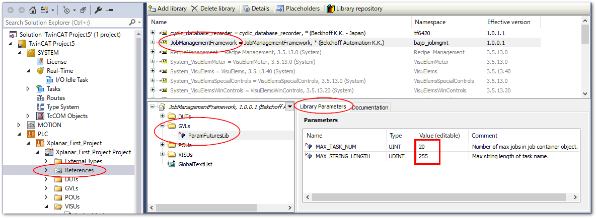

# ジョブフレームワークライブラリ使用方法

## インストール

1. 以下のGithubリポジトリをクローンしてください。

    [https://github.com/Beckhoff-JP/PLC_JobManagementFramework](https://github.com/Beckhoff-JP/PLC_JobManagementFramework)

2. TwinCAT XAEでプロジェクトを開き、{ref}`library_making_basic`に従ってライブラリファイル`JobManagement.library`を保存してください。

3. ライブラリを使用する任意のプロジェクトを作成してください。そのあと、{ref}`section_use_library`に従ってライブラリをインストール、追加を行います。

4. ライブラリを追加したら、ライブラリパラメータを調整します。`Reference`からライブラリマネージャから`JobManagementFramework`を選び、GVLs以下の`ParamFutureLib`を選択します。Library Parametersタブに現れる下記パラメータを適切な値に設定します。

    ```{csv-table}
    :header: パラメータ名称, デフォルト値, 説明

    MAX_TASK_NUM, 20, 逐次・並列ジョブを実行するために複数のジョブを格納するコンテナオブジェクトに格納できるジョブ数を指定します。
    MAX_STRING_LENGTH, 255, ジョブのひな型となるFutureオブジェクトに設定する名称の最大文字数を指定します。
    ```

    {align=center}


## Futureファンクションブロックの実装

最初に、基本の制御モデルをファンクションブロックを作成します。`FB_AbstructFuture`を継承したファンクションブロックを作成してください。

{align=center}

次に、任意のメソッドとプロパティを実装します。追加したファンクションブロックを選択し、コンテキストメニューから`Add` > `Method`または`Property`を選択します。オーバライドする場合Name欄の選択タブから基底ファンクションブロックのメソッドが一覧されますので、選択してください。

{align=center}

メソッドとプロパティは、{numref}`table_future_methods` 、{numref}`table_future_properties` を参照してください。

```{csv-table} フューチャーオブジェクトのメソッド一覧
:header: メソッド名, 型, 戻り値 ,説明
:name: table_future_methods

`init`, BOOL , 初期化処理が完了したらTRUEを返す,実行前に必要な変数やオブジェクトの初期化を行います。処理完了時にTRUEを返す必要があります。
`execute`, BOOL , 処理が完了したらTRUEを返す,タスク本体の処理を実装します。処理完了時にTRUEを返す必要があります。
`quit`, BOOL , 終了処理が完了したらTRUEを返す,実行後の変数やオブジェクトの後始末を行います。処理完了時にTRUEを返す必要があります。
`abort`, BOOL , 中断処理が完了したらTRUEを返す,中断処理が行われた際に実施する処理を実装します。処理完了時にTRUEを返す必要があります。
```

```{csv-table} フューチャーオブジェクトのプロパティ一覧
:header: プロパティ名,型, 方向 ,説明
:widths: 1,1,1,5
:name: table_future_properties

nErrorID, UDINT, GET, エラー発生時は0以外の値を返します。[参照](https://infosys.beckhoff.com/content/1033/tc3_plc_intro/12049349259.html?id=2525089929595466454)
active_futures, UINT, GET, `FB_SerialJobContainer`や`FB_ParallelJobContainer`に実装されたプロパティ。`FB_SerialJobContainer`の場合は現在処理中のFuture番号を返す。`FB_ParallelJobContainer`では、実行するFutureの合計数を返す。いずれも`executing()`メソッド実行中以外は0を返す。`FB_Executor` の `active_task_id` プロパティから取り出すことができます。
```

どのメソッドも、実装時は次のルールに基づく必要があります。

入出力変数は空にしておく
    : 入出力変数はインターフェースにより定められていますので、加えることはできません。ファンクションブロックの入出力変数や、ファンクションブロック独自のプロパティを使って、外部とのデータアクセスを行ってください。

終了条件としてメソッドの戻り値を`TRUE`にする
    : FB_Executorファンクションブロックは `init()`, `execute()`, `quit()`, `abort()` 各メソッドを実行したあと、戻り値がTRUEとなる事でプログラムが進行します。かならず戻り値を設定してください。

    : ```{code} iecst
      METHOD execute : BOOL

      <<execute 処理>>
      IF <<execute 処理終了条件>> THEN
        execute := TRUE;
      END_IF
      ```

    : ファンクションブロック内の変数や処理の初期化や中断の処理が不要な場合でも、以下の通り空の`init()`, `quit()`, `abort()`を実装する必要があります。

    : ```{code} iecst
      METHOD init : BOOL
      <<init 処理>>
      IF <<init 処理終了条件>> THEN
        init := TRUE;
      END_IF
      ```

    : ```{code} iecst
      METHOD quit : BOOL
      <<quit 処理>>
      IF <<quit 処理終了条件>> THEN
          quit := TRUE;
      END_IF
      ```

    : ```{code} iecst
      METHOD abort : BOOL
      <<abort 処理>>
      IF <<abort 処理終了条件>> THEN
        abort := TRUE;
      END_IF
      ```

終了時にエラーが発生した場合は `nErrorID` プロパティを通して0以外の値を通知します
    : `init()`, `execute()`, `quit()`の終了時のエラー状態は、`nErrorID` プロパティにて通知してください。 `FB_Executor` で実行した際、これらの処理が完了するとこの終了コードが`FB_Executor.nErrorID`プロパティで取り出せます。また、0以外の値となった場合は、`E_FutureExecutionState.abort`状態となり処理中断状態となります。中断時に実行する処理内容は、`abort()`に定義してください。


## ジョブの生成

作成したタスクファンクションブロックから、インスタンスとなるジョブ生成を行い、実際に動作させます。

本フレームワークには、ジョブコンテナという仕組みも用意されています。ジョブコンテナとは、複数のジョブを組み合わせて、同時に実行する、もしくは、逐次実行することが可能になるジョブの容れ物です。

このジョブの容れ物自体も一つのジョブとして扱うことができ、親子関係を構築する事ができます。これにより、次図のような複雑な連動動作が可能になります。

```{figure} assets/sample_code_job_structure.png
:align: center
:name: fig_job_container_task_image

ジョブコンテナを組み合わせたジョブイメージ
```

また、一度構成したジョブは再利用可能な固定ジョブコンテナと、ジョブ実行中も新たに新規ジョブを登録でき、実行完了したら次々と消えていく、キュージョブコンテナの二種類が用意されています。

これらを組み合わせた実行ジョブ生成手順について説明します。

### タスクインスタンスの生成


### ジョブコンテナ

FB_BatchJobContainer
    : あらかじめ指定したジョブを順に逐次実行するジョブコンテナ

FB_ParallelJobContainer
    : あらかじめ指定したジョブを同時に実行するジョブコンテナ

FB_ParallelQueueJobContainer
    : いつでもジョブ生成可能で、同時実行するジョブコンテナ

FB_QueueJobContainer
    : いつでもジョブ生成可能で、生成した順に逐次実行するジョブコンテナ

InterfaceFutureとInterfaceContainerを実装したファンクションブロックで、複数のFutureタスクをまとめて取り扱うコンテナオブジェクトです。

`FB_ParallelJobContainer`
    : 登録したFutureタスク全てを同時に実行します。（{numref}`fig_parallel_job_container`）

`FB_SerialJobContainer`
    : 登録したFutureタスクを、登録した順に実行します。（{numref}`fig_serial_job_container`）

```{figure} assets/run_future_cue.png
:align: center
:name: fig_parallel_job_container

並行処理ジョブコンテナ（`FB_ParallelJobContainer`によるタスク配置）イメージ
```

```{figure} assets/run_future_serial.png
:align: center
:name: fig_serial_job_container

直列処理ジョブコンテナ（`FB_SerialJobContainer`によるJOB配置）イメージ
```

`FB_ParallelJobContainer`や`FB_SerialJobContainer`内でタスク同士が同期的に連動するのは`execute()`の前後のみです。`init()`はタスク開始時から全タスク同時に開始し、`quit()`は`execute()`実行完了後すぐに実行されます。

また、`FB_ParallelJobContainer`と`FB_SerialJobContainer`もまた`InterfaceFuture`インターフェースを実装していますので、それ自体を`FB_Executor`に処理させることができます。これにより、並行処理と逐次処理を組み合わせた複雑なタスク実行が可能となっています。

```{tip}
このデータモデルは、コンテナと処理が親子関係を構成し、定義によってさまざまな枝葉モデルが構築可能です。このソフト実装のデザインパターンを、[GoFのCompositeパターン](https://ja.wikipedia.org/wiki/Composite_%E3%83%91%E3%82%BF%E3%83%BC%E3%83%B3)と呼びます。
```

{numref}`example_of_main_program_using_job_framework`のMAINプログラム例で作成したジョブのタイムチャートイメージを{numref}`fig_job_container_task_image`に示します。枠囲い部分がジョブコンテナです。その中の線は個々のタスクです（{numref}`fig_job_control_class_diagram`の`ConcreteActivity`に該当するオブジェクト）。これらはFB_ParallelJobContainerやFB_SerialJobContainerと共に、InterfaceFutureを実装したものです。このインターフェースを使って `FB_Executor` が処理を実行します。

```{figure} assets/sample_code_job_structure.png
:align: center
:name: fig_job_container_task_image

ジョブコンテナを組み合わせたジョブイメージ
```


### ジョブ構成とメイン実行エンジンとしてのFB_Executorインスタンス作成

#### メインプログラム実装

メインプログラムでは、タスク（`InterfaceFuture`を実装したもの）、`FB_executor`、ジョブコンテナ（`FB_ParallelJobContainer`、`FB_SerialJobContainer`）の各インスタンスを定義します。

ジョブにつき一つの`FB_executor`のインスタンスを用意する
    : ここでは、複数のタスクが組み合わされた一連の流れをジョブと呼びます。このジョブ毎に一つの`FB_executor`インスタンスを用意してください。`future`プロパティにて、タスクインスタンス、または、複数のタスクを束ねるジョブコンテナオブジェクトを関連付けます。

ジョブコンテナインスタンスのadd_task
    : `FB_ParallelJobContainer`、`FB_SerialJobContainer`それぞれ`add_task()`を実施します。`FB_SerialJobContainer`では、`add_task()`を実施した順番で処理が行われます。

`FB_Executor.execute()` でジョブを実行し、タスク開時に`FB_Executor.start()`を呼び出す
    : ジョブ実行中は`FB_Executor.execute()`を呼び出し続けてください。また、`FB_Executor.ready`がTRUEとなったら、`FB_Executor.start()`を呼び出してください。これによりタスク処理を開始します。
    
    : また、処理中断からの再開時にも、`FB_Executor.start()`を呼び出してください。中断前に実施していた`InterfaceFutre.init()`, `InterfaceFuture.execute()`, `InterfaceFuture.quit()`を再開実行します。

    : ```{note}
      `FB_Executor.abort()` や Futureの各処理でnErrorIDでエラー検出した場合、直前に行っていたinit(), execute(), quit()などのメソッドは中断されます。このためオブジェクトの変数状態は保持されます。これにより、例えばTONファンクションブロック等では、バックグラウンドで時間カウントアップを継続したままの状態で中断される事となり、次回再開時にはタイマ値がlimitに達した状態から処理が行われてしまいます。

      この対策として、サンプルコードでは`InterfaceFuture.abort()`処理内にて、タイマ値の現在地を保存した上でタイマの計測停止を行います。また、次回処理再開時にはその残時間を改めてTONに設定しています。処理中断・再開処理にはこのような対策が必要となります。
      ```

外部からの処理中断を行う
    : ボタン操作等で、実行中の処理を中断を行うには、`FB_Executor.abort()`を実行してください。1度実行すれば内部で状態保持しますので、1サイクルのみ実行してください。

ジョブを最初からやりなおす場合は`FB_Executor.init()`を実行する
    : 実行済みのジョブの各オブジェクトは最終状態を保持したままとなっています。ジョブコンテナおよびそこに関連付けられたタスク全てを初期化するには、`FB_Executor.init()`を実行します。

    : また、処理中断となったあと、再開せずに初期状態に戻す場合も`FB_Executor.init()`を実行してください。