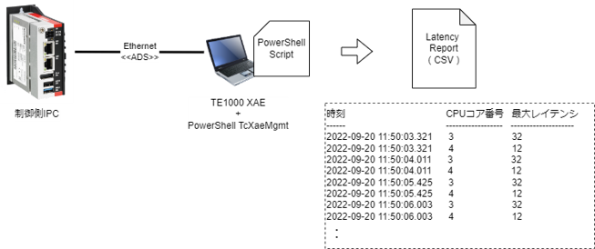

# Power shellを用いたシステムレイテンシ計測

システムの可用性を評価する方法にはさまざまな方法があります。TwinCATでは、特にEtherCAT のI/O制御に至るまでのリアルタイム性能が維持できているかを測る指標としてレイテンシ値を計測することができます。この値を長期的に計測することでシステムが安定稼働できているか評価することが重要となります。

本章では、その簡易的な手法としてPower shellのスクリプトを用いてログを記録する手順を示します。

ここで計測できるレイテンシ値は、 "Max latency" と呼ばれるもので、TwinCATがConfiguration modeからRun modeへ移行して以来、最大値を更新した値を保持するものとなっています。

一定の周期でIPC上の各リアルタイムコアの最大レイテンシの変化トレンドをCSVファイルに記録することができるため、どのタイミング（時刻）でレイテンシのピークを迎えたのかを判別することで問題の要因を特定することができます。

## 必要ライセンス  

* [TE1000 TwinCAT3 ADS PowershellModule](https://infosys.beckhoff.com/content/1033/tc3_ads_ps_tcxaemgmt/index.html?id=532703962714578460)

## 構成

* Windows Powershell5.1 以上
* Ver 3.1.4024.10 以上のバージョンのTwinCATTE1000XAE



```{note}
PowerShellツールを動作させるレイテンシログ収集用のPCでは各種PowerShellモジュールをインターネット経由でインストールするため、インターネット接続が必要です。
```

```{warning}
制御しているIPC上に ``TcXaeMgmt`` をインストールしてログ収集することも可能です。この場合もセットアップ時にIPCのインターネット接続が必要になります。ただし、IPCではTwinCAT XAR 動作のためにWindows Defenderを有効にする事ができませんので、セキュリティ上のリスクがある事をご承知おきください。
```

## 準備

### TcXaeMgmtのインストール

インターネットに接続された環境で、管理者モードでPowerShellを起動してください。以下のコマンドを順に入力します。

1. スクリプト実行を許可する

    ```powershell
    PS> Set-ExecutionPolicy RemoteSigned
    ```

2. PowershellGetモジュールの最新版をインストール

    ```powershell
    PS> Install-Module PowershellGet -Force
    ```

3. TcXaeMgmtツールのインストール

    ```powershell
    PS> Install-Module TcXaeMgmt -Force -AcceptLicense -SkipPublisherCheck
    ```

4. 完了したら下記の通りインストールできたのかを確認する  
    下記の出力結果にある。 ``Directory: `` 以後に記載されたパスを記憶する。次の手順でパスを登録する必要がある。 

    ```{code-block} powershell
    PS > Get-Module TcXaeMgmt –ListAvailable
     Directory: C:\Users\****
    ModuleType Version Name ExportedCommands
    ---------- ------- ---- ----------------
    Script 6.0.57 TcXaeMgmt {Add-AdsRoute, Close-TcSession, Copy-AdsFile, Get-AdsRoute...
    ```

5. 環境変数“PSModulePath” へインストールされたTcXaeMgmtのパスを登録。  
    ``ControlPanelのSystem Properties`` から環境変数の設定項目を探し、 ``System Variable`` の中から ``PSModulePath`` を選択。無け
    れば ``Edit..`` ボタンを押して上記パスのエントリーを ``New`` で追加。

    

## ツールの実行

1. レポートツールの展開  
    [LatencyReport.ps1](LatencyReport.ps1)を適当な場所へ配置

2. 配置した場所でPowerShellを起動してコマンド実行

    ```powershell
    PS> LatencyReport.ps1 -NetId 5.28.170.190.1.1 -wait_time 100 -stop_time "2022-09-20 12:00:00"
    ```

    ``NetId``
    : 観測したいXARが動作するPLCのAMS NetIDを指定する。省略した場合は同一ホスト上のXAR(“127.0.0.1.1.1”と同じ)に接続。ターゲットIPCのNetIdは次の通りEdit Routesの一覧から参照

    

    ``wait_time``
    : 観測後、この指定ミリ秒経ってから次の計測を行う。省略した場合は待機なし（0ミリ秒）として、即次の計測を行う。（例：10秒なら10000）

    ``stop_time``
    : この指定時刻になったら計測を終了する。省略した場合は10秒後の時刻が指定される。

3. ``stop_time`` で指定した時間まで、 ``wait_time`` の時間間隔で以下のフォーマットでコンソール画面への表示と、CSVファイルへの出力が行われる。

    

    コンソール画面表示
    : 以下の通り処理が進む毎に表示される。
    ```{code-block} powershell
    PS > ./LatencyReport.ps1 –NetId 169.254.230.17.1.1 –stop_time "2022-09-21 10:42:21"
    Time Core ID Latency Max Latency
    ---- ------- ------- -----------
    2022/09/26 11:58:45.667 1 0 8
    2022/09/26 11:58:46.064 1 0 8
    2022/09/26 11:58:46.178 1 0 8
    2022/09/26 11:58:46.295 1 0 8
    2022/09/26 11:58:46.420 1 4 8
    2022/09/26 11:58:46.545 1 0 8
    2022/09/26 11:58:46.665 1 0 8
    2022/09/26 11:58:46.782 1 0 8
    2022/09/26 11:58:46.905 1 0 8
    2022/09/26 11:58:47.024 1 0 8
    Recording finished
    ```

    保存されるCSVフォーマット
    : ``latency_<<AMSNetID>>_YYMMDDhhmmss.csv`` 
    
    例）
    : ``latency_169.254.230.17.1.1_220921104221.csv``

    ``Core ID``
        :   割り当てたリアルタイムコア番号  

    ``Latency``
        :   取得した瞬間のレイテンシー  

    ``Max Latency``
        :   Run modeになってからの最大レイテンシー

    ```{note}
    Max Latencyの単位はμsです。
    ```

    ```{warning}
    **Max Latencyの値について**  の記憶をリセットし、前回プロットしたときからの最大値に更新されます。Real Timeウィンドウ閉じると最大値リセットが止まります。
    

    TwinCAT XAEにてReal TimeのOnlineタブを開くと、Latencyグラフにプロットするたびに最大値
    ```
