# TF6100 OPC UA Server

TF6100 OPC UA Serverを用いた接続方法は次の2通りあります。

直接接続
    : 個々のIPCにサーバ機能があり、クライアントは個々のIPCのサーバへ直接アクセスします。
        {align=center}

エッジPC経由の接続
    : 個々のIPCにADSで接続したエッジPC内にゲートウェイを設置します。クライアントはゲートウェイを経由して個々のIPCのデータにアクセスします。
        {align=center}

エッジPC経由を用いた接続方法は、IPC毎にTF6100のライセンスが必要ないので経済的ではありますが、エッジサーバに対する負荷が大きく、特にIPCの台数が増えるほどIPCとゲートウェイ間の通信量が増し、エッジPCにも多くのメモリを要します。また、エンドポイントIPCのPLCのプログラムコード変更に伴い、都度ゲートウェイとの間でシンボルリストの交換が必要になり、保守上の手間が増えます。

ここでは、個々のIPCにサーバ機能を搭載し、直接接続する手順について説明します。

## インストール

次のコンポーネントを個々にインストールしてください。

TF6100 | TwinCAT 3 OPC UA Server
    : IPCにインストールします。

TF6100 | TwinCAT 3 OPC UA Configurator
    : XAE側にインストールします。

## 初期設定

(section_opcua_server_plc_project)=
### OPC UAサーバ側のPLCプロジェクトの作成

ライセンスを有効にします。

{align=center}

OPC UAによるデータアクセスを許可したいPLC変数宣言部に以下のとおり attributeを設定します。

```{code-block} iecst

{attribute 'OPC.UA.DA' := '1'}
nMyCounter : INT;
```

PLCプロジェクトの Settingsにて、Target Files内の `TMC File`にチェックを入れます。

{align=center}

````{tip}
OPC UA Serverは、TwinCATと通信するためにADSを用いてデータ収集します。この際、PLCプロジェクト内にあるシンボル一覧の定義ファイルを参照します。これが `Port_851.tmc` ファイルです。このファイルはTarget FilesのTMC Fileにチェックを入れたプロジェクトをActive Configurationした際、IPC内の以下のパスへ生成します。 OPC UA Serverはこのファイルを参照してシンボル情報モデルをクライアントへ提供します。

```
C:\TwinCAT\3.1\Boot\Plc
```
````

```{admonition} OPC UAサーバのサンプルコードについて

OPC UAのサーバ設定済みのTwinCATのサンプルコードは以下で取得できます。この中の、`TF6100_OpcUa_Server_Sample` をXAEで開いてください。

[https://github.com/Beckhoff/TF6100_Samples](https://github.com/Beckhoff/TF6100_Samples)

また、より詳しい設定方法については以下のInfoSysをご覧ください。

[https://infosys.beckhoff.com/content/1033/ts6100_tc2_opcua_server/15620470667.html?id=7253220225871226637](https://infosys.beckhoff.com/content/1033/ts6100_tc2_opcua_server/15620470667.html?id=7253220225871226637)
```


### IPCのファイヤウォール設定

IPCのファイヤウォール設定にて、TCPプロトコルポート 4840 の外部アクセスを有効にします。

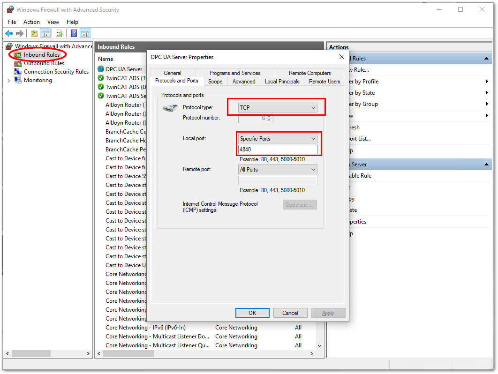{align=center}


### OPC UA Configuratorとの接続設定とサーバの初期化

```{admonition} 前提条件

OPC UA Configuratorは、[スタンドアロンアプリケーション](https://infosys.beckhoff.com/content/1033/tf6100_tc3_opcua_configurator/15555668491.html?id=1251015389796173606)として起動する方法と、[XAE Visual Studio上でConfiguratorのプロジェクトとして構成する方法](https://infosys.beckhoff.com/content/1033/tf6100_tc3_opcua_configurator/15555215755.html?id=7151566535546389617)の二通りがあります。本節では後者の手順でサーバ構成手順をご説明します。
```

#### Configuratorプロジェクトの追加

Solutionプロジェクトの最上位から、`Add` > `New Project...` を選択します。

{align=center}

Connectivity Projectを新規生成します。

{align=center}

OPC UA Server Projectを新規生成します。

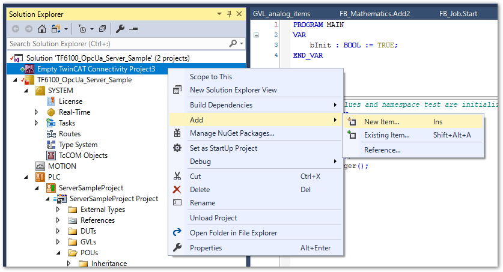{align=center}

{align=center}

#### サーバ接続設定

ターゲットIPCのIPアドレスを調べます。

{align=center}

{align=center}

ターゲットIPCのIPアドレスが、`169.254.233.34`であることが分かります。次に、ツールバーにOPC UA Configuratorの表示を有効にします。

{align=center}

追加されたOPC UA Configurator のツールバーから次の操作を行います。


1. Serverlist選択フィールドから、`Edit Serverlist` を選択してください。

    {align=center}

2. 現われた Server configuration ウィンドウ左下の `Add Server` ボタンを押すとEndpoint configurationウィンドウが現われます。次を入力してください。

    {align=center}

    UaServer URL
        : デフォルトが `opc.tcp://<XAEのホスト名>:4840` の`<XAEのホスト名>`部分を接続先IPCのホスト名に変更する。ホスト名がDNSにより解決されていない場合は、IPアドレスにします。`169.254.233.34` の例では、`opc.tcp://169.254.233.34:4840` としてください。

    Endpoint
        : セレクトフィールドをクリックすると自動的に接続確認を行い、エンドポイント一覧されます。この際、IPCに設定されたコンピュータ名ではなく、IPアドレスでアクセスした場合は次の通り警告が現われます。`はい(Y)` を選択してください。
        : {align=center}

    設定が済むと次の通りとなります。その他は設定せず、`OK`ボタンを押してください。

    {align=center}

3. 次の通りServer configurationに設定が一覧されます。`OK` ボタンを押してウィンドウを閉じてください。

    {align=center}

これまでの手順にてサーバ設定が完了したら、OPC UA Server ツールバーの `Edit Serverlist` 選択フィールドは、設定したサーバが選択可能になります。サーバを追加して、右隣にある`Connect`ボタンを押してください。

{align=center}

初回接続時に未初期化状態のサーバを検出すると、次の通り初期化ウィンドウが現われます。IPCのOSのログインユーザとしてOPC UAサーバ管理者として扱うアカウントのユーザ名、パスワードを入力してOKボタンを押します。OPC UA用の管理者アカウントですので、必ずしもOSの管理者権限（rootやAdministratorsグループユーザ）である必要はありません。

{align=center}

```{tip}
Windows搭載のIPCの場合、初期のアカウントはAdministratorです。Administratorは全ての管理権限を持ちますので、仮にOPC UAの認証にOS認証を用いると、このアカウントを踏み台にしてOPC UA以外のリソースに対して全て権限が許された状態となります。

よって、より優れたセキュリティポリシーとして、OPC UAなどのサービス毎に個別の適切な権限のアカウントをWindows上にユーザ登録し、このアカウントを用いてサーバアクセスすることをお勧めします。
```

この後、再度`Connect`ボタンを押して、設定したユーザとパスワードにてログインを行ってください。


認証が通過すると、最初にサーバ側の設定をConfiguratorプロジェクトにロードするかどうかダイアログが現われます。`はい(Y)`を選択してください。

{align=center}

サーバ側の設定を、Configuratiorプロジェクトにどのようにロードするか確認ダイアログが現われます。Configuratorプロジェクトの設定は保持しつつ、サーバ側の設定をマージする場合は`いいえ(N)`を、完全にサーバの設定で上書きする場合は`はい(Y)`を押します。

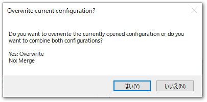{align=center}

これにより以下の通りセキュリティのみ設定されたプロジェクトがXAE上に展開されます。

{align=center}

## サーバの構成

この節以後で、XAE上のConfiguratorプロジェクトでOPC UA Serverの設定を構成します。設定した内容をOPC UA Serverへ反映するには、次図の通りActivateボタンを押して反映させてください。

{align=center}


### DA（データアクセス）の設定

初期化されたOPC UA ServerはデフォルトでPort 851のPLCモジュールのDAがPLC1として構成されています。よって本節の手順は通常実施不要です。

同様の構成手順を手動で行う方法について説明します。複数PLCインスタンスがある場合は、この手順にて追加を行ってください。ここでは一つ目のPLCインスタンスであるPort 851として説明を進めます。

まずあらかじめ、対象のPLCプロジェクトのTMCファイル設定でPort_851.tmcファイルが出力されるように設定します。設定方法は{ref}`section_opcua_server_plc_project` をご覧ください。このファイルを介してPLCのシンボルをサーバとして共有する設定を行います。

`Data Access` ツリーのコンテキストメニューから、`Add new Device Type` を指定します。

{align=center}

次のようなダイアログが出現します。

{align=center}

概ねデフォルトのままで構いません。AMS Net IDはOPC UAサーバをターゲットIPCと別のIPCに設置した場合のみターゲットとなるTwinCATのNetIDを指定してください。IPC上のローカルにOPC UA Serverをインストールされている場合は、`127.0.0.1.1.1`のままで結構です。

Ads Portは、単一のPLCプロジェクトの場合`851`で構いません。複数起ち上げている場合、個別のADSポート番号を指定してください。

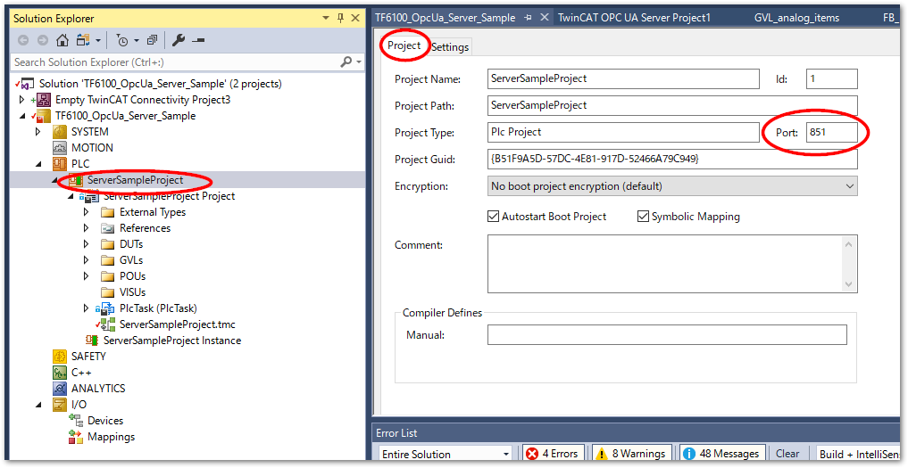{align=center}

(opc_ua_server_authenticate_by_os)=
### OS認証によるユーザの追加

IPCのOSに登録したユーザアカウントを基に認証を行う方式でOPC UAサーバに接続するユーザを追加する手順について説明します。

最初にコンピュータの管理を起動します。

{align=center width=300px}

ユーザの追加を行います。

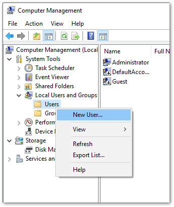{align=center}

OPC UAで接続するユーザ名を登録します。

{slign=center}

必要に応じて権限グループを選択してください。何も無ければUsersのままとしてください。

{align=center}

続いて、XAEにてユーザ追加を行います。

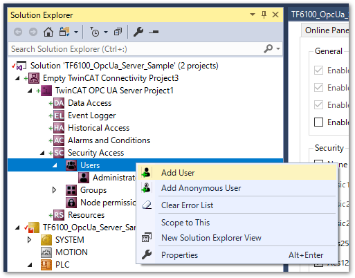{align=center}

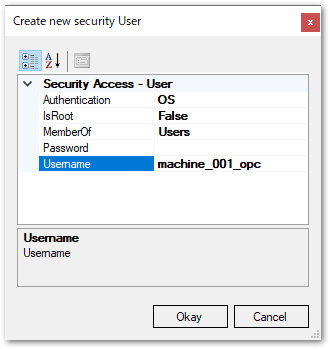{align=center}

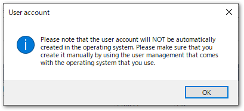{align=center}

````{admonition} OPC UA サーバの認証定義ファイル

TF6100のOPC UAサーバにより追加されたユーザは、サーバとなるIPCの以下のファイルに記録されます。（Windowsの場合）

``` shell
C:\TwinCAT\Functions\TF6100-OPC-UA\<platform名>\Server\TcUaSecurityConfig.xml
```

XAEのConfiguratorでユーザを以下の通り設定されているとします。

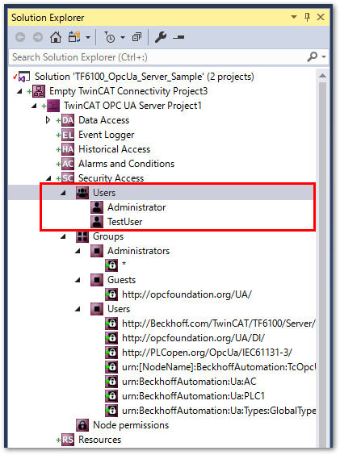{align=center}

`TcUaSecurityConfig.xml` 内のUsersエントリにて次の通り登録されています。

```{code-block} xml
:caption: TcUaSecurityConfig.xml のユーザ定義部

  <Users>
    <User Name="Administrator" Auth="OS" Password="" IsRoot="true" MemberOf="Administrators" />
    <User Name="TestUser" Auth="Server" Password="1234" IsRoot="true" MemberOf="Administrators" />
  </Users>
```

認証方式（Administration）設定は、Server, OS, X.509の3通りがありますが、Serverを選択すると、上記TestUserに見られるようにパスワードが平文で保存されてしまいます。X.509によるTLS認証か、OSによるユーザ、パスワード認証をお使いいただくことをお勧めします。

````


### 接続確認


1. 接続先のURLを入力して、左端の`Get Endpoints`ボタンを押します。
    {align=center}

2. サーバが提供する認証方式から一つを選び、`Connect`ボタンを押します。
    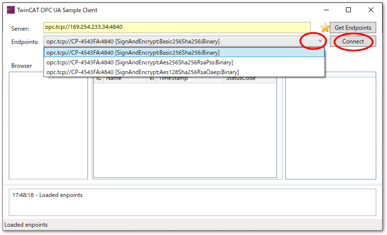{align=center}

3. {ref}`opc_ua_server_authenticate_by_os`で追加したアカウントのユーザ名とパスワードを設定してOKボタンをおしてください。
    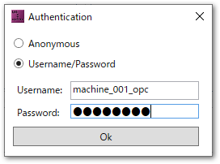{align=center}

4. 認証が許可されて接続が成功すると、BrowserツリーにDAリソースが一覧されます。
    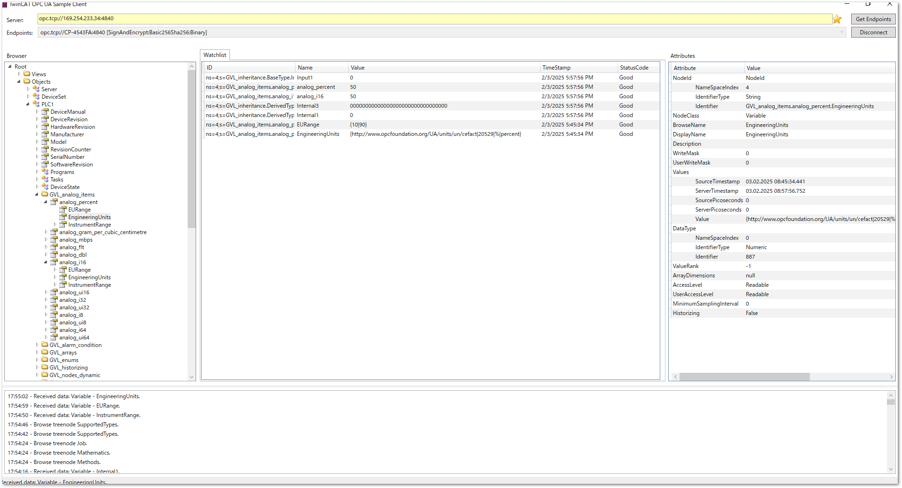{align=center}