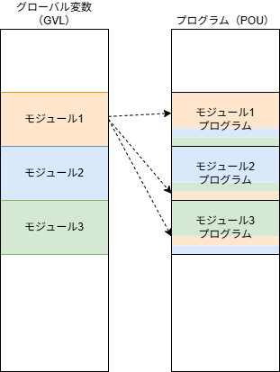
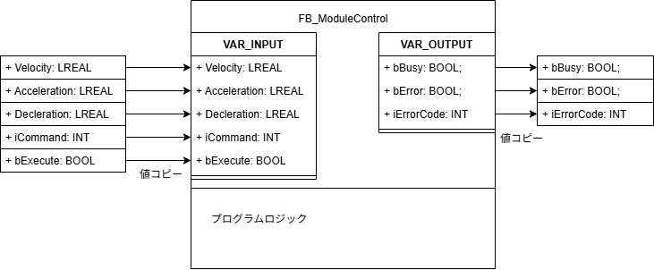

# カプセル化

カプセル化とは、特定の機能実行が完全に独立され、外部メモリ環境から影響されないように実装する手法のことです。カプセル化を使わない場合のプログラムの作り方は次のとおりになります。

* プログラム実行に必要なメモリをグローバルメモリで定義している。
* グローバルメモリで定義した変数を複数のプログラム内にまたがって使用している。
* 同じロジックのプログラムにも関わらず、異なるプログラムロジックで異なる変数を使用している。

{align=center}

そもそもプログラムが独立している場合、プログラム内で宣言した変数はローカル変数です。これだけ使用していれば互いに影響しあう事はありません。
しかし、現実問題としては外部とのデータの交換が必要です。このためによく使いがちなのがグローバル変数です。

プログラム内のロジックを共通化していたとしても、グローバル変数の異なる領域を使わざるを得ないため、仮に複数同一モジュールを実装しなければならない場合でも、プログラムを単純にコピーするだけでは機能しません。
対応するモジュールへのグローバル変数の書き換えが必要となり、先述の通り都度テストが必要となります。加えてモジュール間で互いに影響しあうメモリ共有を行うと、 **タイミングや条件によって何が起こるか分からない** ソフトウェアができあがります。

対してカプセル化のできたプログラム構造は次の通りとなります。

{align=center}

カプセル化の前提として以下の条件が挙げられます。

* 外部と共有する「型」を定義してどのモジュールでも共通の手続きでデータを取り扱えるようにする。
* 内部データは決して外界と混在させず、隠蔽する。
* 複雑な型データはコピーして受け渡すのではなく、（ショートカットのように）メモリアドレスを参照して操作する。これによってデータの持ち主の手を離れないようにする。

上記の図を例に説明します。カプセル化に従うと、プログラムさえも「型」に従って実行されることが約束されます。この図では、 `Module control` という型のプログラムには、共通して「Velocity」、「Acceleration」、「Deccleration」という属性を持っていることが保証されます。また、相互のモジュール間通信を担う `Module communication` というプログラムへの参照（ショートカット）も属性として持っていることが保証されます。

これによりモジュール動作に必要な外部から設定するデータが揃った上で、内部ロジックはローカル変数にて独立して動作させることが可能となります。また、相互に交換が必要なデータは、専用のデータ交換用のプログラムを通じて行うことができます。

このようにプログラムを作成することで次のTwinCATの機能を使ってカプセル化を実現することができます。

ファンクションブロック
    : プログラム内部のロジックを外界と遮断し、入力変数、出力変数のみで外部とデータの受け渡しします。
      {align=center}
      定義したファンクションブロックは、次の通り複数モジュールにインスタンス変数化する事ができます。入出力変数は変数宣言時の初期値として直接指定する事もできます。
      ```{code} iecst
      PROGRAM MAIN
      VAR
          module1 : FB_ModuleControl := (Velocity := 150, Acceleration := 500, Deccleration := 500); // モジュール1の制御プログラム
          module2 : FB_ModuleControl := (Velocity := 250, Acceleration := 500, Deccleration := 500); // モジュール2の制御プログラム
          module3 : FB_ModuleControl := (Velocity := 550, Acceleration := 500, Deccleration := 500); // モジュール3の制御プログラム
      END_VAR
      // 実行
      module1(iCommand := 1, bExecute := TRUE);
      module2(iCommand := 1, bExecute := TRUE);
      module3(iCommand := 1, bExecute := TRUE);
      ```

参照渡し
    : ファンクションブロックにおける入力、出力変数は値をコピーします。
      このため、ファクションブロック外とのデータの受け渡しは個々に行う必要があります。
      たとえば、異なるファンクションブロックとデータをやり取りする場合はどうすれば良いでしょうか。また、Tc2_Motionが提供するAXIS_REF型のような入力データと出力データが混在した構造体変数を直接読み書きするにはどうすれば良いでしょうか。
      入力、出力変数だけだと、それぞれの要素を入出力で個々に接続する必要があり、極めて面倒です。構造体も外部ファンクションブロックも「型」を通してデータを入出力できるので、そのままファンクションブロック内部で取り扱う方が効率的です。
      そこで、実データをコピーして読み込むのではなく、外部データを間接的に読み込んで使用する、「参照」という仕組みを使います。
      {align=center}
      この場合、読み込んだデータの実体は外部にある変数オブジェクトそのものです。入力変数や出力変数の場合はファンクションブロック内部で宣言した
      変数にもメモリアドレスが割り付けられ、ここに値を書き込んだり、取り出したりします。しかし入出力変数の場合は
      ファンクションブロック内部にはデータは存在せず、ただ、外部に存在する変数の場所が格納されているショートカットのような存在です。
      これを通してファンクションブロック内部のプログラムは外部のデータへ直接アクセスして読み書きすることができます。

      実装の方法として注意が必要なポイントとしては、VAR_IN_OUTで定義された変数はファンクションブロック内部に実体がありません。
      よって下記の `Axis*` や `mod*_parameters` のように外部に実体となるインスタンス変数の定義が必要です。
      定義した外部の変数は、ファンクションブロックの実行引数として与えます。この入出力変数は省略することができません。
      ```{code} iecst
      TYPE
      STRUCT ST_ModuleParameter
          Velocity : LREAL; // 速度
          Acceleration : LREAL; // 加速度
          Deccleration : LREAL; // 減速度
      END_STRUCT
      END_TYPE
      ```
      ```{code} iecst
      PROGRAM MAIN
      VAR
          Axis1 : AXIS_REF;
          Axis2 : AXIS_REF;
          Axis3 : AXIS_REF;
          mod1_parameters : ST_ModuleParameter := (Velocity := 150, Acceleration := 500, Deccleration := 500);
          mod2_parameters : ST_ModuleParameter := (Velocity := 150, Acceleration := 500, Deccleration := 500);
          mod3_parameters : ST_ModuleParameter := (Velocity := 150, Acceleration := 500, Deccleration := 500);
          module1 : FB_ModuleControl; // モジュール1の制御プログラム
          module2 : FB_ModuleControl; // モジュール2の制御プログラム
          module3 : FB_ModuleControl; // モジュール3の制御プログラム
      END_VAR
      module1(Axis := Axis1, stParameter := mod1_parameters, iCommand := 1, bExecute := TRUE);
      module2(Axis := Axis1, stParameter := mod1_parameters, iCommand := 1, bExecute := TRUE);
      module3(Axis := Axis1, stParameter := mod1_parameters, iCommand := 1, bExecute := TRUE);
      ```
