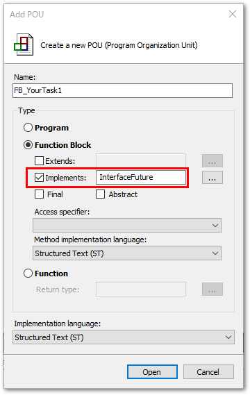
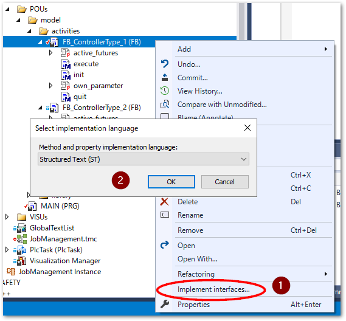

# 並行ジョブ実行フレームワーク

制御システムでは、様々な動作や振る舞いを持つサブコンポーネント機器を取り扱う必要があり、これらの特徴に合わせて制御機器システムのソフトウェア開発とテスト（品質管理）に手間や工数をかけなければなりません。

この工数を定量化し、品質のばらつきを低減させるためには、抽象度に応じた設計の分離が欠かせません。

例えばモーション機器であれば、メーカや機種によってI/Oの入出力構成や通信インターフェースはバラバラですが、これらの機器に求める機能はインチング、JOG、原点復帰、リミット制御、位置決め、トルクなどの共通機能に抽象化できます。さらに、これらの機器がどのようなシーンで使われるか、という視点に移すと、保守・調整、生産運転、段取り替えなどの生産現場におけるさまざまなユースケースまで抽象化できます。

このように抽象度の層の間を共通のインターフェースとしておく事により、抽象度の高い機能レベルから取り扱える機器は簡単に付け替えることが可能となります。

ポリモフィズムは、この抽象度の異なるオブジェクト間を共通インターフェースによって結び付け、共通のロジックから様々な異なる具象オブジェクトを取り扱う事ができるようにするオブジェクト指向の機能概念です。

ここでは、制御でよく使われる状態マシンとアクティビティ制御を抽象化し、様々な機器を一様に制御する方法についてご紹介します。

状態マシンとは、{numref}`state-machine` に示す例のようなプログラムコードをいいます。`_state`変数に格納された状態に応じて処理が順次実行されたり、場合によっては任意の処理ステップへジャンプすることができます。`CASE`文では、マッチしない`_state`番号のブロックは一切処理が行われません。

{numref}`state-machine` のプログラムでは、状態1で3秒のディレイ時間を経て、状態2で外部入力の信号の立ち上がりをカウントし、20回に達するまで`bOutput`をTRUE状態にする、という処理を行っています。

```{code-block} iecst
:caption: 状態マシン例
:name: state-machine

VAR
    _state : UINT;
    bStart :BOOL;
    bOutput AT%Q* :BOOL;
    bInput AT%I* :BOOL;
    bComplete :BOOL;
    delay_timer :TON;
    input_edge :R_TRIG;
    counter : DINT;
    delay_time :TIME := T#3S;
    process_count : DINT := 30;
END_VAR


CASE _state OF
    0:
        bOutput := FALSE;
        bComplete := FALSE;
        counter := 0;
        IF bStart THEN
            _state := 1;
        END_IF
    1:
        delay_timer(IN := TRUE, PT:=delay_time);
        IF process_timer.Q THEN
            _state := 2;
        END_IF
    2:
        bOutput := TRUE;
        input_edge(CLK := bInput);
        IF input_edge.Q THEN
            counter := counter + 1;
        END_IF
        IF counter >= process_count THEN
            _state := 3;
        END_IF
    3:
        bOutput := FALSE;
        bComplete := TRUE;
        IF NOT bStart THEN
            _state := 0;
        END_IF
END_CASE
```

このプログラムコードには欠陥があります。`delay_timer` は状態1の時にしか実行されません。このため、状態2に移行した後も`delay_timer`のTONインスタンスの状態は保持されたままとなります。次回この状態マシンを最初から実行し直すと、状態1を実行し始めた時点ですでに前回のタイマ値を保持しており、ディレイ時間の設定値3秒が経過した状態から始まります。よって、一瞬で状態1が終了してしまうこととなります。

従って、{numref}`state-machine2` の通りタイマファンクションブロックを別の状態の際に初期化しなければなりません。

```{code-block} iecst
:caption: タイマファンクションブロックの初期化を施した状態マシン例
:name: state-machine2

CASE _state OF
    0:
        bOutput := FALSE;
        bComplete := FALSE;
        counter := 0;
        IF bStart THEN
            _state := 1;
            delay_timer(IN := FALSE);
        END_IF
    1:
        delay_timer(IN := TRUE, PT:=delay_time);
        IF process_timer.Q THEN
            _state := 2;
        END_IF
    2:
        delay_timer(IN := FALSE);
        bOutput := TRUE;
        input_edge(CLK := bInput);
        IF input_edge.Q THEN
            counter := counter + 1;
        END_IF
        IF counter >= process_count THEN
            _state := 3;
        END_IF
    3:
        bOutput := FALSE;
        bComplete := TRUE;
        IF NOT bStart THEN
            _state := 0;
        END_IF
END_CASE
```

このように、コアとなる処理内容はタイマにより時間計測を行うことですが、その前後で初期化などを行う必要があります。

この実装例でみられるとおり、本来の目的では、状態1はタイマによる処理、状態2はカウンタによる処理、としたいところですが、タイマの後始末や初期化処理がその前後のステップに食い込むなど、明確にプログラムロジックが分かれていません。

PLCは、TcCOMモジュール全体でサイクリックに処理が繰り返されるもので、機能毎に独立して処理される訳ではありません。よって前述のとおり非活性状態のオブジェクトを含む、全体のオブジェクト状態を常に管理し続けなければなりません。これが徹底されていないことにより、不具合やバグが生じる要因となりえます。

## 並行ジョブ実行フレームワークサンプルコードのご紹介

このサンプルコードでは、タスクの生成から終了に対する統合的な状態管理機能と、その状態に応じたユーザ定義機能を提供します。これにより前節で説明したオブジェクト状態管理に関する問題を解決することができます。

また、さまざまなIOやハードウェアの制御機能を「タスク」として抽象化することができます。これによってソフトウェア機能の部品化を加速し、統一したインターフェースに基づいてトレーサビリティ、イベント管理など付帯機能などとの連携が容易になります。

### タスクの構成とオブジェクトモデル

フレームワークでは、{numref}`fig_future_time_chart`に示すタイミングチャートの単位をタスクとして制御できるようにします。タスクの本体は`executing()`で定義しますが、`init()`、`quit()`でその前後処理を定義します。

```{figure} assets/task_time_chart.png
:align: center
:name: fig_future_time_chart

タスクの構成と外部とのハンドシェーク
```

クラス図を{numref}`fig_job_control_class_diagram` に示します。タスクの定義は、`InterfaceFuture`のインターフェースを実装することで行います。サンプルコードではPOUsのツリー以下に`model/activities`というサブフォルダを構成し、ここにさまざまな制御パターンを集めて定義しています。これを用いてMAINプログラムでジョブを組み立てます。（{numref}`example_of_main_program_using_job_framework`）

このように、制御デザインパターンと、これを組み合わせたジョブを区別して管理することで拡張性に優れた制御プログラムや、制御デザインパターンのライブラリ化が容易になります。

```{figure} assets/activity_control_class_diag.png
:align: center
:name: fig_job_control_class_diagram

JOB制御クラス図
```

```{code-block} iecst
:caption: 並行ジョブ実行フレームワークを用いたMAINプログラム例
:name: example_of_main_program_using_job_framework

PROGRAM MAIN
VAR
    _state :UINT;
    fbTask1 : FB_ControllerType_1;
    fbTask2 : FB_ControllerType_1;
    fbTask3 : FB_ControllerType_2;
    fbTask4 : FB_ControllerType_2;
    fbTask5 : FB_ControllerType_1;
    fbTask6 : FB_ControllerType_1;


    component1_in : BOOL;
    component1_out : BOOL;
    component2_in : BOOL;
    component2_out : BOOL;
    component3_in : BOOL;
    component3_out : BOOL;
    component4_in : BOOL;
    component4_out : BOOL;
    serial_job1 : FB_SerialJobContainer;
    serial_job2 : FB_SerialJobContainer;
    serial_job3 : FB_SerialJobContainer;
    pararel_job1 : FB_ParallelJobContainer;
    pararel_job2 : FB_ParallelJobContainer;
    executor: FB_Executor;
    execution_step: UINT;
    resume: BOOL;
    abort: BOOL;
END_VAR

// HMIボタンによる処理中断
IF abort THEN
    executor.abort();
END_IF

CASE _state OF
    0:
        // 固有パラメータ設
        fbTask1.own_parameter := T#13S;
        fbTask2.own_parameter := T#20S;
        fbTask3.own_parameter := 2;
        fbTask4.own_parameter := 2;
        
        // 入出力変数の受け渡し
        fbTask1(own_output := component1_out);
        fbTask2(own_output := component2_out);
        fbTask3(own_input := component3_in, own_output := component3_out);
        fbTask4(own_input := component4_in, own_output := component4_out);
        
        // futureオブジェクトの配置により実行順序を定義
        pararel_job1.add_future(serial_job1);
        pararel_job1.add_future(serial_job2);
        serial_job1.add_future(fbTask1);
        serial_job1.add_future(fbTask2);
        serial_job2.add_future(fbTask3);
        serial_job2.add_future(fbTask4);
        pararel_job2.add_future(fbTask3); // 同時実行でなければ同じFutureオブジェクトを使いまわせる
        pararel_job2.add_future(fbTask4);
        serial_job3.add_future(pararel_job1);
        serial_job3.add_future(pararel_job2);
        executor.future := serial_job3;
        _state := 1;
    1:
        // タスクスタート（wait_for_process か 処理中断再開でスタート）
        IF (executor.current_state = E_FutureExecutionState.wait_for_process AND executor.ready) OR 
            (executor.current_state = E_FutureExecutionState.abort AND resume) THEN
            executor.start();
        END_IF
        // ジョブ実行中execute()の常時実行
        IF executor.execute() AND executor.nErrorID = 0 THEN
            _state := 2;
        END_IF
    2:
        // シーケンス初期化を行い、再度ジョブ実行（繰り返し処理）
        executor.init();
        _state := 1;
END_CASE

execution_step := executor.active_task_id;

resume := FALSE;

```


```{note}

本サンプルプログラムは、以下で公開しています。

[https://github.com/Beckhoff-JP/PLC_JobManagementFramework.git](https://github.com/Beckhoff-JP/PLC_JobManagementFramework.git)

```

### InterfaceFuture


```{csv-table}
:header: メソッド名, 型, 戻り値 ,説明

`init`, BOOL , 実行前に必要な変数やオブジェクトの初期化を行います。処理完了時にTRUEを返す必要があります。
`execute`, BOOL , タスク本体の処理を実装します。処理完了時にTRUEを返す必要があります。
`quit`, BOOL , 実行後の変数やオブジェクトの後始末を行います。処理完了時にTRUEを返す必要があります。
`abort`, BOOL , 中断処理が行われた際に実施する処理を実装します。処理完了時にTRUEを返す必要があります。
```

```{csv-table}
:header: プロパティ名,型, 方向 ,説明
:widths: 1,1,1,5

nErrorID, UDINT, GET, エラー発生時は0以外の値を返します。[参照](https://infosys.beckhoff.com/content/1033/tc3_plc_intro/12049349259.html?id=2525089929595466454)
active_futures, UINT, GET, `FB_SerialJobContainer`や`FB_ParallelJobContainer`に実装されたプロパティ。`FB_SerialJobContainer`の場合は現在処理中のFuture番号を返す。`FB_ParallelJobContainer`では、実行するFutureの合計数を返す。いずれも`executing()`メソッド実行中以外は0を返す。`FB_Executor` の `active_task_id` プロパティから取り出すことができます。
```


`InterfaceFuture`インターフェースの名前は[Futureパターン](https://ja.wikipedia.org/wiki/Future_%E3%83%91%E3%82%BF%E3%83%BC%E3%83%B3)から由来しています。複数の演算コアで並列処理を行うのではなく、単一の演算コア上にタスクを順次パイプライン実行していく仕組みにより、処理完了を待たされる（ブロックされる）ことなく処理を進めることができます。実際の演算は将来行われることからFutureパターンと呼ばれています。

このインターフェースにより実装したファンクションブロックをタスクとして、次節に示す`FB_Executor`で統一的に実行することが可能になります。

### FB_Executor

`InterfaceFuture`をの実装ファンクションブロックを実行する主体は、`FB_Executor`です。

```{csv-table}
:header: メソッド名, 型, 戻り値 ,説明
:widths: 1,1,2,6

`init`, BOOL , 初期化処理完了時にTRUEが返る , タスクの処理を開始できる状態に初期化する。
`execute`, BOOL , タスク処理完了時にTRUEが返る , "`future.init()`, `future.execute()`, `future.quit()`を順次実行します。すべて完了したら戻り値がTRUEになります。"
`abort`, BOOL, 中断処理完了時にTRUEが返る, "`future.init()`、`future.execute()`、`future.quit()` 何れか実行中にこのメソッドを実行すると、`E_FutureExecutionState.abort` の状態に遷移し、`future.abort()`を実行する。"
`start`, BOOL , なし, `E_FutureExecutionState.wait_for_process` 状態時にこのメソッド実行すると、`InterfaceFuture.execute()`処理を、`E_FutureExecutionState.abort` の状態の際にこのメソッドを実行すると、中断する前に実行していた`future.init()`、`future.execute()`、`future.quit()`の処理を再開する。
```

```{csv-table}
:header: プロパティ名,型, 方向 ,説明
:widths: 1,1,1,5

nErrorID, UDINT, GET, エラー発生時は0以外の値を返します。[参照](https://infosys.beckhoff.com/content/1033/tc3_plc_intro/12049349259.html?id=2525089929595466454)
active_task_id, UINT, GET, `FB_SerialJobContainer`や`FB_ParallelJobContainer`の実行状態がモニタできます。`FB_SerialJobContainer`の場合は現在処理中のFuture番号を返します。`FB_ParallelJobContainer`では、実行するFutureの合計数を返します。いずれも`executing()`メソッド実行中以外は0を返します。
current_state, E_FutureExecutionState, GET, `execute()`中の実行状態を返します。
future, InterfaceFuture, SET, 実装したタスクをセットします。
done, BOOL, GET, InterfaceFutureで実装した`execute()`の処理が完了後TRUEを返します。
ready, BOOL, GET, InterfaceFutureで実装した`init()`の処理が完了後TRUEを返します。
```

`start()`メソッドや、`ready`、`done`プロパティはタスク同士を連続して実行する際、InterfaceFutureの`init()`や`quit()`の処理によりサイクルの隙間が発生しないようにするトリガやイベントです。

### ジョブコンテナ

複数のタスクをまとめて取り扱うコンテナオブジェクトが二つ用意されています。`FB_ParallelJobContainer`や`FB_SerialJobContainer`を用いると、{numref}`fig_parallel_job_container`や、{numref}`fig_serial_job_container`のように同時実行、または、逐次実行が可能となります。

```{figure} assets/run_future_cue.png
:align: center
:name: fig_parallel_job_container

並行処理ジョブコンテナ（`FB_ParallelJobContainer`によるタスク配置）イメージ
```

```{figure} assets/run_future_serial.png
:align: center
:name: fig_serial_job_container

直列処理ジョブコンテナ（`FB_SerialJobContainer`によるJOB配置）イメージ
```

`FB_ParallelJobContainer`や`FB_SerialJobContainer`内でタスク同士が同期的に連動するのは`execute()`の前後のみです。`init()`はタスク開始時から全タスク同時に開始し、`quit()`は`execute()`実行完了後すぐに実行されます。

また、`FB_ParallelJobContainer`と`FB_SerialJobContainer`もまた`InterfaceFuture`インターフェースを実装していますので、それ自体を`FB_Executor`に処理させることができます。これにより、並行処理と逐次処理を組み合わせた複雑なタスク実行が可能となっています。

```{tip}
このデータモデルは、コンテナと処理が親子関係を構成し、定義によってさまざまな枝葉モデルが構築可能です。このソフト実装のデザインパターンを、[GoFのCompositeパターン](https://ja.wikipedia.org/wiki/Composite_%E3%83%91%E3%82%BF%E3%83%BC%E3%83%B3)と呼びます。
```

{numref}`example_of_main_program_using_job_framework`のMAINプログラム例で作成したジョブのタイムチャートイメージを{numref}`fig_job_container_task_image`に示します。枠囲い部分がジョブコンテナです。その中の線は個々のタスクです（{numref}`fig_job_control_class_diagram`の`ConcreteActivity`に該当するオブジェクト）。これらはFB_ParallelJobContainerやFB_SerialJobContainerと共に、InterfaceFutureを実装したものです。このインターフェースを使って `FB_Executor` が処理を実行します。

```{figure} assets/sample_code_job_structure.png
:align: center
:name: fig_job_container_task_image

ジョブコンテナを組み合わせたジョブイメージ
```

### 実装手順

本フレームワークを用いた開発手順についてご説明します。

#### ジョブコンテナに格納できるタスク数の設定

FB_ParallelJobContainerやFB_SerialJobContainer内に配置可能なInterfaceFutureの配列数は、GVLs内の`ParameterFutureLib`のライブラリパラメータ`MAX_TASK_NUM`にて設定してください。

本フレームワークをライブラリとして活用される場合は、{ref}`section_library_parameter` に示すとおり、ライブラリマネージャのライブラリ内の`Library parameters`タブを開いて設定してください。

#### インターフェース実装

インターフェースの追加は、ファンクションブロックの追加時に次の通り指定します。

{align=center}

これにより追加されたファンクションブロックは次のとおり`IMPLEMENTS InterfaceFuture`が付加されたファンクションブロックが作成されます。

```{code-block} iecst

FUNCTION_BLOCK FB_YourTask1 IMPLEMENTS InterfaceFuture
VAR_INPUT
 :
```

また、ライブラリを変更し、インターフェースに新たなメソッドやプロパティ定義を加えた場合は、次の操作にて実装ファンクションブロックに対して、不足分を反映することができます。

1. 実装ファンクションブロックを選択してコンテキストメニューから`Implements Interfaces`を選択する。
2. メソッドで実装するIEC61131-3の言語を選択します。

{align=center}

```{note}
Implements Interfacesメニューで自動反映される内容はメソッドやプロパティの新規追加のみです。実装済みのファンクションブロックのメソッドやプロパティについて行われた、インターフェースの変更や削除の内容は反映されませんのでご注意ください。

インターフェースと実装ファンクションブロックのメソッド、プロパティ、またその型や引数の仕様が異なると、ビルドに失敗します。ビルドエラーが出なくなるように手動で変更を反映してください。
```

##### init(), execute(), quit(), abort() メソッドの実装

サンプルプログラムでは、`model/activities`フォルダ内にある各ファンクションブロックに該当する部分で、機能やコンポーネントに合わせた具体的なタスクを定義するファンクションブロックの書き方について説明します。

入出力変数は空にしておく
    : 入出力変数はインターフェースにより定められていますので、加えることはできません。ファンクションブロックの入出力変数や、ファンクションブロック独自のプロパティを使って、外部とのデータアクセスを行ってください。

終了条件としてメソッドの戻り値を`TRUE`にする
    : FB_Executorファンクションブロックは `init()`, `execute()`, `quit()`, `abort()` 各メソッドを実行したあと、戻り値がTRUEとなる事でプログラムが進行します。かならず戻り値を設定してください。

    : ```{code} iecst
      execute := <<終了条件>>;
      ```

    : ファンクションブロック内の変数や処理の初期化や中断の処理が不要な場合でも、以下の通り空の`init()`, `quit()`, `abort()`を実装する必要があります。

    : ```{code} iecst
      {warning 'add method implementation '}
      METHOD init : BOOL

      init := TRUE;
      ```

    : ```{code} iecst
      {warning 'add method implementation '}
      METHOD quit : BOOL

      quit := TRUE;
      ```

    : ```{code} iecst
      {warning 'add method implementation '}
      METHOD abort : BOOL

      abort := TRUE;
      ```

終了時にエラーが発生した場合は `nErrorID` プロパティを通して0以外の値を通知します
    : `init()`, `execute()`, `quit()`の終了時のエラー状態は、`nErrorID` プロパティにて通知してください。 `FB_Executor` で実行した際、これらの処理が完了するとこの終了コードが`FB_Executor.nErrorID`プロパティで取り出せます。また、0以外の値となった場合は、`E_FutureExecutionState.abort`状態となり処理中断状態となります。中断時に実行する処理内容は、`abort()`に定義してください。

##### I/O変数の受け渡し

I/Oなど参照渡しする変数についてはファンクションブロックの`VAR_IN_OUT`を用いる方法が最もシンプルです。インターフェースなどを使う目的でプロパティで受け渡す場合は、次の方法があります。

1. ポインタ型の内部変数を用意

    タスクのファンクションブロック内部ではポインタとして変数を定義し、プログラムロジックを記述します。ここでは、XPlanarのオブジェクト変数である`MC_PlanarMover`を外部から参照渡しする例でご説明します。

    ```{code-block} iecst

    VAR
        _fbMover    : POINTER TO MC_PlanarMover;
        _cmdFB      : POINTER TO MC_PlanarFeedback;
    END_VAR

    //直線運動
    _fbMover^.MoveToPosition(_cmdFB^,stMoverPosition,fbDnyMove,0);
    ```

2. REFERENCE TO で参照渡しするメソッドやプロパティを実装する。

    プロパティでセットする場合は、プロパティの型を `REFERENCE TO ****` とし、内部変数には、`ADR()`関数でポインタにして渡す。これにより、外部の変数そのものをファンクションブロック内でメンバ変数として扱うことができます。

    ```{code-block} iecst
    PROPERTY fbMover : REFERENCE TO MC_PlanarMover

    SET:

    _fbMover := ADR(fbMover);
    ```

    コンストラクタメソッドで受け渡す場合も同様に、リファレンスでコンストラクタ引数を設定し、ポインタで内部変数に渡します。

    ```{code-block} iecst
    METHOD FB_init : BOOL
    VAR_INPUT
        bInitRetains : BOOL; // if TRUE, the retain variables are initialized (warm start / cold start)
        bInCopyCode : BOOL;  // if TRUE, the instance afterwards gets moved into the copy code (online change)
        fbMover : REFERENCE TO MC_PlanarMover;
    END_VAR

    _fbMover := ADR(fbMover);
    ```

    外部からは次の方法で参照渡しします。コンストラクタ引数の場合は、`()`内の引数ですのでリファレンス変数でも`:=`代入演算子が用いられますが、プロパティセットの場合、`REF=` の演算子で参照代入する必要があります。（[参照](https://infosys.beckhoff.com/content/1033/tc3_plc_intro/2529458827.html?id=2716630061017907414)）


    ```{code-block} iecst
    PROGRAM MAIN
    VAR
        fbMover   : MC_PlanarMover; // 例: XPlanarの可動子オブジェクト

        // InterfaceFutureを実装したタスクファンクションブロック
        fbTask    : FB_AnyTask(fbMover := fbMover);  // コンストラクタで受け渡す場合
    END_VAR

    // Property SET メソッドで受け渡す場合は、`REF=`演算子で参照代入する必要があります
    fbTask.fbMover REF= fbMover;
    ```

    上記の方法で、`AT %I*`や`AT %Q*`などを付加した入出力変数なども参照渡ししてファンクションンブロック内でIO制御を行うことが可能になります。

#### メインプログラム実装

メインプログラムでは、タスク（`InterfaceFuture`を実装したもの）、`FB_executor`、ジョブコンテナ（`FB_ParallelJobContainer`、`FB_SerialJobContainer`）の各インスタンスを定義します。

ジョブにつき一つの`FB_executor`のインスタンスを用意する
    : ここでは、複数のタスクが組み合わされた一連の流れをジョブと呼びます。このジョブ毎に一つの`FB_executor`インスタンスを用意してください。`future`プロパティにて、タスクインスタンス、または、複数のタスクを束ねるジョブコンテナオブジェクトを関連付けます。

ジョブコンテナインスタンスのadd_task
    : `FB_ParallelJobContainer`、`FB_SerialJobContainer`それぞれ`add_task()`を実施します。`FB_SerialJobContainer`では、`add_task()`を実施した順番で処理が行われます。

`FB_Executor.execute()` でジョブを実行し、タスク開時に`FB_Executor.start()`を呼び出す
    : ジョブ実行中は`FB_Executor.execute()`を呼び出し続けてください。また、`FB_Executor.ready`がTRUEとなったら、`FB_Executor.start()`を呼び出してください。これによりタスク処理を開始します。
    
    : また、処理中断からの再開時にも、`FB_Executor.start()`を呼び出してください。中断前に実施していた`InterfaceFutre.init()`, `InterfaceFuture.execute()`, `InterfaceFuture.quit()`を再開実行します。

    : ```{note}
      `FB_Executor.abort()` や Futureの各処理でnErrorIDでエラー検出した場合、直前に行っていたinit(), execute(), quit()などのメソッドは中断されます。このためオブジェクトの変数状態は保持されます。これにより、例えばTONファンクションブロック等では、バックグラウンドで時間カウントアップを継続したままの状態で中断される事となり、次回再開時にはタイマ値がlimitに達した状態から処理が行われてしまいます。

      この対策として、サンプルコードでは`InterfaceFuture.abort()`処理内にて、タイマ値の現在地を保存した上でタイマの計測停止を行います。また、次回処理再開時にはその残時間を改めてTONに設定しています。処理中断・再開処理にはこのような対策が必要となります。
      ```

外部からの処理中断を行う
    : ボタン操作等で、実行中の処理を中断を行うには、`FB_Executor.abort()`を実行してください。1度実行すれば内部で状態保持しますので、1サイクルのみ実行してください。

ジョブを最初からやりなおす場合は`FB_Executor.init()`を実行する
    : 実行済みのジョブの各オブジェクトは最終状態を保持したままとなっています。ジョブコンテナおよびそこに関連付けられたタスク全てを初期化するには、`FB_Executor.init()`を実行します。

    : また、処理中断となったあと、再開せずに初期状態に戻す場合も`FB_Executor.init()`を実行してください。