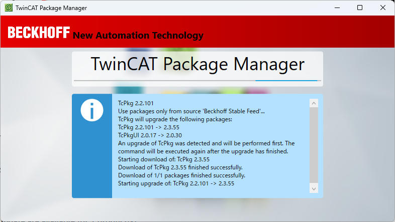
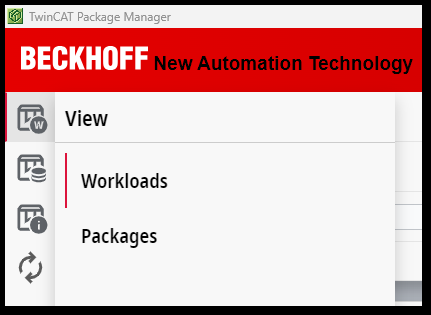
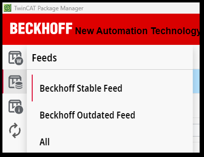
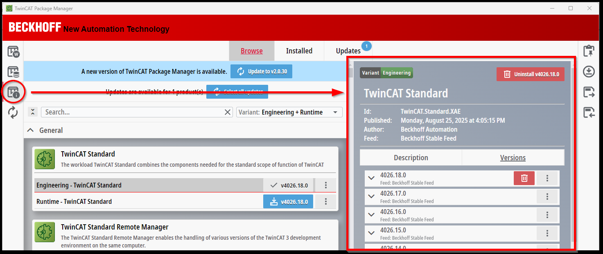
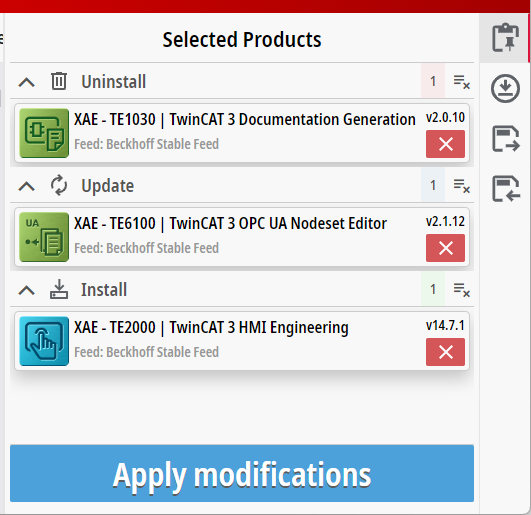

(section_package_manager_gui_ope)=
# パッケージマネージャGUI 操作編

GUIによる基本操作方法について説明します。

## 画面の説明

### 上部タブ

{align=center}

Browse
    : このタブをクリックすると、インストール可能な全てのワークロード、または、パッケージを一覧します。検索窓がありますので、任意の文字列を入力すると、その文字を含むパッケージ、または、ワークロードのみ一覧されます。

      {align=center}

Installed
    : このタブをクリックすると、インストール済みのワークロード、または、パッケージを一覧します。

Updates
    : このタブをクリックすると、更新可能なワークロード、または、パッケージを一覧します。

A new version of TwinCAT package Mnager is available.
    : パッケージマネージャそのものが更新可能な場合、この表示が現れます。`Update to ...` ボタンを押すと更新が行われます。

      {align=center}

Update are available for 1 product(s)
    : `Select all updates` ボタンを押すと、更新可能なパッケージ全てが更新対象として予約されます。

### サイドバー

View
  : 一覧をワークロードかパッケージか切り替える
  
    {align=center width=300px}
  
    `Browse` のタブに一覧するソフトウェアの単位を、ワークロード、または、パッケージの何れかに切り替えます。ソフトウェアの基本単位は「パッケージ」ですが、複数のパッケージをまとめて一つの製品（ `TC****`, `TF****`, `TE****` ）を成す場合、その代表となるメタパッケージを「ワークロード」と呼んでいます。通常はワークロードを指定してインストールを行いますが、オプション機能等は、パッケージを個々に選択してインストールするケースもあります。
    
    したがって、通常は `Workloads` を選択した一覧設定とし、必要に応じて `Packages` に一覧を切り替えて個別に必要なパッケージを選択してインストール操作を行う運用が一般的です。

Feeds
  : 一覧する供給元のパッケージサーバを選択

    {align=center width=300px}
  
    `Browse` のタブに一覧するFeed元のパッケージサーバを選択します。設定画面で登録したパッケージサーバが一覧されますので、選択したパッケージが一覧されます。`All`を選択すると全てのサーバのパッケージ、またはワークロードを一覧します。

Details
  : パッケージの詳細を表示するフレームを開閉します。

    {align=center}

    パッケージの詳細についてのフレームが現れます。どのワークロードまたはパッケージの詳細を閲覧するかは、該当するパッケージの下部名称部分（図の赤枠）をクリックします。詳細フレーム中、`Versions` をクリックすると選択したサーバから供給可能なパッケージの全てのバージョンが一覧されます。

    また、各バージョン名の左端にある展開アイコンをクリックすると、依存パッケージ（同時にインストールが求められるパッケージ）が一覧されます。

    {align=center}

    のアイコンをクリックするとインストール予約、のアイコンをクリックするとアンインストール予約となり、指定したバージョン、および、依存パッケージのインストールが予約されます。

Selected products
  : 選択したパッケージ、またはワークロードの操作

    {align=center}

    Uninstall, Update, Install 予約したパッケージは、このフレームで一覧されます。下部の `Apply modifications` ボタンを押す事でインストール、アンインストール、更新が行われます。

その他
  : 

