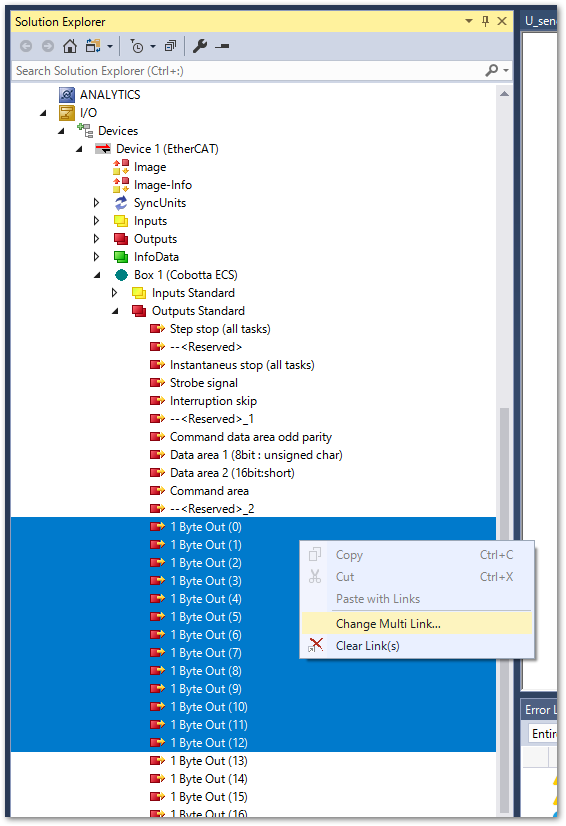
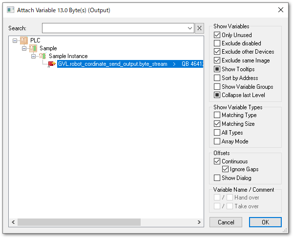

# 実装例：構造体と共用体を使ったマッピング

EtherCATのサブデバイスによっては、様々なデータを入出力できるようにバイトデータ型の配列が用意されているものがあります。サブデバイス側のファームウェアの設定やユーザプログラムによりこのエリアを使って自由なデータ型をマッピングする事ができ、TwinCATとデータの送受信が可能です。

```{figure-md} figure_cobotta_outputs
{align=center}

1 Byte Out (n) 以下にバイトデータの配列がアサインされているEtherCATサブデバイス例
```

{numref}`figure_cobotta_outputs`はあるデバイスの出力例です。汎用的なバイト型のデータの配列が続き、デバイス側で様々な型のデータにマッピングして受け取ることができます。

```{csv-table} マッピングするTwinCAT側の構造体
:header: 変数名, 型, サイズ(Byte), 1 Byte Out (n) のnへの対応
:name: table_cordinates_send_data_structure

trigger, BOOL, 1, 0
axis_x , REAL, 32, 1～4
axis_y , REAL, 32, 5～8
axis_z , REAL, 32, 9～12
```

本節の例では、{numref}`table_cordinates_send_data_structure` の通りTwinCATの構造体を定義し、この構造体に値を代入すると、EtherCATのサブデバイスの`1 Byte Out (n)`エリアに順次マッピングするための構成方法を説明します。

## 構造体定義と共用体定義

まずは、{numref}`table_cordinates_send_data_structure` に示したとおり、`cordinates_send_data`構造体を定義します。

通信用の構造体なので、{ref}`section_memory_alignment`節で説明したとおり`{attribute 'pack_mode' := '1'}`を加えなければなりません。

```{code} iecst
{attribute 'pack_mode' := '1'}
TYPE ST_cordinates_send_data :
STRUCT
    trigger: BOOL;
    axis_x: REAL;
    axis_y: REAL;
    axis_z: REAL;
END_STRUCT
END_TYPE
```

```{tip}
`{attribute 'pack_mode' := '1'}`を加えなければ8バイトアライメントとなり、その後のREAL型の変数に合わせて1バイト占有する`trigger`の変数の後に3バイトの空きが発生します。
```

つづいて、マッピングするための共用体を定義します。バイト配列の出力用変数には、`AT%Q*`を指定し、出力変数であることを宣言します。（入力変数として宣言する場合は`AT%I*`と記述します）

```{code} iecst
TYPE U_send_data_mapper :
UNION
	st_corditnates_send_data : ST_PositionCordinates;
	byte_stream AT%Q* : ARRAY [0..12] OF BYTE;
END_UNION
END_TYPE
```

定義した共用体を、グローバル変数等でインスタンス化します。

```{code} iecst
{attribute 'qualified_only'}
VAR_GLOBAL
    robot_cordinate_send_output: U_send_data_mapper;
END_VAR
```

このあとビルドを行うと、次の通り、PLCプロジェクトの`Instance`として`AT%Q*`を指定した変数のインスタンスが出来上がります。

{align=center}

## EtherCATアドレスへのマッピング

連続したバイト配列の場合、EtherCATデバイス側からマッピングすることで、マルチリンクが活用できます。これにより13Byteまとめて1回でマッピングが可能となり、1Byteづつマッピングする必要がありません。

同じサイズのバイト配列分を範囲指定し、コンテキストメニューから`Change Multi Link...`を選択します。

{align=center}

次図の通り、配列変数が一覧されていますので、選択してOKボタンを押します。

{align=center}

これによりプログラム上で作成したグローバル変数`GVL.robot_cordinate_send_output.st_corditnates_send_data` の構造体要素にそれぞれのデータを代入することができます。

共用体によりバイトデータとしてシリアライズされ、EtherCATのプロセスデータとしてリアルタイムに相手側へデータ転送することができます。