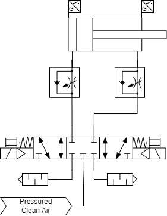
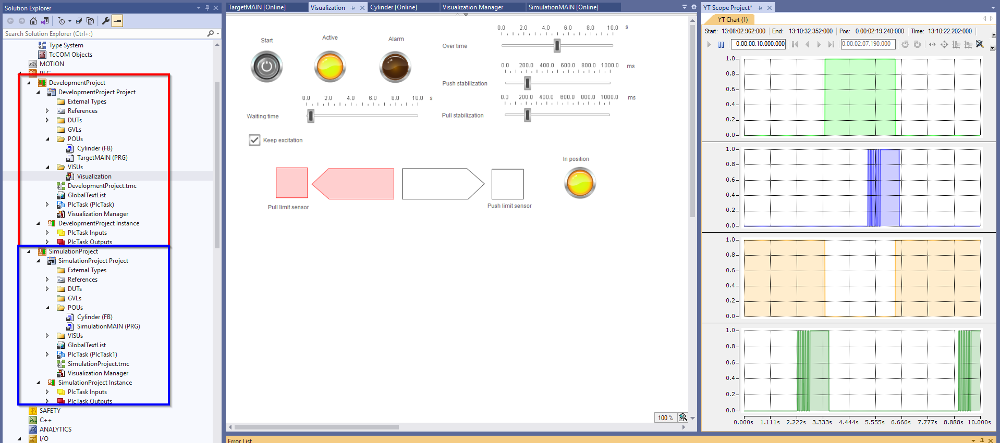

# TE1111によるシミュレーションとテスト

TE1111は、EtherCATを介して仮想的な制御対象ロジックを実行するTwinCATプロジェクトです。{numref}`te1111_standard_connection` や {numref}`te1111_single_connection` の通り専用のシミュレーションIPCをEthernetケーブルで接続する方法や、1台のIPC内で、複数のEthernetポート同士を接続することで、EtherCAT通信が可能となります。EtherCATのスレーブ情報は、制御コントローラ側からENIファイルをエクスポートし、シミュレータにインポートすることで、CoE/SDOデータを交換してOPに移行させられます。その後、プロセスデータを通してシミュレーションロジック側で定義したTwinCATの各種モジュールにて、制御対象の振る舞いをシミュレーションすることができます。

:::{figure-md} te1111_standard_connection
{align=center}

シミュレーション専用マシンがある場合の接続形態
:::

:::{figure-md} te1111_single_connection
{align=center}

IPC1台で制御プロジェクトとシミュレーションプロジェクトが混在する接続形態
:::

シミュレーション側でさらなるEtherCATポートを用いる事で{numref}`te1111_mix_connection` のとおり実ターミナル混在のシミュレーション環境も構築いただく事が可能です。

:::{figure-md} te1111_mix_connection
{align=center}

実I/Oを活用したシミュレーション接続構成
:::


本章では、{numref}`cylinder_pid` の制御対象図の通り、一般的なエアシリンダをクローズドセンター電磁弁を使って制御を行うソフトウェアと、そのシミュレーションロジックを構築します。

プロジェクト、および、IPCは、{numref}`te1111_single_connection`の構成の通り、1台のIPCを使ってエアシリンダの制御プログラムとそのシミュレーションロジックが同一のIPC内に同居する方法（{numref}`PLC_projects`）で様々なテストを実施する手法をご紹介します。

:::{figure-md} cylinder_pid
{align=center}

制御対象図
:::

:::{figure-md} PLC_projects


PLCプロジェクトの構成
:::

```{note}
{numref}`PLC_projects`のサンプルコードは下記のGithubで公開中です。

[https://github.com/Beckhoff-JP/TE1111SimulationSample.git](https://github.com/Beckhoff-JP/TE1111SimulationSample.git)
```

```{toctree}
:hidden:

ethercat_master
simulation_plc
demo
```