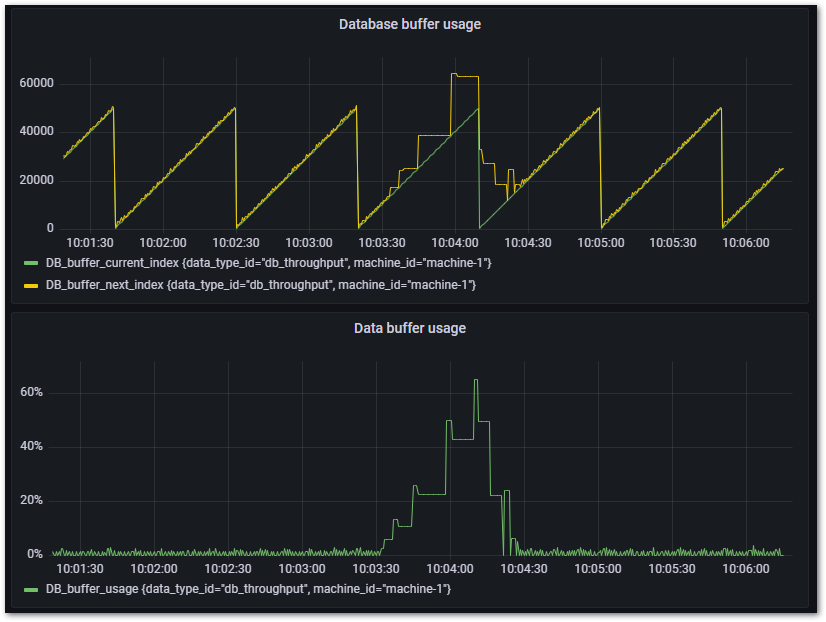

# PLCサンプルプログラム

本家InfoSysのサンプルコードは、[Fast logging with data buffer](https://infosys.beckhoff.com/content/1033/tf6420_tc3_database_server/6263315851.html?id=94896054945471632)をご参照ください。

このサンプルコードでは、次の方針で実装されています。

* PLC Expertモードを用いて、PLCの構造体配列に基づいたINSERTを行っている。
* 二次元配列を使って、バンク切替を行いながらデータベースにインサートを行っている。
* 1バンク辺り100レコード（高速サイクルデータ）を集めて、一括インサートを実施している。

これらと同様の機能を、{ref}`chapter_influxdb`でご紹介した次のライブラリにてSQLデータベースに対しても機能拡張しました。この節では下記ライブラリのメインプログラムに示されたサンプルコードを基に、ライブラリを用いたバッファ付き高速データ記録の実装方法についてご紹介します。

```{admonition} 公開先のGithubリポジトリ
:class: tip 

[https://github.com/Beckhoff-JP/tc_influxdb_client](https://github.com/Beckhoff-JP/tc_influxdb_client) 

```

## サンプルコードで収集するデータ

サンプルコードで収集するデータは、{ref}`chapter_influxdb`でご紹介した例と同様、PLCのバッファ使用状況を記録します。次の通り可視化することで、バッファサイズがデータベースの書き込み速度に適したものとなっているか評価することができます。

{align=center}

前節で示した手順では、既にこのデータを記録するスキーマとしています。本ライブラリを使うに当たっては、制約事項として構造体変数名とデータベースの列名を一致させておく必要があります。

```{csv-table}
:header: 列番号, データベース列名(=構造体変数名), データベース型名, 構造体変数型名

列1, datetime, BIGINT ,ULINT
列2, db_insert_queue_count, integer, UDINT
列3, current_index, integer, UDINT
列4, next_index, integer, UDINT,
列5, buffer_usage, real, REAL
```

## PLCプログラム

### 記録データ構造体作成

まず、テーブル定義に準じた構造体を定義します。

```{code-block} iecst
:caption: データベースへ記録するデータを格納する構造体定義例
:name: sql_expert_mode_data_structure

TYPE DatabaseThroughput_SQL:
STRUCT
    datetime : ULINT; // UNIX epoch
    db_insert_queue_count: UDINT; // キューインされた一括インサート予定のコマンド数
    current_index: UDINT; // 現在のデータバッファの開始インデックス
    next_index: UDINT; // 次回インサートコマンドが発行される予定のバッファの終端インデックス
    buffer_usage: REAL; // バッファの使用率（全バッファサイズうのうちインサートコマンドが発行待ちのデータ数）
END_STRUCT
END_TYPE
```

### バッファへのデータ書き込みプログラム定義

```{code-block} iecst
:caption: データ記録用サンプルプログラム変数宣言部
:name: sql_cyclic_record_sample_main_program_declaration

VAR
    // Initial
    initialized : BOOL;

    // Datetime utilities
    fbDtUtil : FB_DatetimeUtilities;

    // Record data buffer
    DatabaseThroughputRecordData_SQL    :DatabaseThroughput_SQL;    // for insert dataset
    DatabaseThroughputRecordBuffer_SQL  :ARRAY [0..<任意のバッファ個数>] OF DatabaseThroughput_SQL;

    fbThroughputRecorder_SQLDB  :BufferedRecord(
        GVL.fbSQLRecorder, 
        ADR(DatabaseThroughputRecordBuffer_SQL), 
        SIZEOF(DatabaseThroughputRecordBuffer_SQL),
        <任意のデータバッファ個数>
    );		// record controller

END_VAR
```


```{code-block}
:caption: データ記録用サンプルプログラム部
:name: sql_cyclic_record_sample_main_program

(* 
初期化プログラム
スタート後1サイクルだけ実行
 *)
IF NOT initialized THEN
    // 構造体名称の設定
    fbThroughputRecorder_SQLDB.structure_name := 'DatabaseThroughput'; // Measurement name

    // SQLデータベースのテーブル名
    fbThroughputRecorder_SQLDB.SQL_parameters.table_name := 'database_throughput';

    // 列パラメータの登録
    fbThroughputRecorder_SQLDB.SQL_parameters.add_column('datetime', E_ExpParameterType.Int64, SIZEOF(DatabaseThroughputRecordData_SQL.datetime)); // 列1

    fbThroughputRecorder_SQLDB.SQL_parameters.add_column('db_insert_queue_count', E_ExpParameterType.Int32, SIZEOF(DatabaseThroughputRecordData_SQL.db_insert_queue_count)); // 列2

    fbThroughputRecorder_SQLDB.SQL_parameters.add_column('current_index', E_ExpParameterType.Int32, SIZEOF(DatabaseThroughputRecordData_SQL.current_index)); // 列3

    fbThroughputRecorder_SQLDB.SQL_parameters.add_column('next_index', E_ExpParameterType.Int32, SIZEOF(DatabaseThroughputRecordData_SQL.next_index)); // 列4

    fbThroughputRecorder_SQLDB.SQL_parameters.add_column('buffer_usage', E_ExpParameterType.Float32, SIZEOF(DatabaseThroughputRecordData_SQL.buffer_usage)); // 列5

    initialized := TRUE;
END_IF

// Windowsの時刻ロケールデータとの同期等を行うため常時実行
fbDtUtil();


// 記録用の構造体へのデータ登録
// fbDtUtil.Filetime_To_UnixT()でマイクロ秒精度のUNIX時間を取得する
DatabaseThroughputRecordData_SQL.datetime := fbDtUtil.Filetime_To_UnixT(F_GetSystemTime());
DatabaseThroughputRecordData_SQL.db_insert_queue_count := GVL.fbSQLRecorder.queue.queue_usage;
DatabaseThroughputRecordData_SQL.current_index := fbThroughputRecorder_SQLDB.index;
DatabaseThroughputRecordData_SQL.next_index := fbThroughputRecorder_SQLDB.next_index;
DatabaseThroughputRecordData_SQL.buffer_usage := fbThroughputRecorder_SQLDB.buffer_usage;

// バッファへの書き込み命令
fbThroughputRecorder_SQLDB.write(ADR(DatabaseThroughputRecordData_SQL));
```


### バッファ⇒データベース書き込みプログラム定義

まず、グローバル変数に、RecordSQLファンクションブロックのインスタンスを定義します。コンストラクタ引数に、TF6420で定義したDBIDを設定します。

```{code-block} iecst
:caption: RecordSQLファンクションブロックインスタンス作成
:name: RecordSQL_function_block

{attribute 'qualified_only'}
VAR_GLOBAL
    // Database record driver
    fbSQLRecorder 		:RecordSQL(DBID := 2);
END_VAR
```

次に`RecordSQL`ファンクションブロックのインスタンスの実行プログラムを記述します。このプログラムは、データ記録用のタスクとは別の独立したタスクで実行させてください。サイクルタイムはバッファへのデータ記録側のサイクルタイムに応じて短くする必要があります。目安として下記をご参考ください。

```{csv-table}
:header: 記録側のサイクルタイム, データベース書込みタスクのサイクルタイム

1ms未満, 1ms
1ms以上, 10ms
```