# Configurator 手順

## 準備

- 実機を準備する。
- 接続順番と Tile の BTN を記録する。
  - Tile の登録時に必要です。

```{admonition} 注意
:class: warning

Configurator は実機と接続してる際に実機情報と簡単にリンクさせるためのソフトウェアです。実機なしのプログラムを作成しているときは Infosys を参考に設定してください。
```

## 実機の Device を読み込む

1. I/O > Devices > Scan を選択する。  

  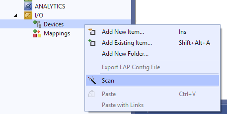

2. 注意文が出るので OK を押す。  

  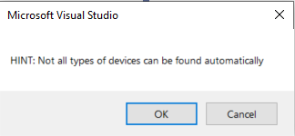

3. EtherCAT 接続されたポートを選択(自動)して OK を押す。

  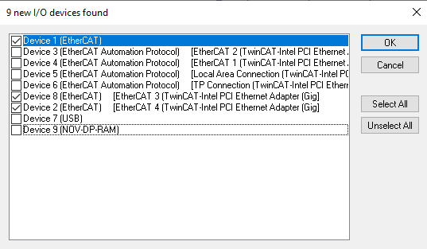

4. Scan for boxes のダイアログが出るので、Yes を選択する。
 
  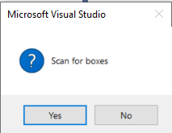

5. 接続されたデバイスが登録されます。  

  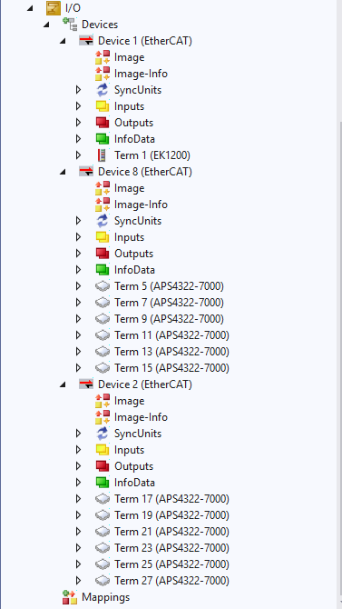

6. FreeRun モードにする。

## Configurator を立ち上げる

TwniCAT > XPlanar > Configurator を選択する。  


## Parts 設定

中央グラフィックの使用するタイルをクリックする。  
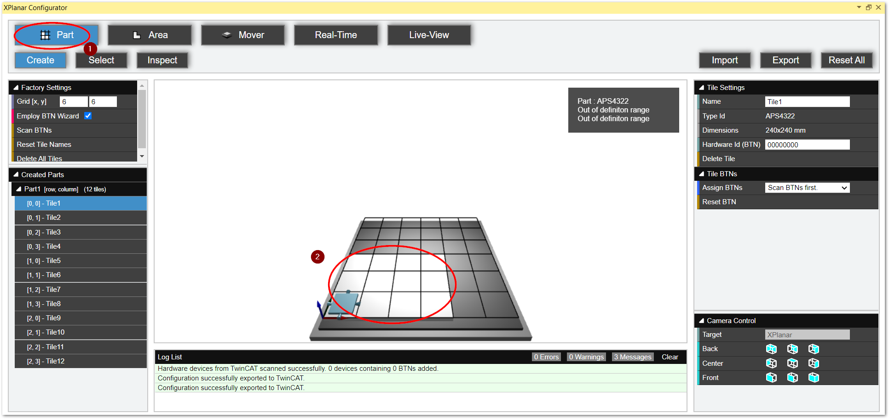

> FreeRun モードでないと Scan BTNs で Device が見つからないので注意する。

画面左上の Factory Settings から ScanBTN を選択する。  


Tile Settings から Assign BTNs で適切な BTN を割り当てる。  
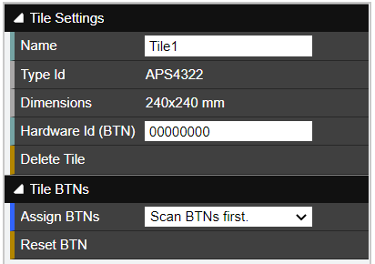
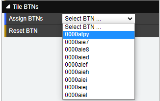

全て選択すると下記のようになります。
(BTN はご使用の XPlanar 固有のものになります。)  


## Mover 設定

上部のボタンから使用する Mover 種類を選択する。  
タイル上に使用する Mover を置く。  
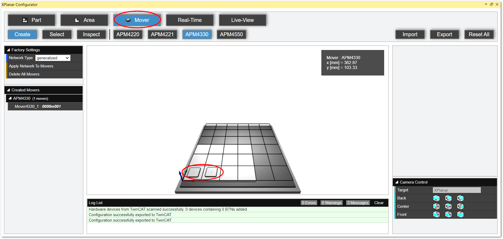

## Real-Time 設定

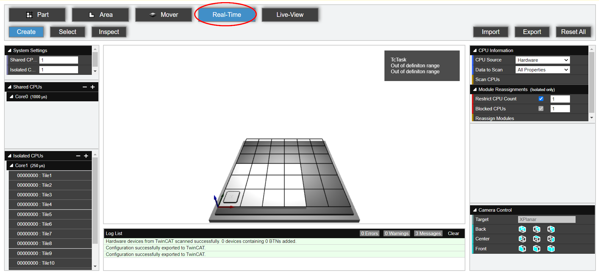

使用する Core の割り当てを入力する。  


- Restrict CPU Count に ☑ を入れる。

  - Isolated Core に設定するため。

- Restrict CPU Count に 1 を入れる。
  - 1 以外は入れない。1 以外はタスクの自動割付がされない。

Reassign Modules を選択する。  
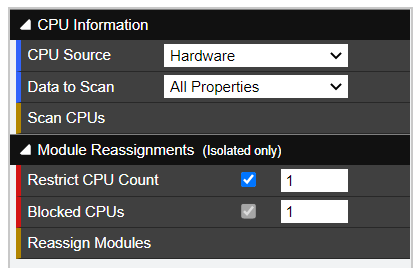

Isolated CPUs の 250 µs のコアに割り当てられているか確認する。  


## 設定データの出力

下記の操作にて次の処理が行われます。処理が完了するまでTwinCATのプロジェクトを閉じない様に注意してください。

* bmlファイルの出力
* TwinCATのモーション軸の生成

次の手順を実行します。

1. 上部メニューから Export を選択する。  

  

2. 確認画面で Yes を選択する。  

  

3. Console 画面が表示される。  

  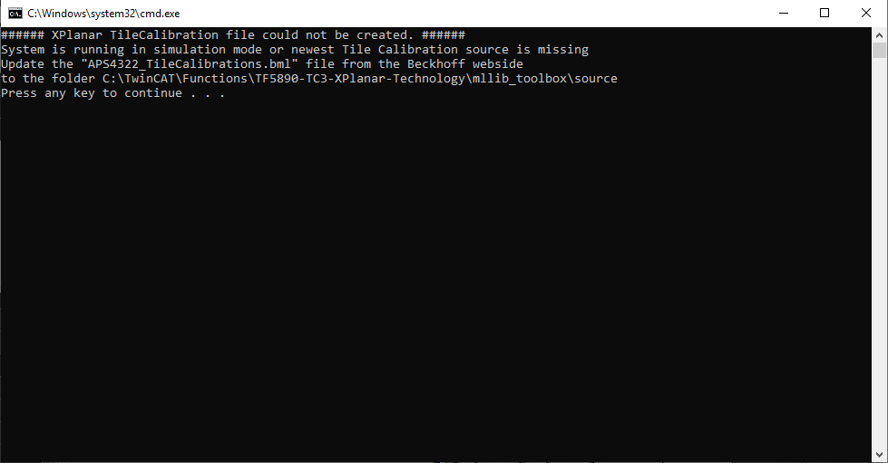

処理が完了すると、自動的に以下のフォルダへにbmlファイルが保存されたフォルダを開いたエクスプローラが出現します。

```
C:\TwinCAT\Functions\TF5890-TC3-XPlanar-Technology\mllib_toolbox\target
```

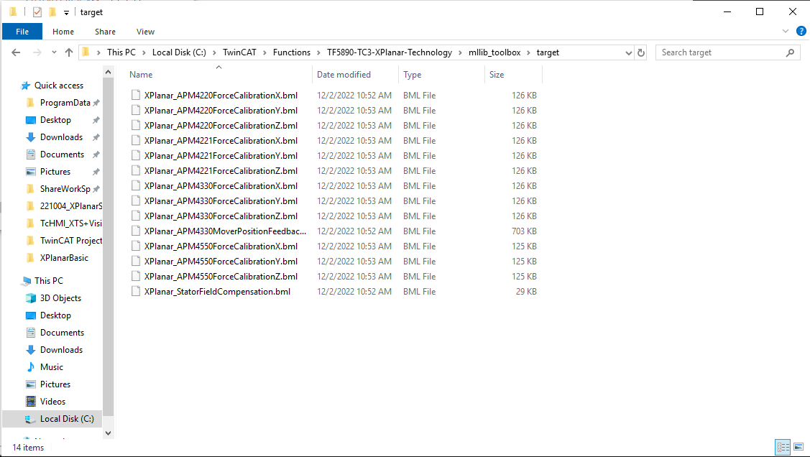

4. これらのファイル全てを選択し、ターゲットIPCの以下のフォルダへ配置してください。

```
C:\TwinCAT\3.1\Target\Config\XPlanar\bml
```

  


5. TwinCAT XAE 上のプロジェクトには、SYSTEM, MOTION に自動でオブジェクトが登録されます。

  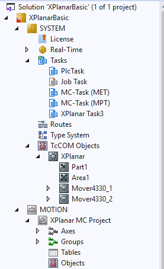
