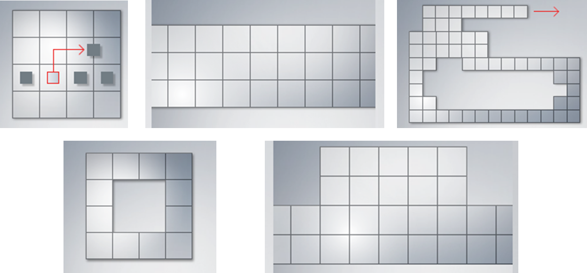

# 開発手順

XPlanarの開発は次の手順で行います。


1. タイルの配置と配線

    タイルへの電源供給と、IPCとEtherCATの配線を行い、TwinCATプロジェクト上でタイルのIOインスタンスを作成します。

2. モーション軸作成
    
    Configuratorツールを使ってモーション軸を構成します。

3. PLCインスタンス作成

    PLCプロジェクトを作成し、必要ライブラリを読み込ませた上で、モーション軸とリンクするためのインスタンス変数を作成します。

4. リンク

    Configuratorにより作成したモーション軸と、PLCで作成したインスタンス変数をリンクします。

5. プログラミング

    制御プログラム、および、デバッグ、チューニング等を実施します。

## タイルの配置と配線

前頁でご紹介したタイルを任意の形状に配置してください経路に応じて自由に配置できます。



タイル間、およびIPCへのEthernetケーブル、および電源ケーブルを接続します。最後に、可動子をタイル上に配置します。

```{admonition} 危険
:class: warning

可動子の磁性体の吸引磁力は約{math}`400Kg/m^2` です。磁性金属に近づけると、吸引力により身体に致命的な損傷や、設備の破損、破壊を引き起こす可能性があります。必ず以下の手順を守って可動子を取り扱ってください。

* 可動子は必ず搬送用トレーにセットした状態で持ち運びを行ってください。
    {align=center width=450px}

* 可動子と搬送用トレーの脱着は、必ずタイル上で行ってください。
    {align=center width=450px}

```

## EtherCATのスキャン


